# Motif Analysis Report

| UniProt ID | Analyzed Direction | WebLogo | Top Candidates & P-val | Plots (Matrix & Bootstrap) | Note | Analysis Note |
|---|---|---|---|---|---|---|
| **A1B3Z0** | Direct | 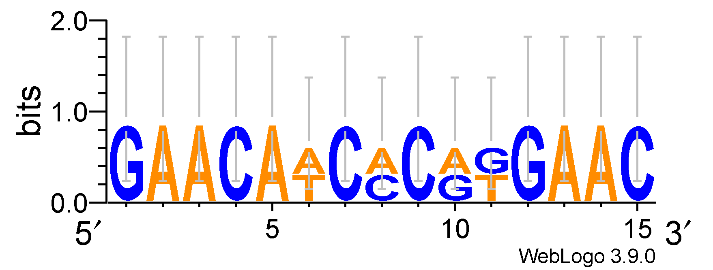 | <table border="1" class="dataframe">  <thead>    <tr style="text-align: right;">      <th>score</th>      <th>p_value</th>      <th>group1</th>      <th>group2</th>    </tr>  </thead>  <tbody>    <tr>      <td>8.0</td>      <td>2.1800e-02</td>      <td>GAAC</td>      <td>GAAC</td>    </tr>  </tbody></table> | 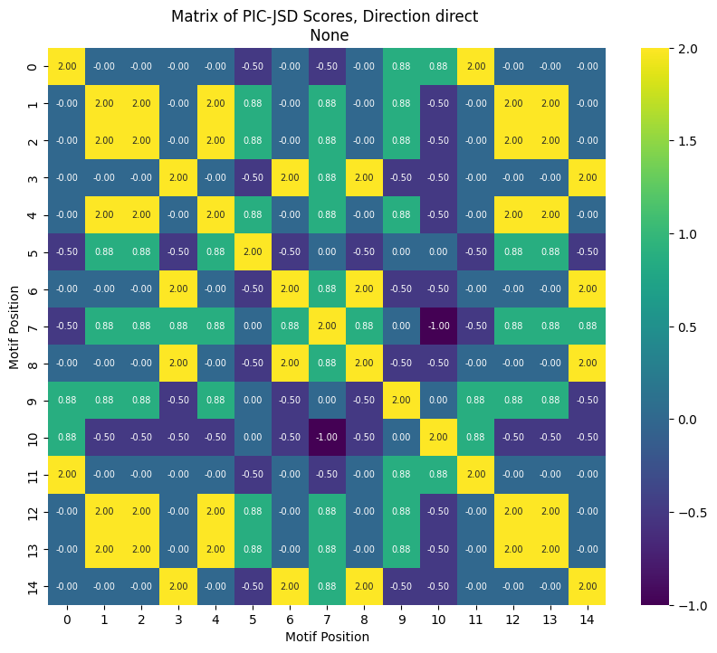 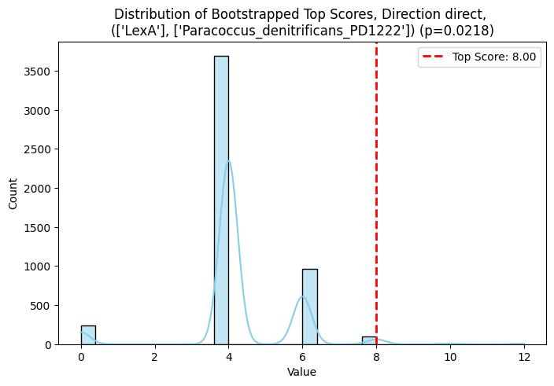 | (2 seq) |  |
| **A1B3Z0** | Reverse |  | <table border="1" class="dataframe">  <thead>    <tr style="text-align: right;">      <th>score</th>      <th>p_value</th>      <th>group1</th>      <th>group2</th>    </tr>  </thead>  <tbody>    <tr>      <td>3.0</td>      <td>3.3180e-01</td>      <td>GG</td>      <td>AC</td>    </tr>  </tbody></table> | 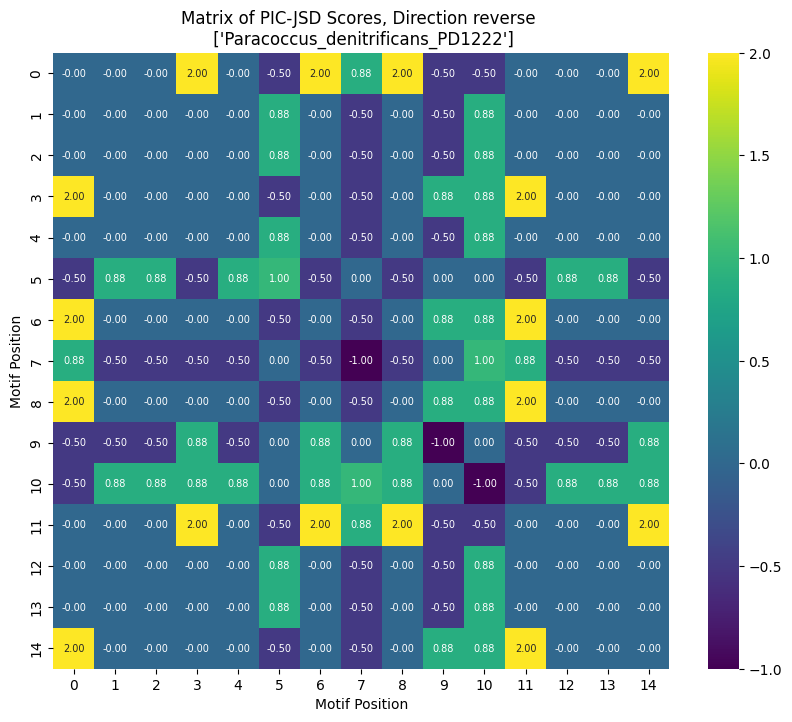 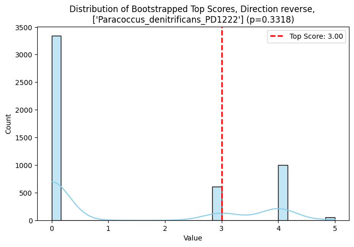 | (2 seq) | [(['LexA'], ['Paracoccus_denitrificans_PD1222'])]: No diagonal candidates were possible at the selected 80% threshold for CollecTF_FASTA/LexA/Paracoccus_denitrificans_PD1222/TF_LexA_A1B3Z0.fas, automatically reduced to 75%, at value 0.9999999932676049. |
| **C1F978** | Direct | 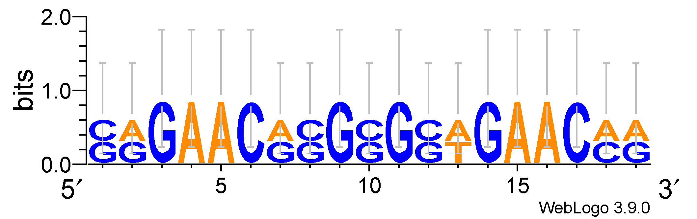 | <table border="1" class="dataframe">  <thead>    <tr style="text-align: right;">      <th>score</th>      <th>p_value</th>      <th>group1</th>      <th>group2</th>    </tr>  </thead>  <tbody>    <tr>      <td>8.0</td>      <td>8.0000e-04</td>      <td>GAAC</td>      <td>GAAC</td>    </tr>  </tbody></table> | 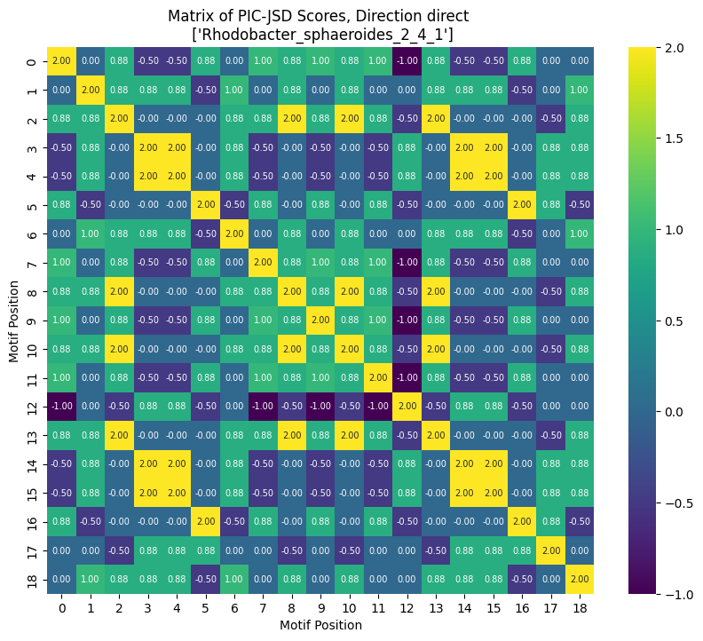 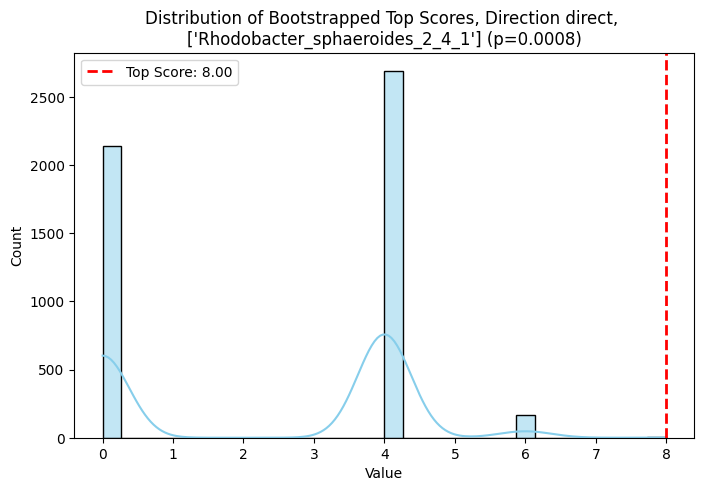 | (2 seq) |  |
| **C1F978** | Reverse |  | <table border="1" class="dataframe">  <thead>    <tr style="text-align: right;">      <th>score</th>      <th>p_value</th>      <th>group1</th>      <th>group2</th>    </tr>  </thead>  <tbody>    <tr>      <td>2.632331</td>      <td>9.8580e-01</td>      <td>ACA</td>      <td>ACG</td>    </tr>    <tr>      <td>1.754887</td>      <td>1.0000e+00</td>      <td>CG</td>      <td>GC</td>    </tr>    <tr>      <td>1.754887</td>      <td>1.0000e+00</td>      <td>GC</td>      <td>CG</td>    </tr>    <tr>      <td>1.754887</td>      <td>1.0000e+00</td>      <td>CA</td>      <td>CA</td>    </tr>    <tr>      <td>1.754887</td>      <td>1.0000e+00</td>      <td>CA</td>      <td>CG</td>    </tr>  </tbody></table> | 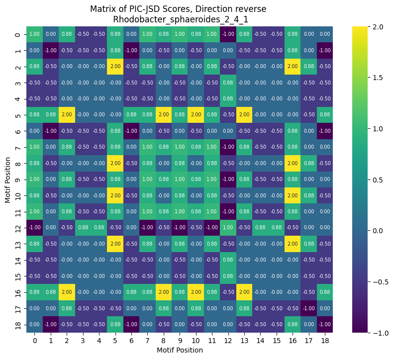 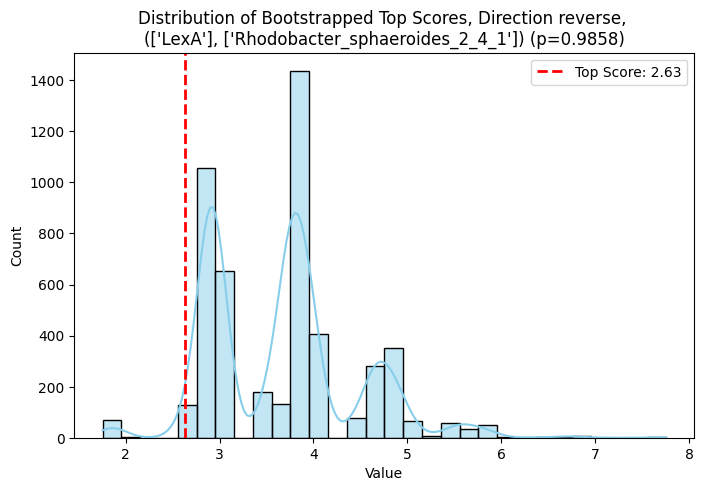 | (2 seq) | [(['LexA'], ['Rhodobacter_sphaeroides_2_4_1'])]: No diagonal candidates were possible at the selected 80% threshold for CollecTF_FASTA/LexA/Rhodobacter_sphaeroides_2_4_1/TF_LexA_C1F978.fas, automatically reduced to 45%, at value 0.49999999663380246. |
| **D5ALN0** | Direct | 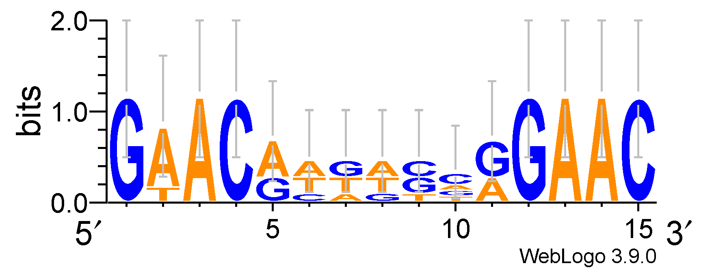 | <table border="1" class="dataframe">  <thead>    <tr style="text-align: right;">      <th>score</th>      <th>p_value</th>      <th>group1</th>      <th>group2</th>    </tr>  </thead>  <tbody>    <tr>      <td>7.422973</td>      <td>2.0000e-04</td>      <td>GAAC</td>      <td>GAAC</td>    </tr>  </tbody></table> | 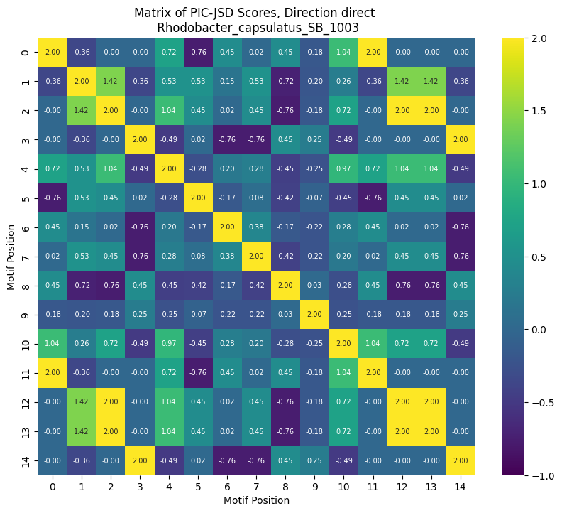 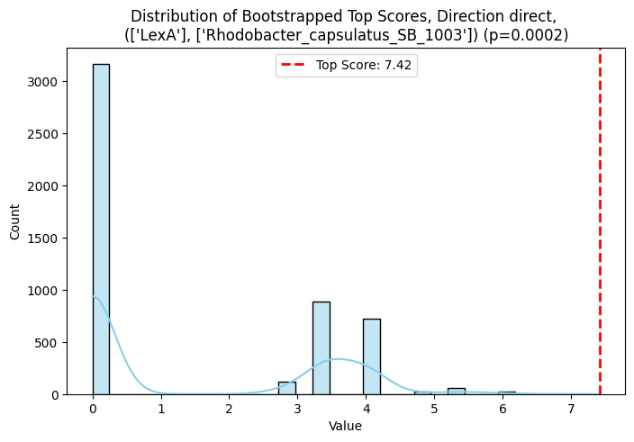 |  |  |
| **D5ALN0** | Reverse |  | No candidates found | 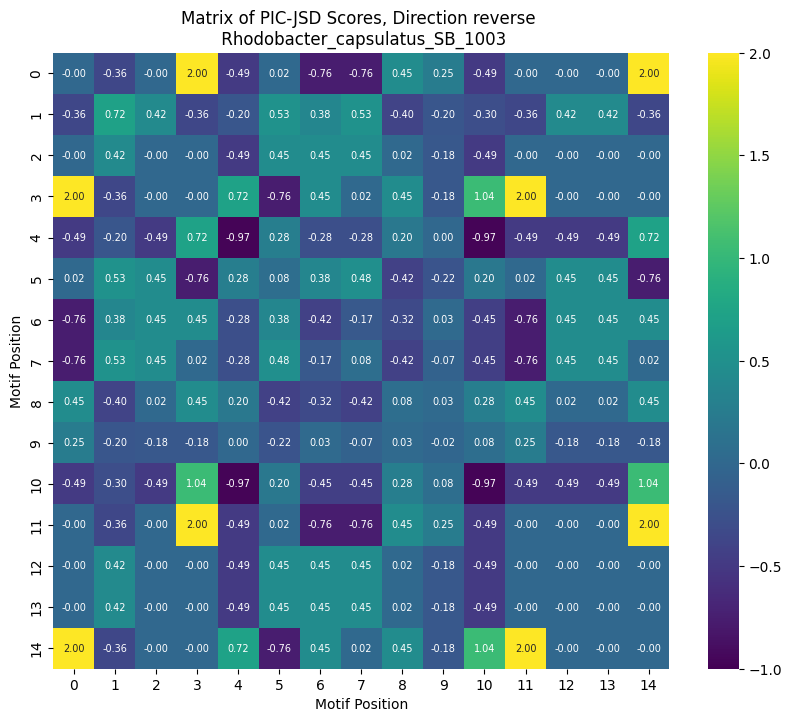 No Bootstrap |  | [DETECT_PATTERNS] - (['LexA'], ['Rhodobacter_capsulatus_SB_1003']): Exhausted all fallbacks down to 25th percentile. No diagonal candidates >=2 positions found at user-specified 80% |
| **Q8UFK2** | Direct | 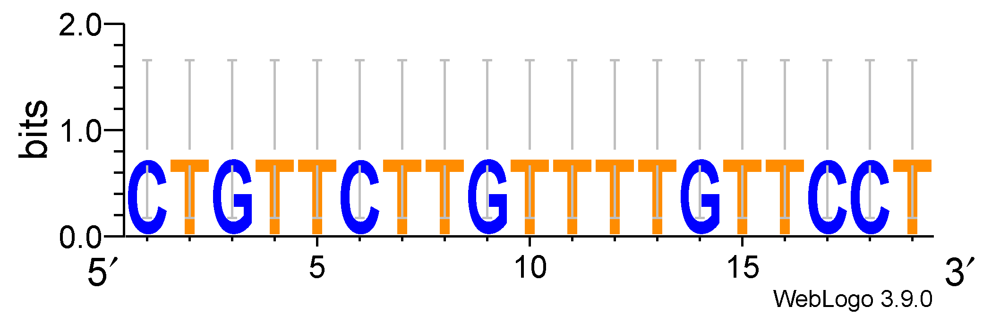 | <table border="1" class="dataframe">  <thead>    <tr style="text-align: right;">      <th>score</th>      <th>p_value</th>      <th>group1</th>      <th>group2</th>    </tr>  </thead>  <tbody>    <tr>      <td>10.0</td>      <td>6.2720e-01</td>      <td>TTGTT</td>      <td>TTGTT</td>    </tr>    <tr>      <td>10.0</td>      <td>6.2720e-01</td>      <td>TGTTC</td>      <td>TGTTC</td>    </tr>    <tr>      <td>8.0</td>      <td>9.6920e-01</td>      <td>TGTT</td>      <td>TGTT</td>    </tr>    <tr>      <td>6.0</td>      <td>1.0000e+00</td>      <td>TTT</td>      <td>TTT</td>    </tr>    <tr>      <td>4.0</td>      <td>1.0000e+00</td>      <td>CT</td>      <td>CT</td>    </tr>    <tr>      <td>4.0</td>      <td>1.0000e+00</td>      <td>TT</td>      <td>TT</td>    </tr>    <tr>      <td>4.0</td>      <td>1.0000e+00</td>      <td>TT</td>      <td>TT</td>    </tr>    <tr>      <td>4.0</td>      <td>1.0000e+00</td>      <td>TT</td>      <td>TT</td>    </tr>    <tr>      <td>4.0</td>      <td>1.0000e+00</td>      <td>TT</td>      <td>TT</td>    </tr>    <tr>      <td>4.0</td>      <td>1.0000e+00</td>      <td>TT</td>      <td>TT</td>    </tr>    <tr>      <td>4.0</td>      <td>1.0000e+00</td>      <td>TT</td>      <td>TT</td>    </tr>    <tr>      <td>4.0</td>      <td>1.0000e+00</td>      <td>TT</td>      <td>TT</td>    </tr>    <tr>      <td>4.0</td>      <td>1.0000e+00</td>      <td>TT</td>      <td>TT</td>    </tr>    <tr>      <td>4.0</td>      <td>1.0000e+00</td>      <td>TT</td>      <td>TT</td>    </tr>    <tr>      <td>4.0</td>      <td>1.0000e+00</td>      <td>CT</td>      <td>CT</td>    </tr>    <tr>      <td>4.0</td>      <td>1.0000e+00</td>      <td>CT</td>      <td>CT</td>    </tr>  </tbody></table> | 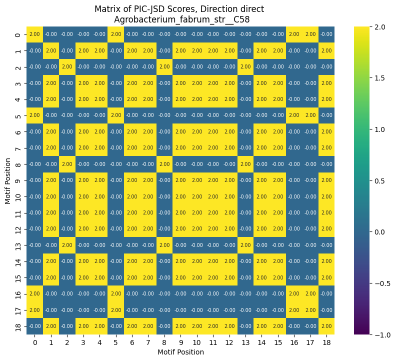 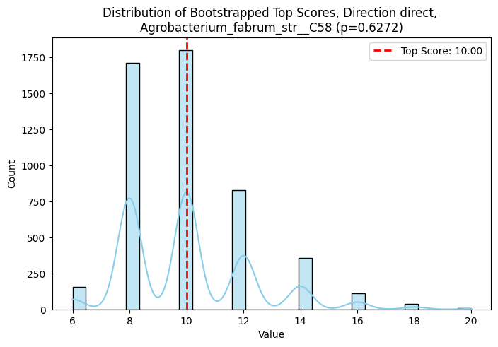 | (1 seq) |  |
| **Q8UFK2** | Reverse |  | No candidates found | 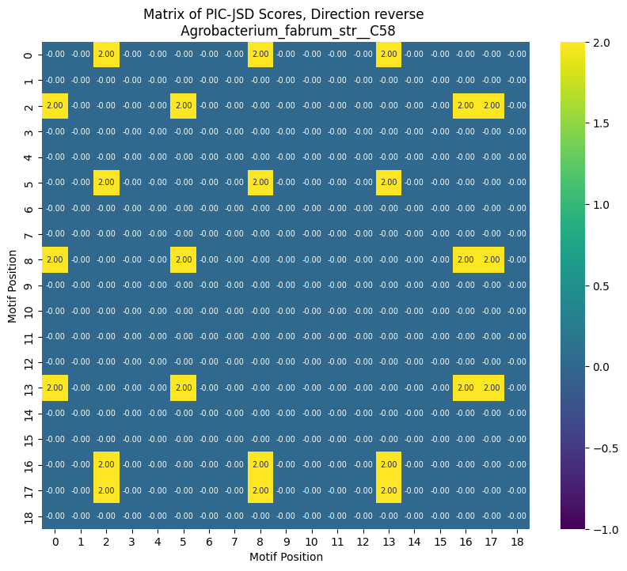 No Bootstrap | (1 seq) | [DETECT_PATTERNS] - (['LexA'], ['Agrobacterium_fabrum_str__C58']): Exhausted all fallbacks down to 25th percentile. No diagonal candidates >=2 positions found at user-specified 80% |
| **Q8YMM5** | Direct | 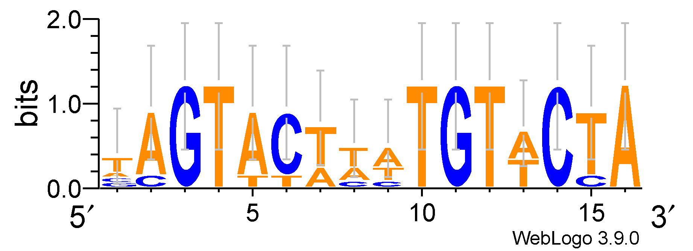 | <table border="1" class="dataframe">  <thead>    <tr style="text-align: right;">      <th>score</th>      <th>p_value</th>      <th>group1</th>      <th>group2</th>    </tr>  </thead>  <tbody>    <tr>      <td>4.000000</td>      <td>9.9400e-02</td>      <td>GT</td>      <td>GT</td>    </tr>    <tr>      <td>2.994755</td>      <td>5.0240e-01</td>      <td>TA</td>      <td>TA</td>    </tr>  </tbody></table> | 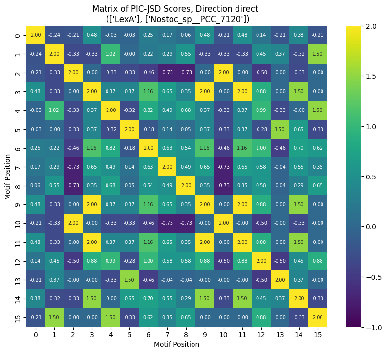 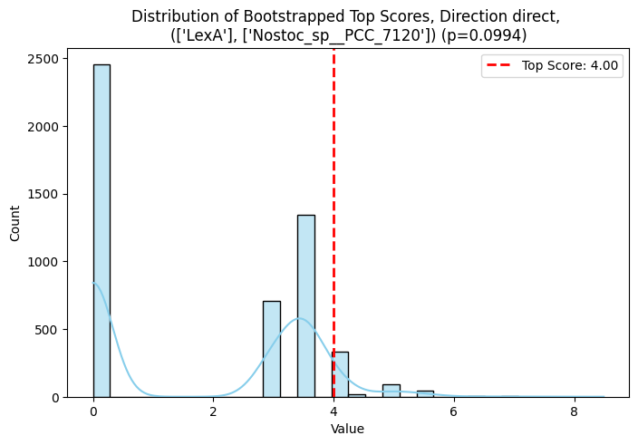 |  |  |
| **Q8YMM5** | Reverse |  | <table border="1" class="dataframe">  <thead>    <tr style="text-align: right;">      <th>score</th>      <th>p_value</th>      <th>group1</th>      <th>group2</th>    </tr>  </thead>  <tbody>    <tr>      <td>2.994755</td>      <td>7.3660e-01</td>      <td>AC</td>      <td>TG</td>    </tr>    <tr>      <td>2.994755</td>      <td>7.1540e-01</td>      <td>GT</td>      <td>CA</td>    </tr>  </tbody></table> | 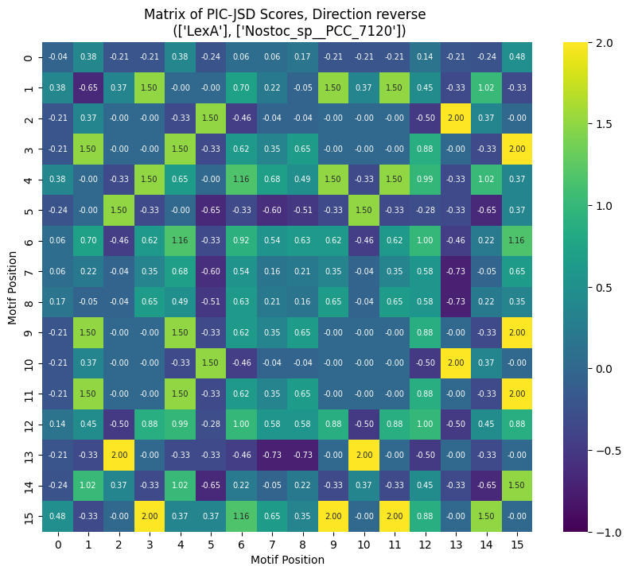 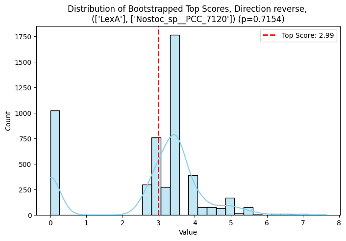 |  |  |
| **Q92PW3** | Direct | 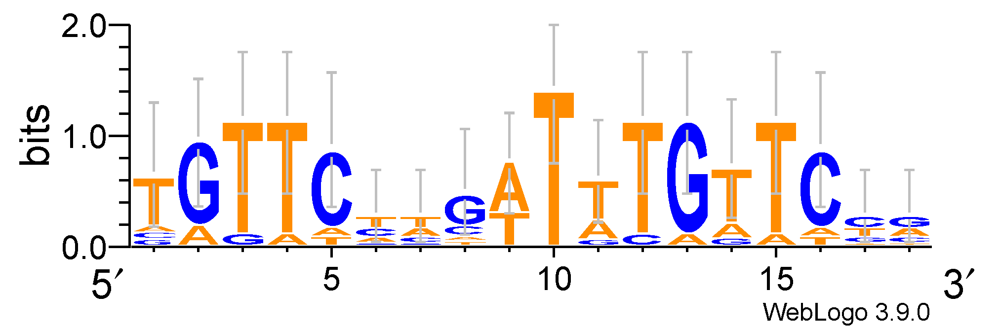 | <table border="1" class="dataframe">  <thead>    <tr style="text-align: right;">      <th>score</th>      <th>p_value</th>      <th>group1</th>      <th>group2</th>    </tr>  </thead>  <tbody>    <tr>      <td>2.609076</td>      <td>5.2340e-01</td>      <td>TC</td>      <td>TC</td>    </tr>  </tbody></table> | 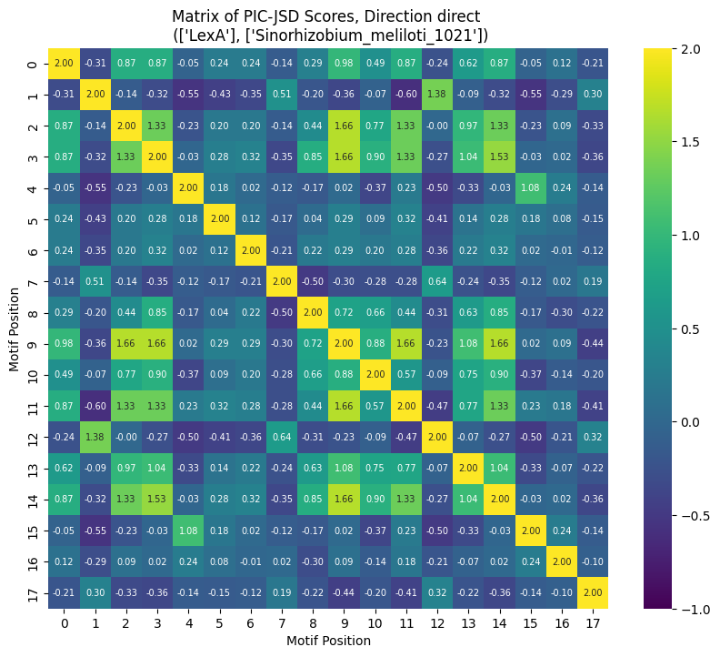 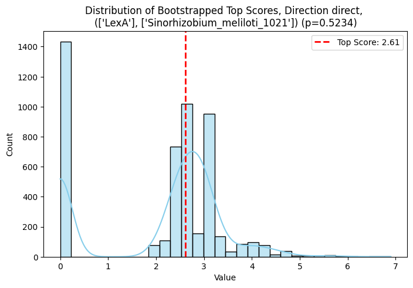 |  | Inconsistent sequence lengths {18, 19} in 'CollecTF_FASTA/LexA/Sinorhizobium_meliloti_1021/TF_LexA_Q92PW3.fas'; trimmed all to 18bp. |
| **Q92PW3** | Reverse |  | <table border="1" class="dataframe">  <thead>    <tr style="text-align: right;">      <th>score</th>      <th>p_value</th>      <th>group1</th>      <th>group2</th>    </tr>  </thead>  <tbody>    <tr>      <td>1.630297</td>      <td>3.9380e-01</td>      <td>GA</td>      <td>CT</td>    </tr>    <tr>      <td>1.630297</td>      <td>3.9380e-01</td>      <td>TC</td>      <td>AG</td>    </tr>  </tbody></table> | 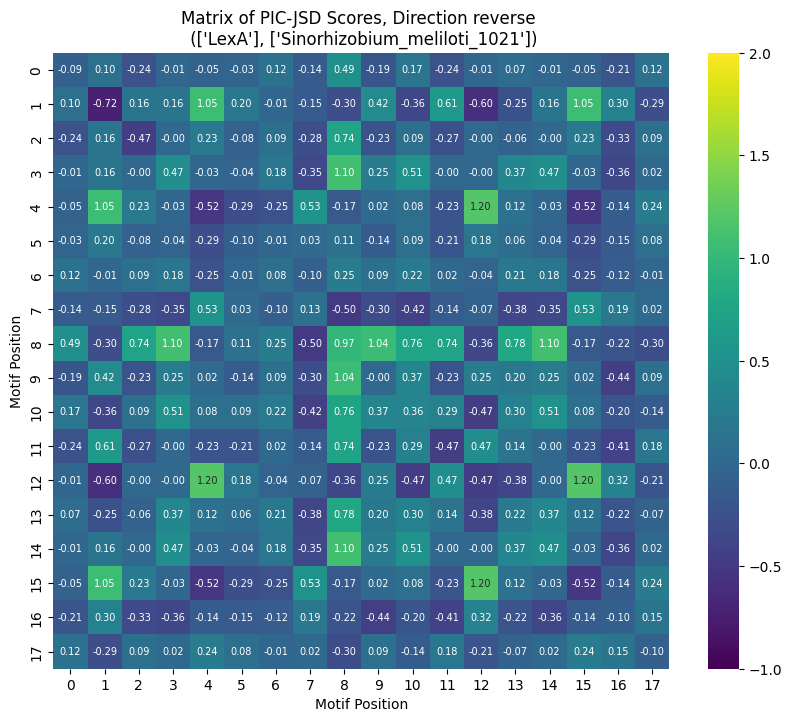 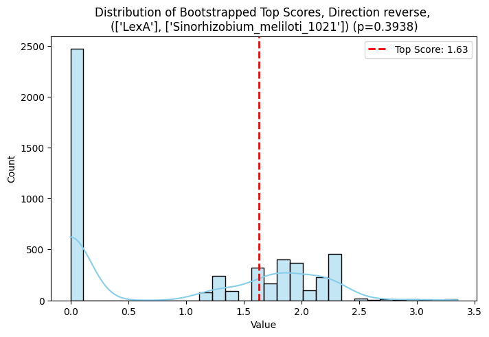 |  | [(['LexA'], ['Sinorhizobium_meliloti_1021'])]: No diagonal candidates were possible at the selected 80% threshold for CollecTF_FASTA/LexA/Sinorhizobium_meliloti_1021/TF_LexA_Q92PW3.fas, automatically reduced to 55%, at value 0.5095314288252772.   Inconsistent sequence lengths {18, 19} in 'CollecTF_FASTA/LexA/Sinorhizobium_meliloti_1021/TF_LexA_Q92PW3.fas'; trimmed all to 18bp. |
| **Q9A724** | Direct | 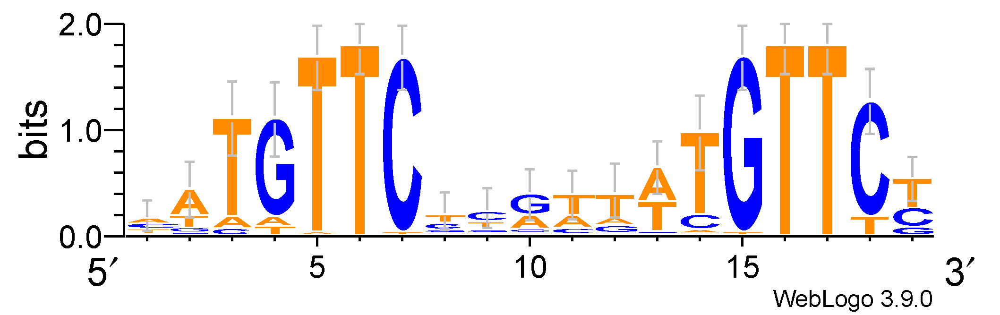 | <table border="1" class="dataframe">  <thead>    <tr style="text-align: right;">      <th>score</th>      <th>p_value</th>      <th>group1</th>      <th>group2</th>    </tr>  </thead>  <tbody>    <tr>      <td>7.888383</td>      <td>0.0000e+00</td>      <td>TGTTC</td>      <td>TGTTC</td>    </tr>  </tbody></table> | 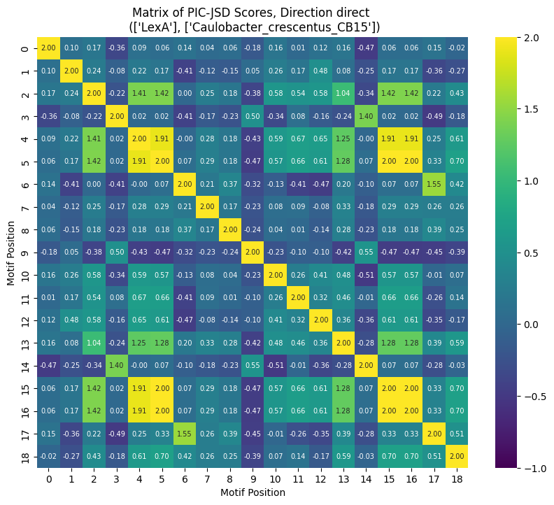 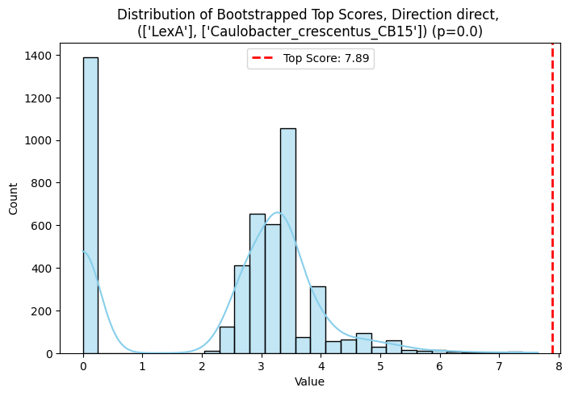 |  |  |
| **Q9A724** | Reverse |  | <table border="1" class="dataframe">  <thead>    <tr style="text-align: right;">      <th>score</th>      <th>p_value</th>      <th>group1</th>      <th>group2</th>    </tr>  </thead>  <tbody>    <tr>      <td>1.229569</td>      <td>6.9480e-01</td>      <td>AT</td>      <td>TA</td>    </tr>  </tbody></table> | 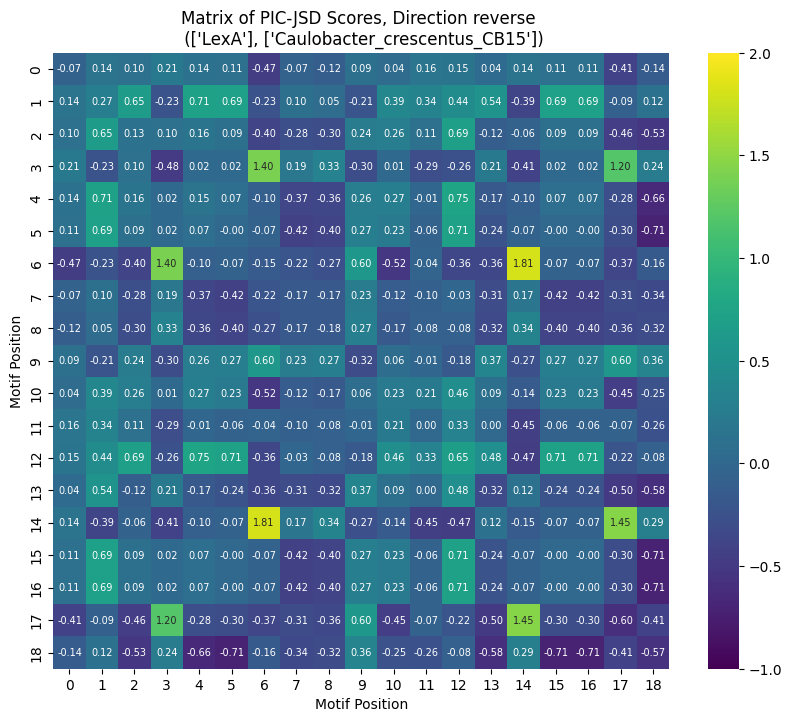 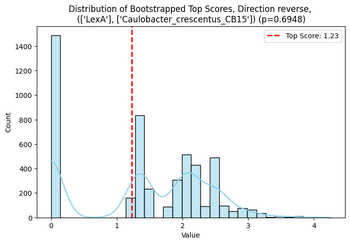 |  | [(['LexA'], ['Caulobacter_crescentus_CB15'])]: No diagonal candidates were possible at the selected 80% threshold for CollecTF_FASTA/LexA/Caulobacter_crescentus_CB15/TF_LexA_Q9A724.fas, automatically reduced to 55%, at value 0.5355375679929383. |
| **Q9ZFA4** | Direct | 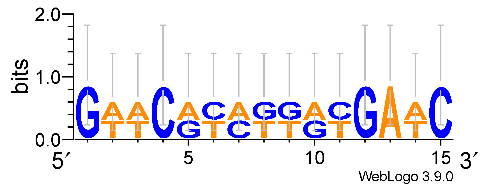 | <table border="1" class="dataframe">  <thead>    <tr style="text-align: right;">      <th>score</th>      <th>p_value</th>      <th>group1</th>      <th>group2</th>    </tr>  </thead>  <tbody>    <tr>      <td>2.0</td>      <td>4.1480e-01</td>      <td>AC</td>      <td>AC</td>    </tr>    <tr>      <td>3.0</td>      <td>2.2160e-01</td>      <td>AC</td>      <td>AC</td>    </tr>  </tbody></table> | 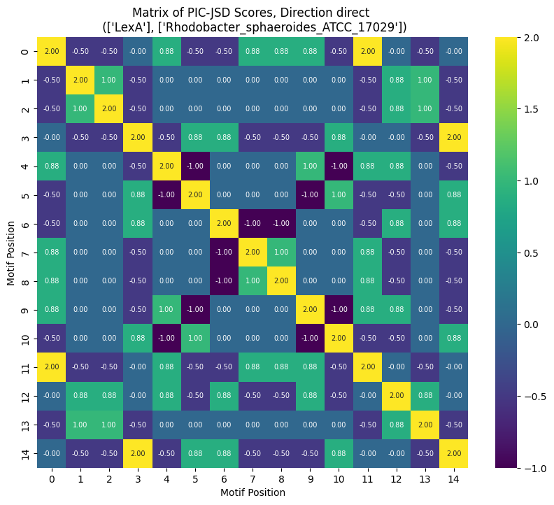 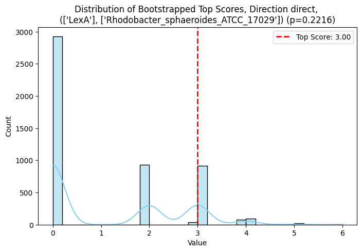 | (2 seq) | [(['LexA'], ['Rhodobacter_sphaeroides_ATCC_17029'])]: No diagonal candidates were possible at the selected 80% threshold for CollecTF_FASTA/LexA/Rhodobacter_sphaeroides_ATCC_17029/TF_LexA_Q9ZFA4.fas, automatically reduced to 70%, at value 0.9999999932676049. |
| **Q9ZFA4** | Reverse |  | <table border="1" class="dataframe">  <thead>    <tr style="text-align: right;">      <th>score</th>      <th>p_value</th>      <th>group1</th>      <th>group2</th>    </tr>  </thead>  <tbody>    <tr>      <td>5.0</td>      <td>2.1000e-02</td>      <td>GACG</td>      <td>ACAC</td>    </tr>    <tr>      <td>3.0</td>      <td>5.3200e-01</td>      <td>AC</td>      <td>AG</td>    </tr>    <tr>      <td>3.0</td>      <td>5.3200e-01</td>      <td>AC</td>      <td>AG</td>    </tr>  </tbody></table> | 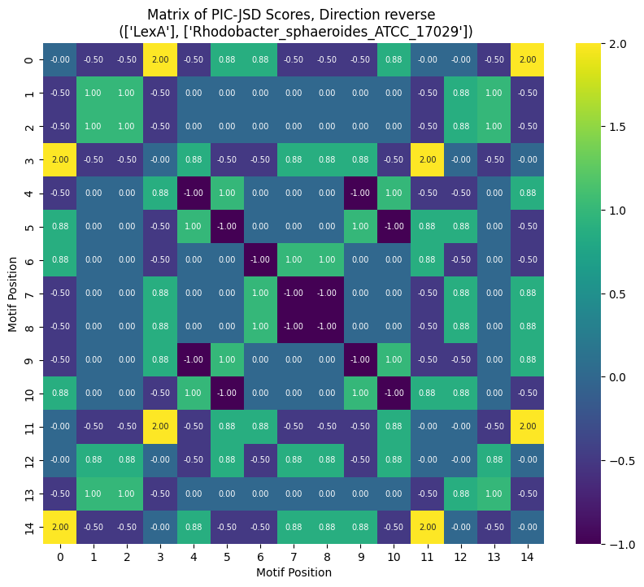 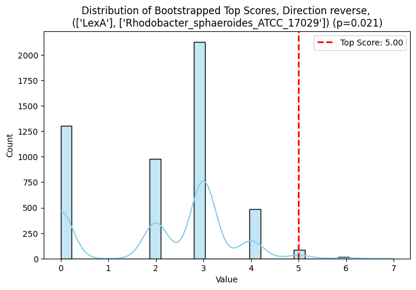 | (2 seq) | [(['LexA'], ['Rhodobacter_sphaeroides_ATCC_17029'])]: No diagonal candidates were possible at the selected 80% threshold for CollecTF_FASTA/LexA/Rhodobacter_sphaeroides_ATCC_17029/TF_LexA_Q9ZFA4.fas, automatically reduced to 75%, at value 0.9999999932676049. |
| **A0A0B6P4W3** | Direct | 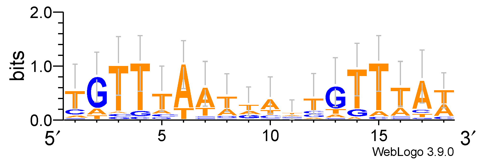 | <table border="1" class="dataframe">  <thead>    <tr style="text-align: right;">      <th>score</th>      <th>p_value</th>      <th>group1</th>      <th>group2</th>    </tr>  </thead>  <tbody>    <tr>      <td>2.025248</td>      <td>1.0800e-01</td>      <td>TT</td>      <td>TT</td>    </tr>    <tr>      <td>1.733280</td>      <td>3.8160e-01</td>      <td>TT</td>      <td>TT</td>    </tr>  </tbody></table> | 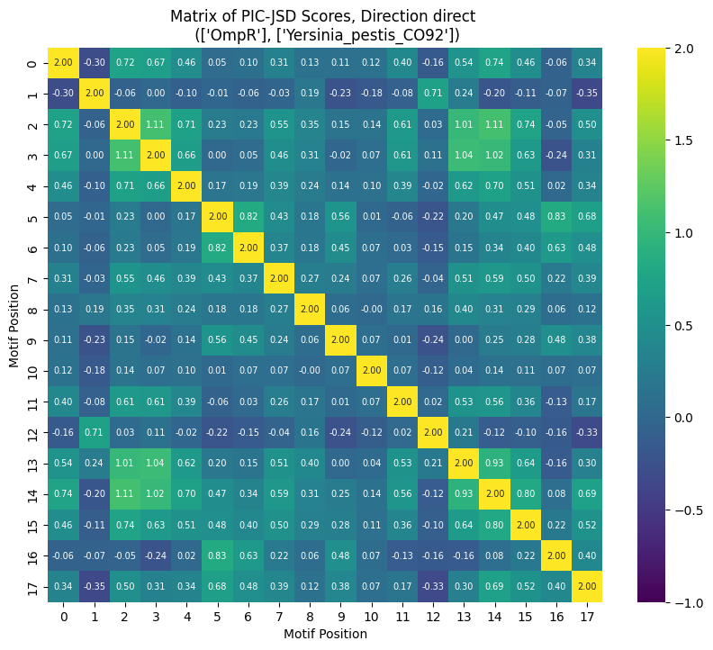 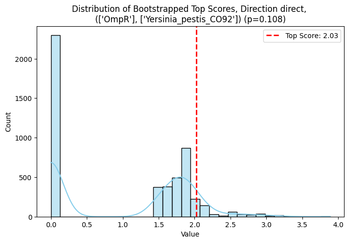 | (Yersinia pestis KIM10+) |  |
| **A0A0B6P4W3** | Reverse |  | <table border="1" class="dataframe">  <thead>    <tr style="text-align: right;">      <th>score</th>      <th>p_value</th>      <th>group1</th>      <th>group2</th>    </tr>  </thead>  <tbody>    <tr>      <td>1.613594</td>      <td>3.8160e-01</td>      <td>AA</td>      <td>TT</td>    </tr>    <tr>      <td>1.267325</td>      <td>6.2120e-01</td>      <td>AA</td>      <td>TT</td>    </tr>    <tr>      <td>1.803419</td>      <td>1.6740e-01</td>      <td>TT</td>      <td>AA</td>    </tr>    <tr>      <td>1.621926</td>      <td>3.7400e-01</td>      <td>TT</td>      <td>AA</td>    </tr>  </tbody></table> | 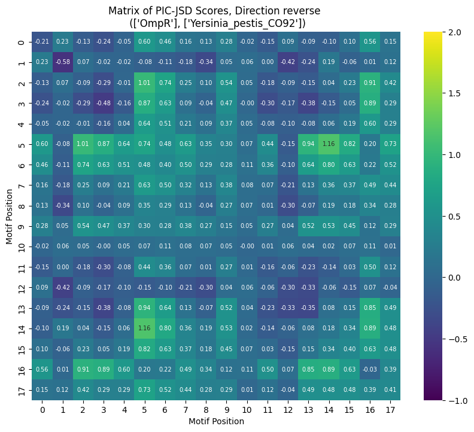 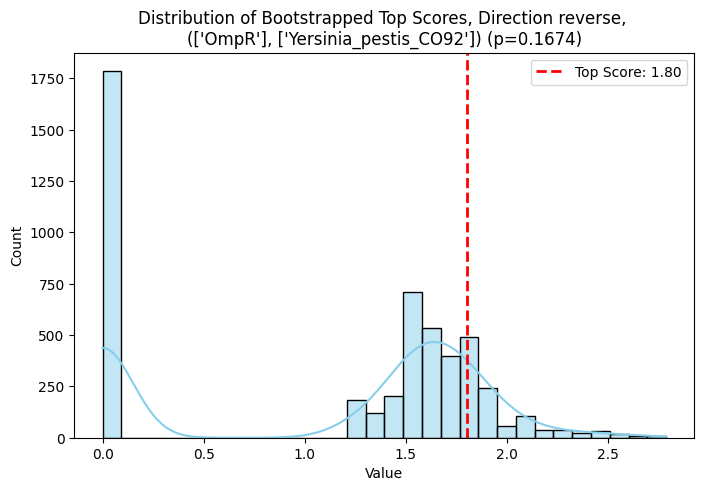 | (Yersinia pestis KIM10+) |  |
| **A4FQD5** | Direct | 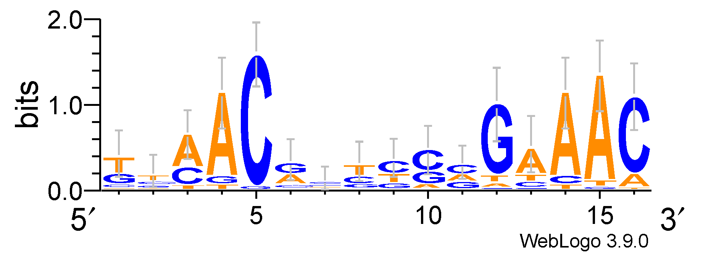 | <table border="1" class="dataframe">  <thead>    <tr style="text-align: right;">      <th>score</th>      <th>p_value</th>      <th>group1</th>      <th>group2</th>    </tr>  </thead>  <tbody>    <tr>      <td>3.485881</td>      <td>1.2000e-03</td>      <td>AAC</td>      <td>AAC</td>    </tr>    <tr>      <td>1.979654</td>      <td>1.8000e-01</td>      <td>AA</td>      <td>AA</td>    </tr>  </tbody></table> | 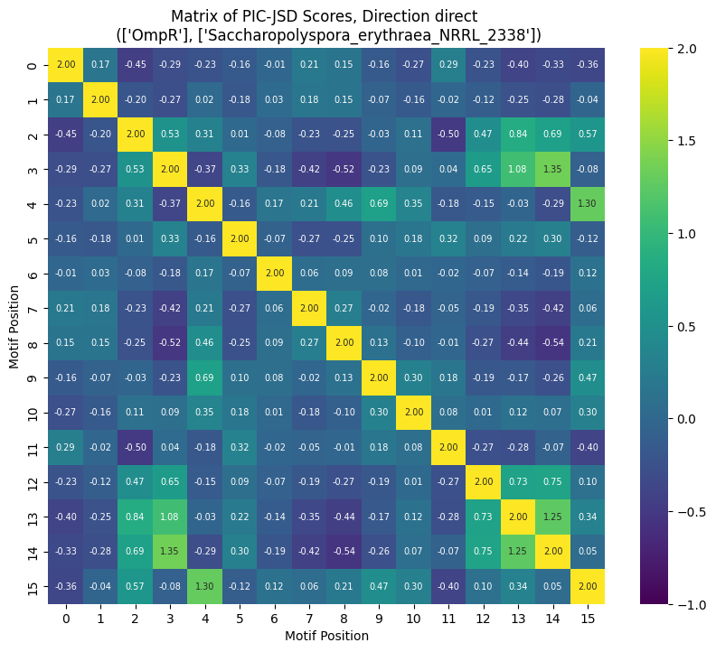 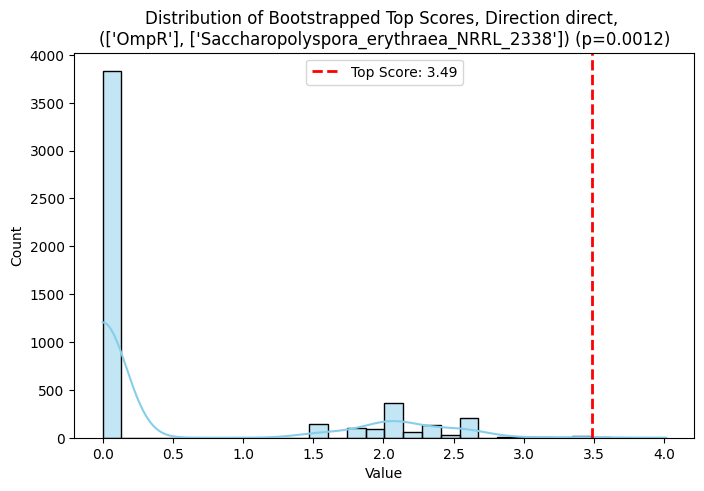 |  |  |
| **A4FQD5** | Reverse |  | <table border="1" class="dataframe">  <thead>    <tr style="text-align: right;">      <th>score</th>      <th>p_value</th>      <th>group1</th>      <th>group2</th>    </tr>  </thead>  <tbody>    <tr>      <td>0.653558</td>      <td>8.8920e-01</td>      <td>CC</td>      <td>GC</td>    </tr>    <tr>      <td>0.651456</td>      <td>8.9540e-01</td>      <td>AC</td>      <td>TT</td>    </tr>  </tbody></table> | 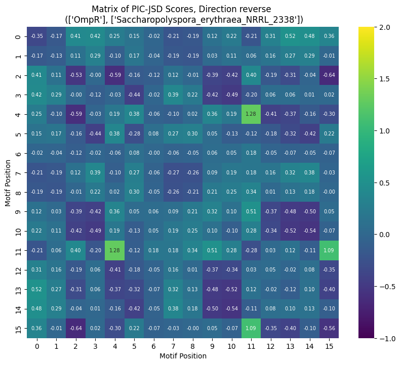 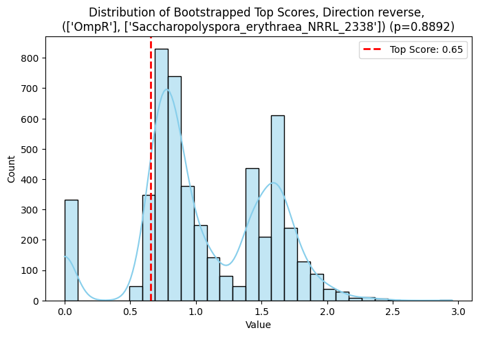 |  | [(['OmpR'], ['Saccharopolyspora_erythraea_NRRL_2338'])]: No diagonal candidates were possible at the selected 80% threshold for CollecTF_FASTA/OmpR/Saccharopolyspora_erythraea_NRRL_2338/TF_GlnR_A4FQD5.fas, automatically reduced to 45%, at value 0.28054872273215165. |
| **P0A9Q1** | Direct | 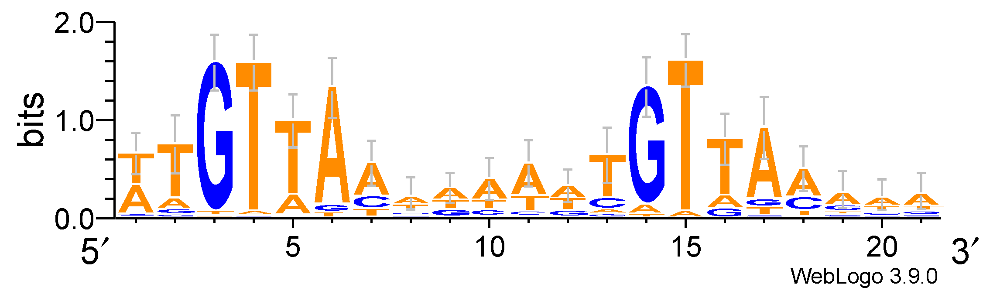 | <table border="1" class="dataframe">  <thead>    <tr style="text-align: right;">      <th>score</th>      <th>p_value</th>      <th>group1</th>      <th>group2</th>    </tr>  </thead>  <tbody>    <tr>      <td>5.201746</td>      <td>0.0000e+00</td>      <td>GTTA</td>      <td>GTTA</td>    </tr>    <tr>      <td>1.579132</td>      <td>6.1700e-01</td>      <td>TT</td>      <td>TT</td>    </tr>    <tr>      <td>1.510582</td>      <td>6.1940e-01</td>      <td>TT</td>      <td>TT</td>    </tr>  </tbody></table> | 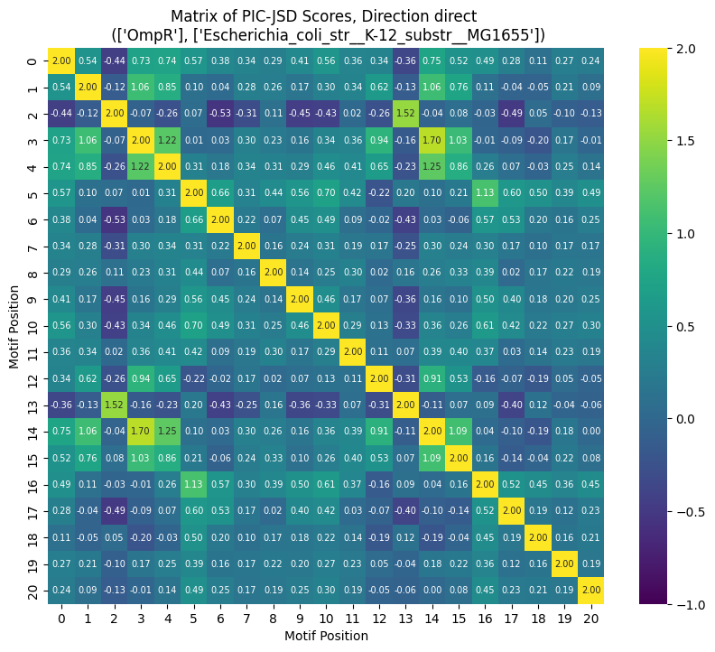 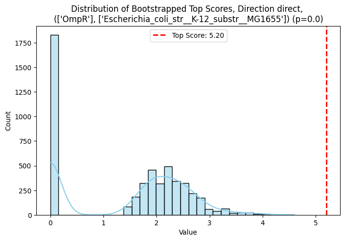 |  |  |
| **P0A9Q1** | Reverse |  | <table border="1" class="dataframe">  <thead>    <tr style="text-align: right;">      <th>score</th>      <th>p_value</th>      <th>group1</th>      <th>group2</th>    </tr>  </thead>  <tbody>    <tr>      <td>3.312507</td>      <td>1.2000e-03</td>      <td>TTAA</td>      <td>AATT</td>    </tr>    <tr>      <td>1.878841</td>      <td>3.5420e-01</td>      <td>AA</td>      <td>TT</td>    </tr>    <tr>      <td>1.470778</td>      <td>6.7280e-01</td>      <td>AA</td>      <td>TT</td>    </tr>  </tbody></table> | 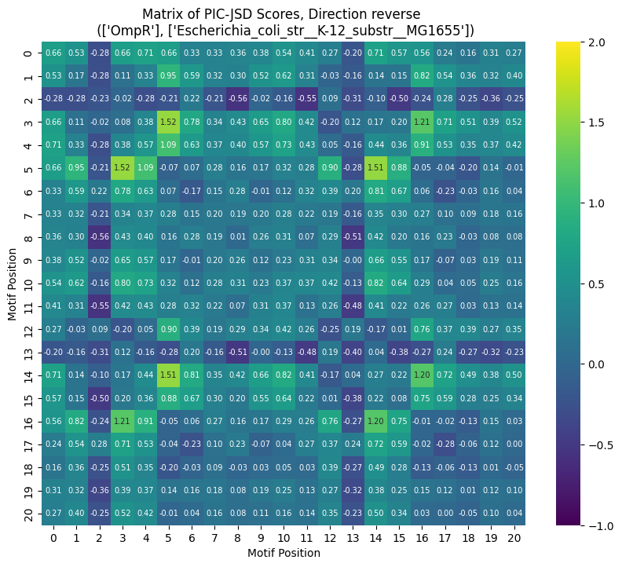 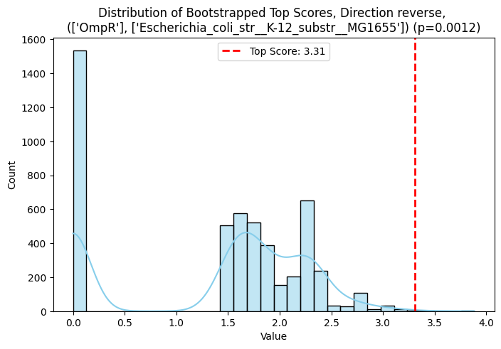 |  |  |
| **P0CAW8** | Direct | 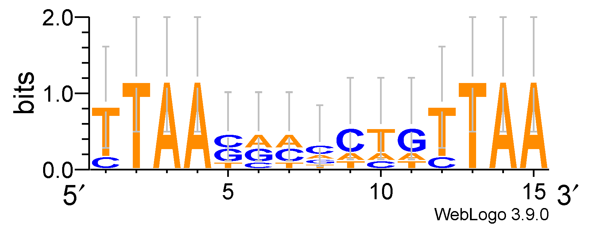 | <table border="1" class="dataframe">  <thead>    <tr style="text-align: right;">      <th>score</th>      <th>p_value</th>      <th>group1</th>      <th>group2</th>    </tr>  </thead>  <tbody>    <tr>      <td>7.278072</td>      <td>1.8000e-03</td>      <td>TTAA</td>      <td>TTAA</td>    </tr>  </tbody></table> | 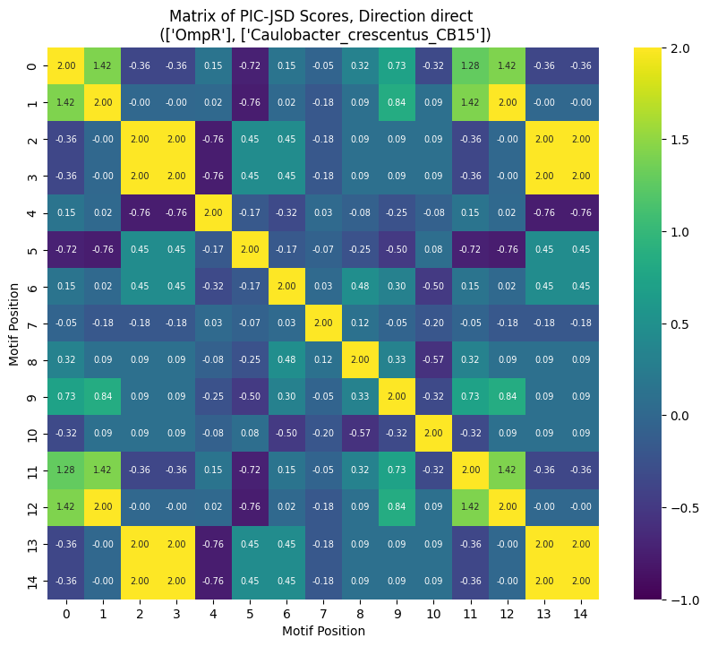 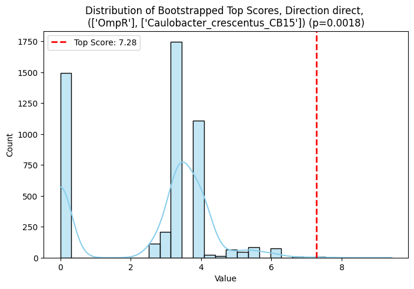 | ( Caulobacter crescentus NA1000) | Inconsistent sequence lengths {16, 15} in 'CollecTF_FASTA/OmpR/Caulobacter_crescentus_CB15/TF_CtrA_P0CAW8.fas'; trimmed all to 15bp. |
| **P0CAW8** | Reverse |  | <table border="1" class="dataframe">  <thead>    <tr style="text-align: right;">      <th>score</th>      <th>p_value</th>      <th>group1</th>      <th>group2</th>    </tr>  </thead>  <tbody>    <tr>      <td>6.845946</td>      <td>6.0000e-04</td>      <td>TTAA</td>      <td>AATT</td>    </tr>    <tr>      <td>3.422973</td>      <td>6.9580e-01</td>      <td>AA</td>      <td>TT</td>    </tr>    <tr>      <td>3.422973</td>      <td>6.9580e-01</td>      <td>AA</td>      <td>TT</td>    </tr>  </tbody></table> | 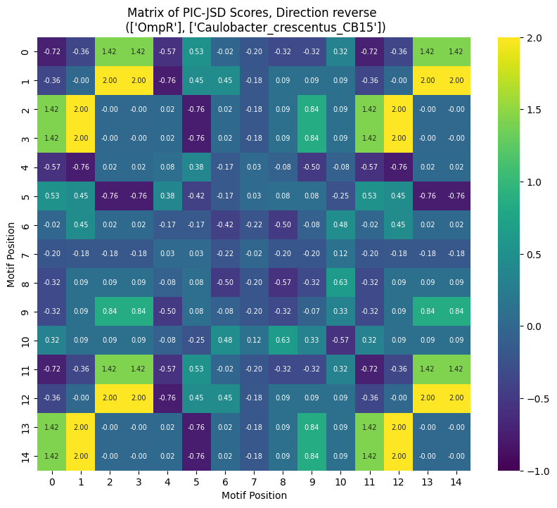 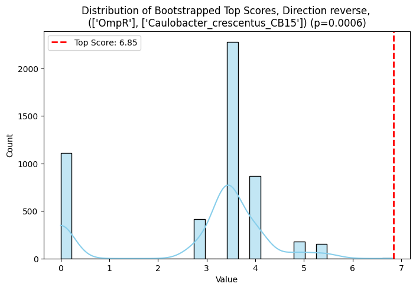 | ( Caulobacter crescentus NA1000) | Inconsistent sequence lengths {16, 15} in 'CollecTF_FASTA/OmpR/Caulobacter_crescentus_CB15/TF_CtrA_P0CAW8.fas'; trimmed all to 15bp. |
| **P0DM78** | Direct | 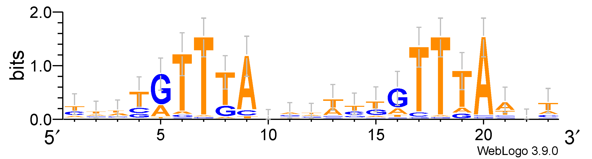 | <table border="1" class="dataframe">  <thead>    <tr style="text-align: right;">      <th>score</th>      <th>p_value</th>      <th>group1</th>      <th>group2</th>    </tr>  </thead>  <tbody>    <tr>      <td>5.945906</td>      <td>0.0000e+00</td>      <td>GTTTA</td>      <td>GTTTA</td>    </tr>    <tr>      <td>2.583122</td>      <td>2.5640e-01</td>      <td>TT</td>      <td>TT</td>    </tr>    <tr>      <td>2.612901</td>      <td>2.3060e-01</td>      <td>TT</td>      <td>TT</td>    </tr>    <tr>      <td>2.654528</td>      <td>2.1140e-01</td>      <td>TT</td>      <td>TT</td>    </tr>    <tr>      <td>2.684308</td>      <td>1.8320e-01</td>      <td>TT</td>      <td>TT</td>    </tr>  </tbody></table> | 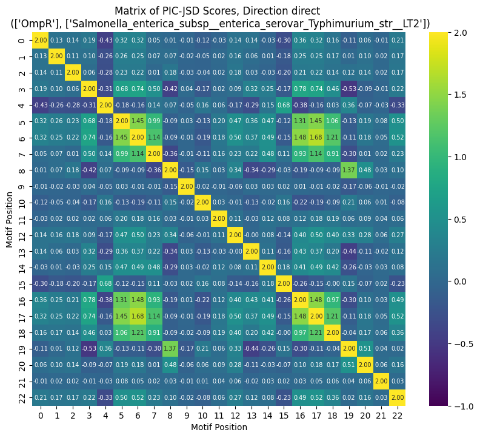 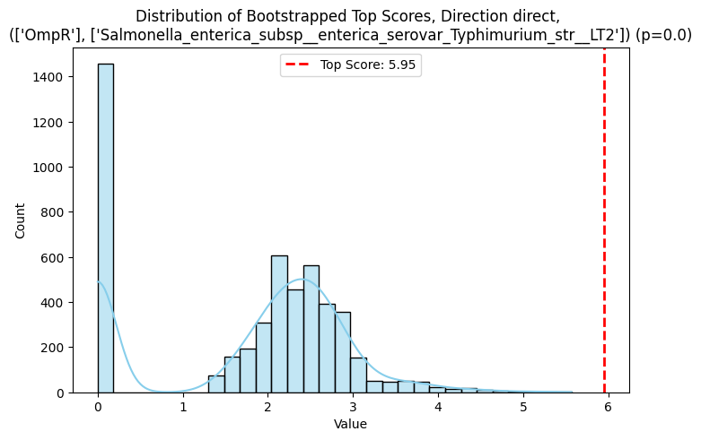 |  |  |
| **P0DM78** | Reverse |  | <table border="1" class="dataframe">  <thead>    <tr style="text-align: right;">      <th>score</th>      <th>p_value</th>      <th>group1</th>      <th>group2</th>    </tr>  </thead>  <tbody>    <tr>      <td>2.165651</td>      <td>2.1380e-01</td>      <td>TA</td>      <td>AT</td>    </tr>  </tbody></table> | 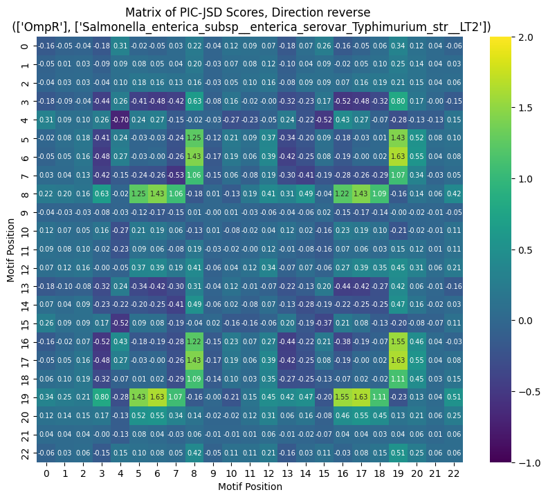 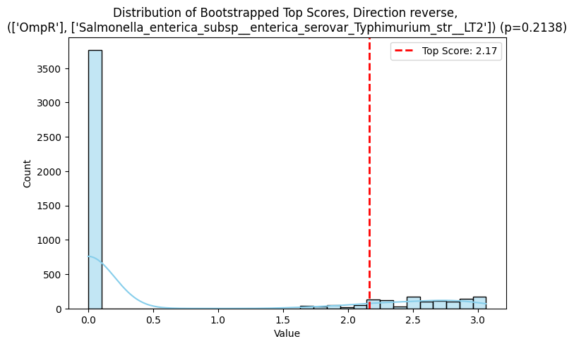 |  |  |
| **P23836** | Direct | 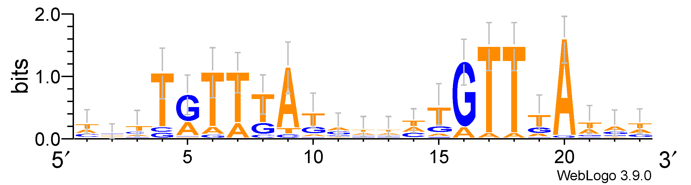 | <table border="1" class="dataframe">  <thead>    <tr style="text-align: right;">      <th>score</th>      <th>p_value</th>      <th>group1</th>      <th>group2</th>    </tr>  </thead>  <tbody>    <tr>      <td>4.274988</td>      <td>2.0000e-03</td>      <td>TGTT</td>      <td>TGTT</td>    </tr>    <tr>      <td>2.125920</td>      <td>3.5160e-01</td>      <td>TT</td>      <td>TT</td>    </tr>  </tbody></table> | 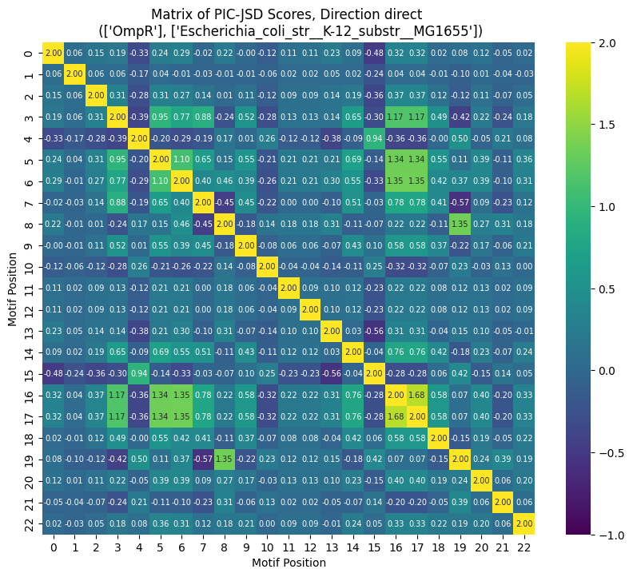 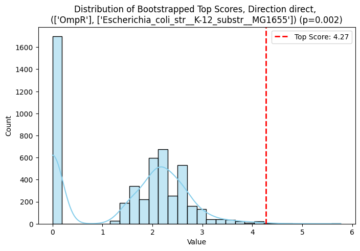 | (Escherichia coli str. K-12 substr. W3110) |  |
| **P23836** | Reverse |  | <table border="1" class="dataframe">  <thead>    <tr style="text-align: right;">      <th>score</th>      <th>p_value</th>      <th>group1</th>      <th>group2</th>    </tr>  </thead>  <tbody>    <tr>      <td>1.539139</td>      <td>3.7140e-01</td>      <td>TA</td>      <td>AT</td>    </tr>  </tbody></table> | 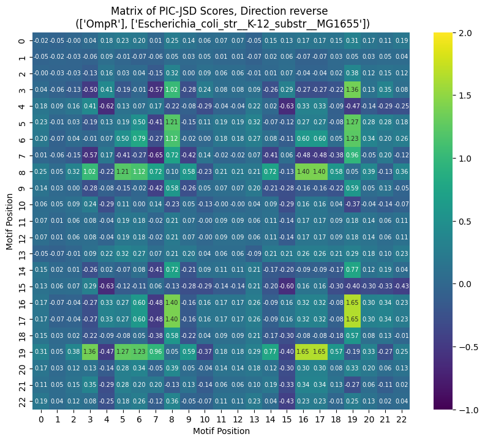 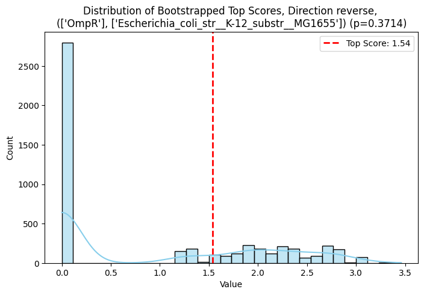 | (Escherichia coli str. K-12 substr. W3110) |  |
| **Q3K4G1** | Direct | 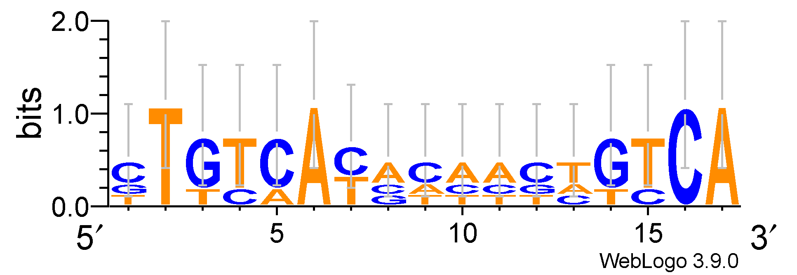 | <table border="1" class="dataframe">  <thead>    <tr style="text-align: right;">      <th>score</th>      <th>p_value</th>      <th>group1</th>      <th>group2</th>    </tr>  </thead>  <tbody>    <tr>      <td>5.695954</td>      <td>0.0000e+00</td>      <td>GTCA</td>      <td>GTCA</td>    </tr>  </tbody></table> | 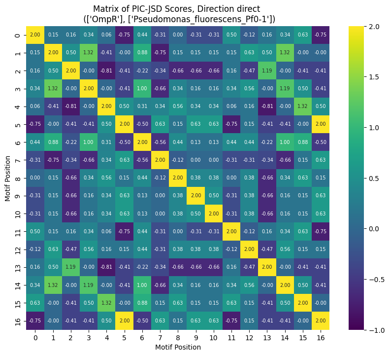 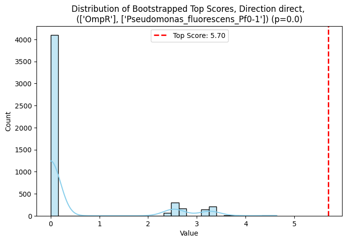 |  |  |
| **Q3K4G1** | Reverse |  | <table border="1" class="dataframe">  <thead>    <tr style="text-align: right;">      <th>score</th>      <th>p_value</th>      <th>group1</th>      <th>group2</th>    </tr>  </thead>  <tbody>    <tr>      <td>3.188722</td>      <td>1.7640e-01</td>      <td>CA</td>      <td>GT</td>    </tr>    <tr>      <td>3.318510</td>      <td>1.2460e-01</td>      <td>CA</td>      <td>GT</td>    </tr>  </tbody></table> | 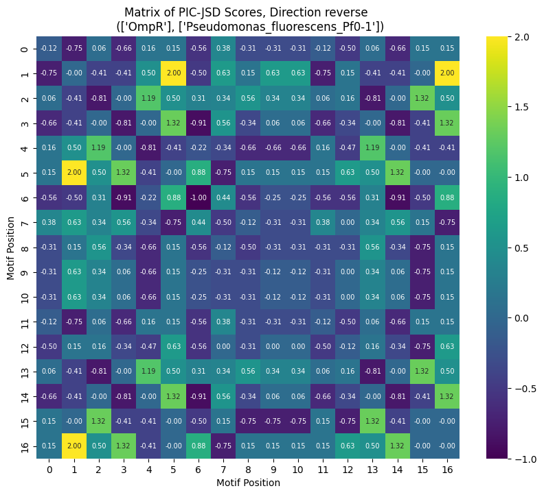 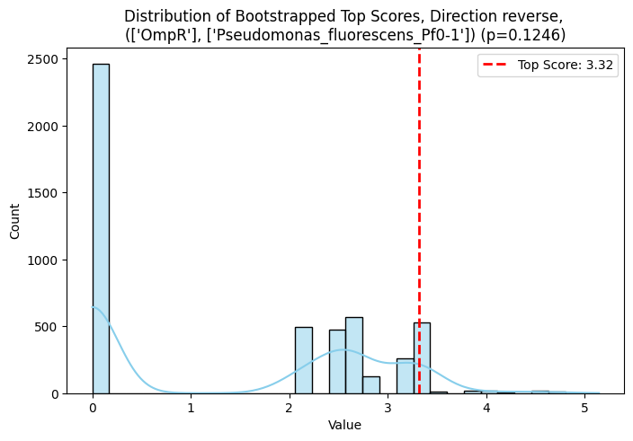 |  |  |
| **Q7CFX0** | Direct | 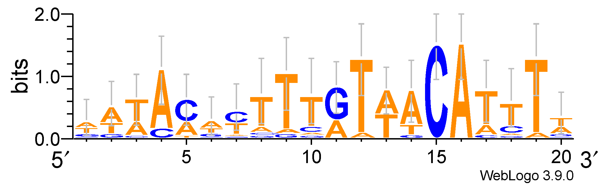 | <table border="1" class="dataframe">  <thead>    <tr style="text-align: right;">      <th>score</th>      <th>p_value</th>      <th>group1</th>      <th>group2</th>    </tr>  </thead>  <tbody>    <tr>      <td>1.723222</td>      <td>7.8400e-01</td>      <td>TT</td>      <td>TT</td>    </tr>  </tbody></table> | 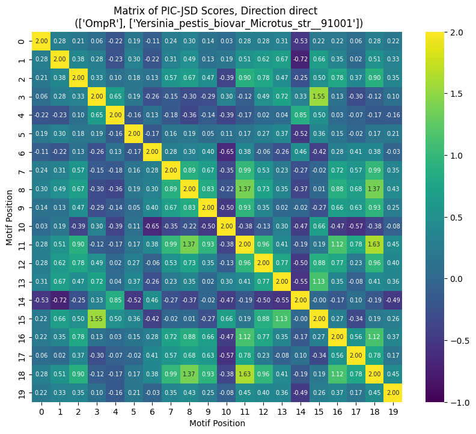 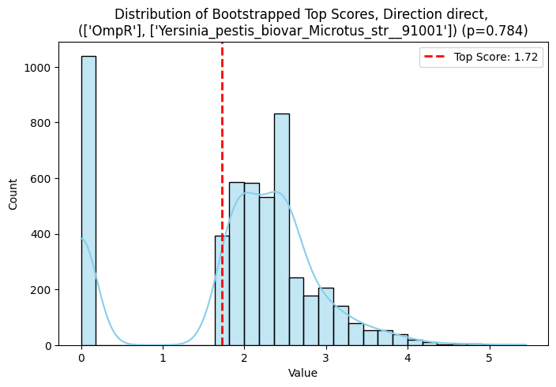 |  | [(['OmpR'], ['Yersinia_pestis_biovar_Microtus_str__91001'])]: No diagonal candidates were possible at the selected 80% threshold for CollecTF_FASTA/OmpR/Yersinia_pestis_biovar_Microtus_str__91001/TF_OmpR_Q7CFX0.fas, automatically reduced to 75%, at value 0.8336571093936151. |
| **Q7CFX0** | Reverse |  | <table border="1" class="dataframe">  <thead>    <tr style="text-align: right;">      <th>score</th>      <th>p_value</th>      <th>group1</th>      <th>group2</th>    </tr>  </thead>  <tbody>    <tr>      <td>3.271546</td>      <td>1.9000e-02</td>      <td>ACA</td>      <td>TGT</td>    </tr>  </tbody></table> | 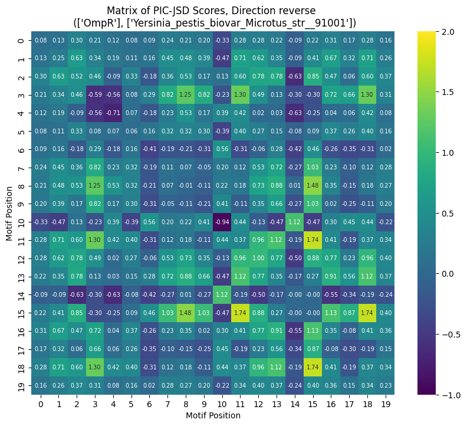 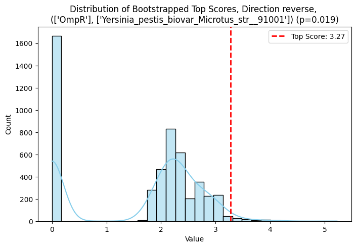 |  |  |
| **Q88PE9** | Direct | 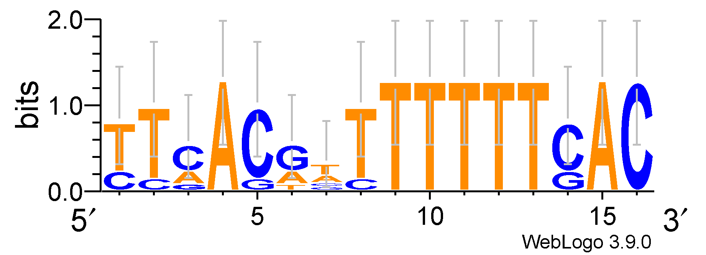 | <table border="1" class="dataframe">  <thead>    <tr style="text-align: right;">      <th>score</th>      <th>p_value</th>      <th>group1</th>      <th>group2</th>    </tr>  </thead>  <tbody>    <tr>      <td>8.0</td>      <td>4.0000e-03</td>      <td>TTTT</td>      <td>TTTT</td>    </tr>    <tr>      <td>6.0</td>      <td>4.2600e-02</td>      <td>TTT</td>      <td>TTT</td>    </tr>    <tr>      <td>4.0</td>      <td>4.9200e-01</td>      <td>TT</td>      <td>TT</td>    </tr>  </tbody></table> | 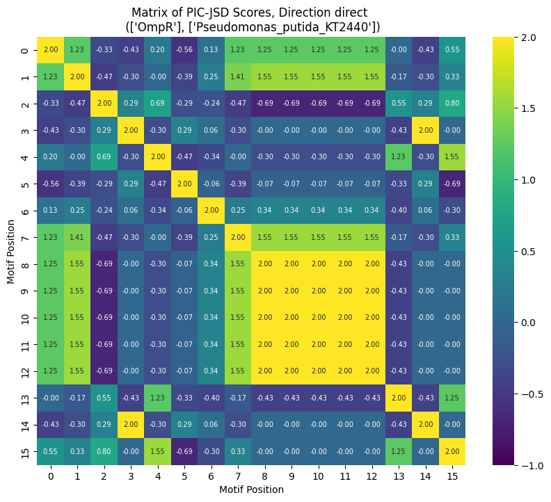 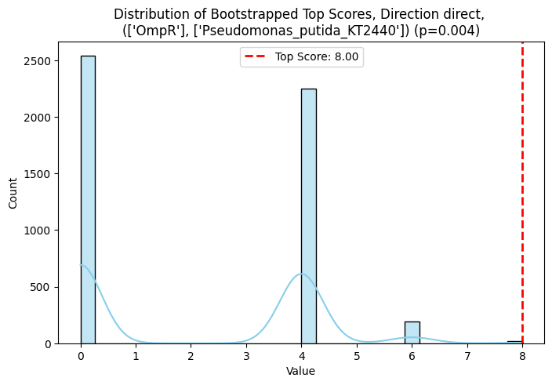 | (https://pmc.ncbi.nlm.nih.gov/articles/PMC2689224/) |  |
| **Q88PE9** | Reverse |  | No candidates found | 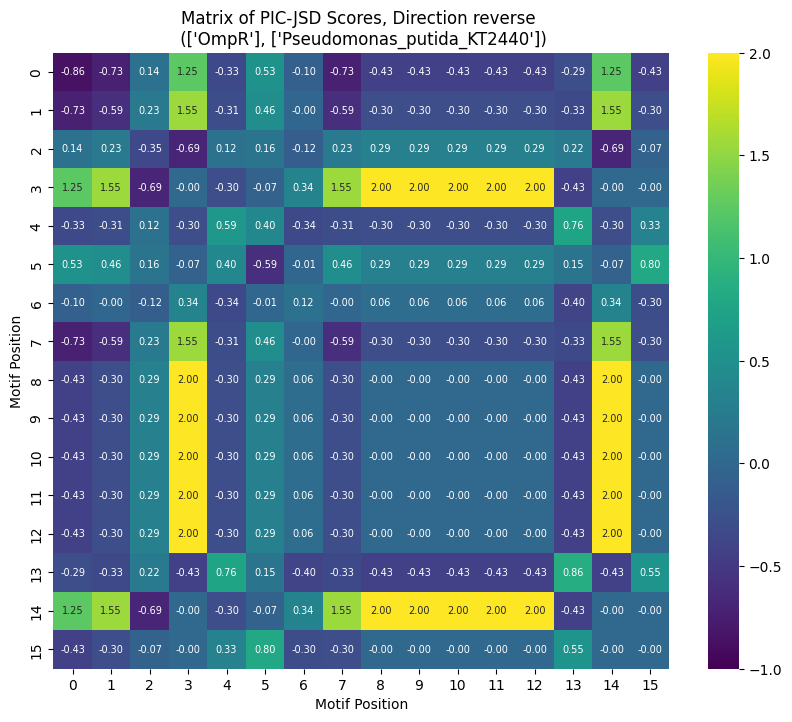 No Bootstrap | (https://pmc.ncbi.nlm.nih.gov/articles/PMC2689224/) | [DETECT_PATTERNS] - (['OmpR'], ['Pseudomonas_putida_KT2440']): Exhausted all fallbacks down to 25th percentile. No diagonal candidates >=2 positions found at user-specified 80% |
| **Q8EAB9** | Direct | 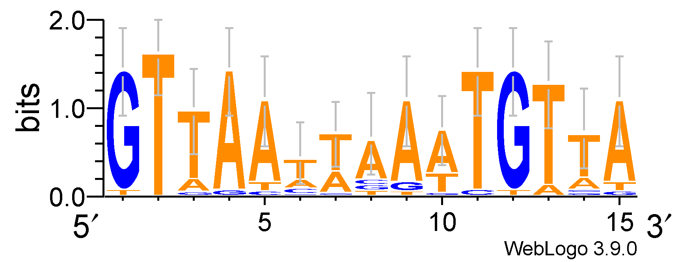 | <table border="1" class="dataframe">  <thead>    <tr style="text-align: right;">      <th>score</th>      <th>p_value</th>      <th>group1</th>      <th>group2</th>    </tr>  </thead>  <tbody>    <tr>      <td>3.375307</td>      <td>1.0480e-01</td>      <td>GT</td>      <td>GT</td>    </tr>  </tbody></table> | 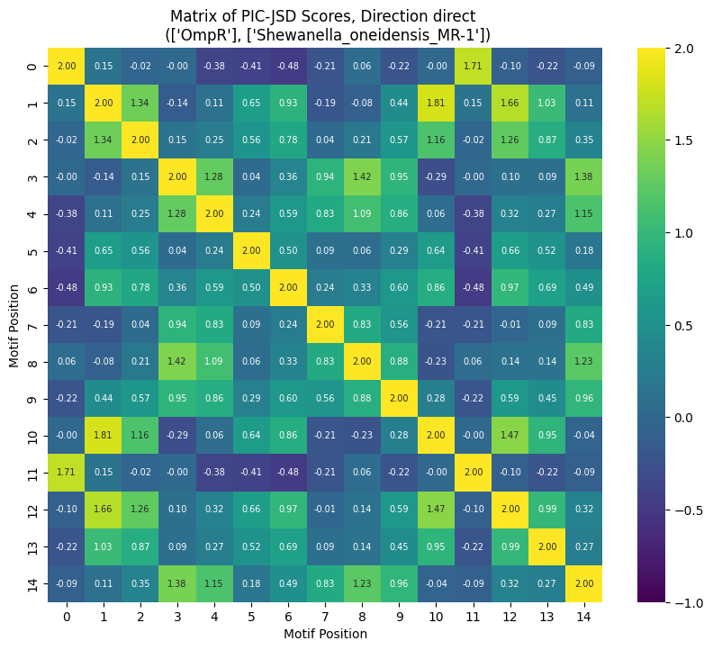 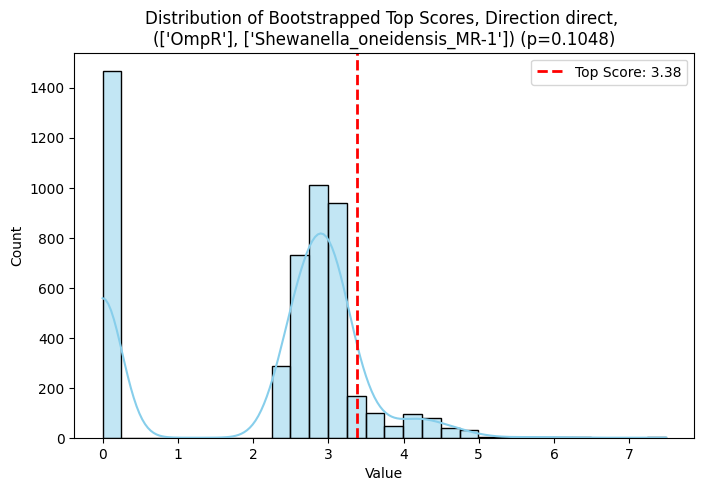 |  |  |
| **Q8EAB9** | Reverse |  | <table border="1" class="dataframe">  <thead>    <tr style="text-align: right;">      <th>score</th>      <th>p_value</th>      <th>group1</th>      <th>group2</th>    </tr>  </thead>  <tbody>    <tr>      <td>2.622849</td>      <td>5.8060e-01</td>      <td>AA</td>      <td>TT</td>    </tr>  </tbody></table> | 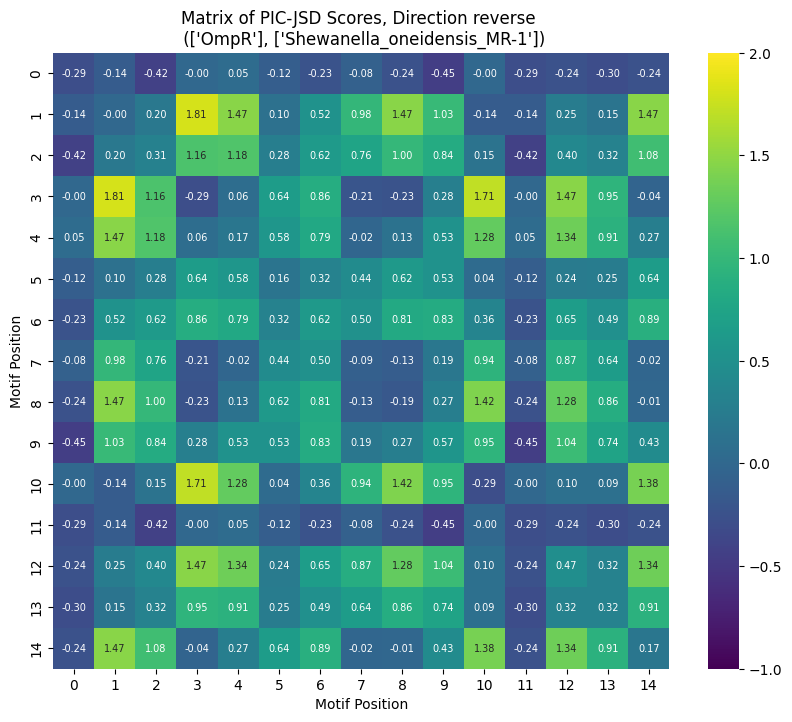 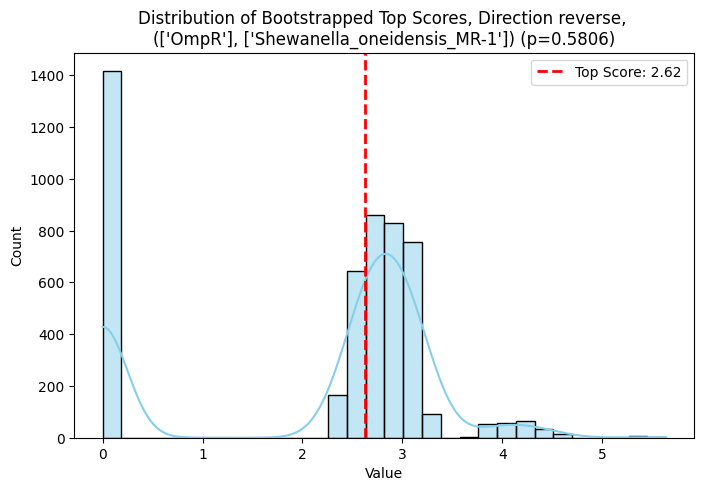 |  |  |
| **Q8EHJ3** | Direct | 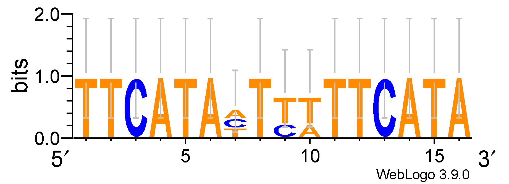 | <table border="1" class="dataframe">  <thead>    <tr style="text-align: right;">      <th>score</th>      <th>p_value</th>      <th>group1</th>      <th>group2</th>    </tr>  </thead>  <tbody>    <tr>      <td>12.0</td>      <td>2.0000e-03</td>      <td>TTCATA</td>      <td>TTCATA</td>    </tr>  </tbody></table> | 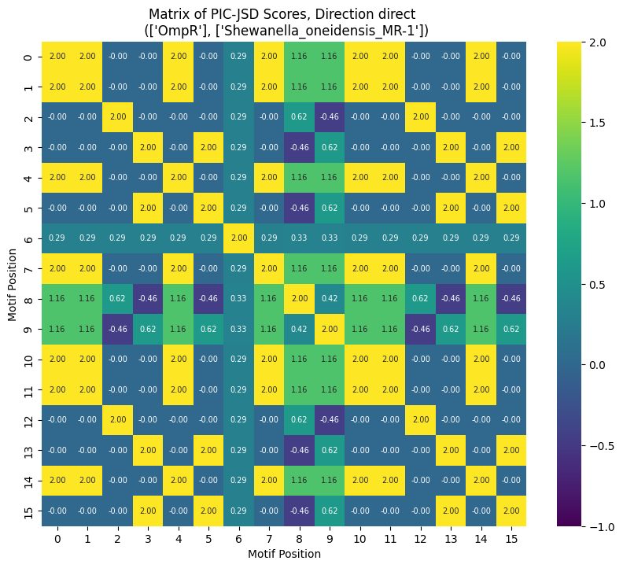 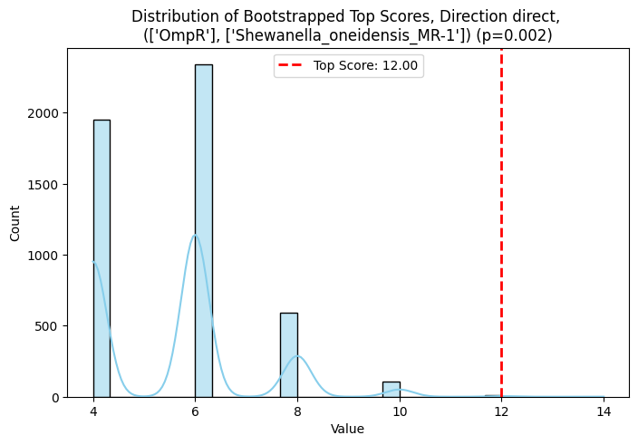 |  |  |
| **Q8EHJ3** | Reverse |  | <table border="1" class="dataframe">  <thead>    <tr style="text-align: right;">      <th>score</th>      <th>p_value</th>      <th>group1</th>      <th>group2</th>    </tr>  </thead>  <tbody>    <tr>      <td>4.0</td>      <td>9.8240e-01</td>      <td>AT</td>      <td>TA</td>    </tr>    <tr>      <td>4.0</td>      <td>9.8240e-01</td>      <td>TA</td>      <td>AT</td>    </tr>  </tbody></table> | 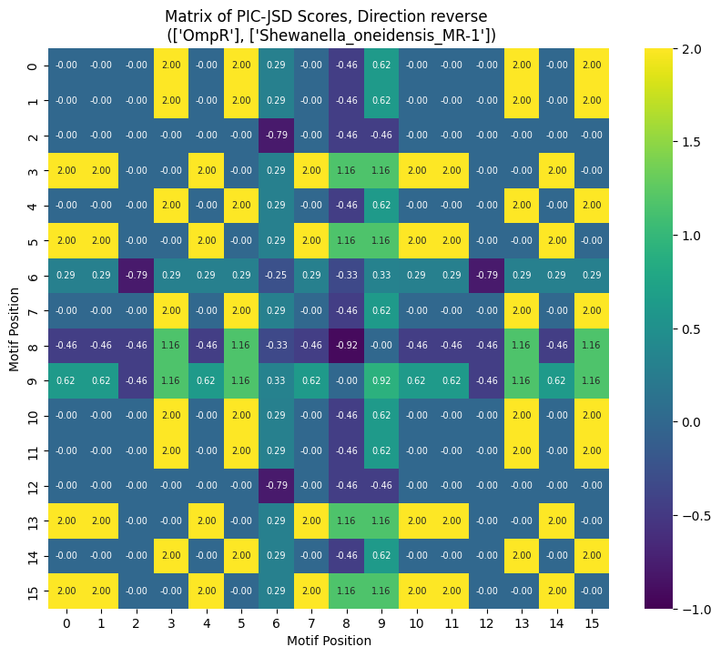 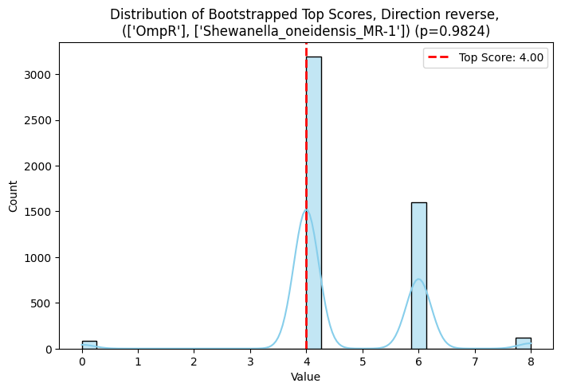 |  |  |
| **P0A4U6** | Direct | 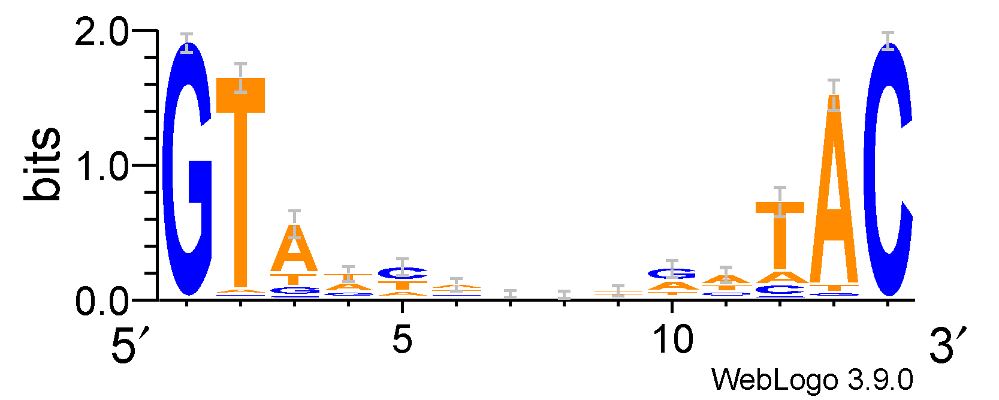 | <table border="1" class="dataframe">  <thead>    <tr style="text-align: right;">      <th>score</th>      <th>p_value</th>      <th>group1</th>      <th>group2</th>    </tr>  </thead>  <tbody>    <tr>      <td>1.893209</td>      <td>2.4000e-02</td>      <td>TA</td>      <td>TA</td>    </tr>  </tbody></table> | 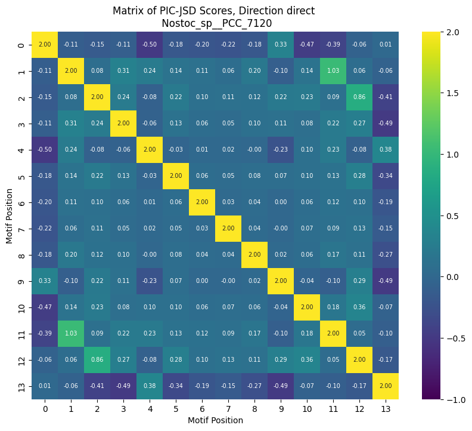 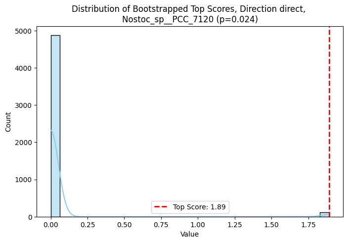 |  |  |
| **P0A4U6** | Reverse |  | <table border="1" class="dataframe">  <thead>    <tr style="text-align: right;">      <th>score</th>      <th>p_value</th>      <th>group1</th>      <th>group2</th>    </tr>  </thead>  <tbody>    <tr>      <td>4.158511</td>      <td>4.0000e-04</td>      <td>TAC</td>      <td>ATG</td>    </tr>  </tbody></table> | 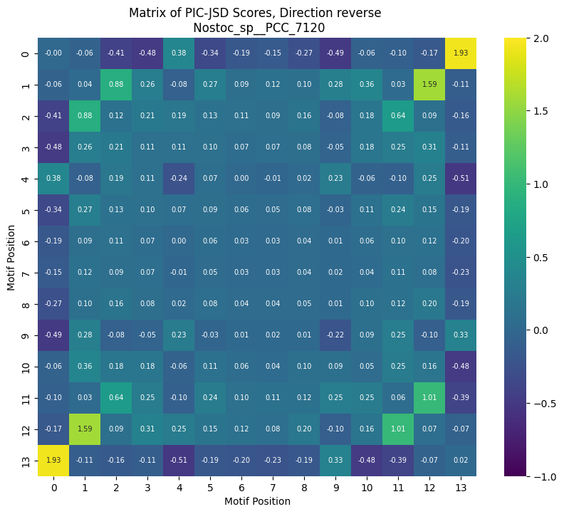 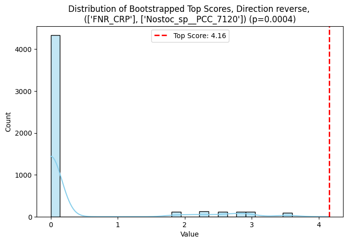 |  |  |
| **P0A9E5** | Direct | 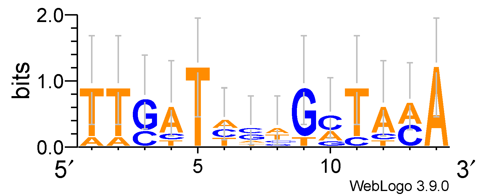 | <table border="1" class="dataframe">  <thead>    <tr style="text-align: right;">      <th>score</th>      <th>p_value</th>      <th>group1</th>      <th>group2</th>    </tr>  </thead>  <tbody>    <tr>      <td>1.441914</td>      <td>8.5840e-01</td>      <td>AA</td>      <td>AA</td>    </tr>  </tbody></table> | 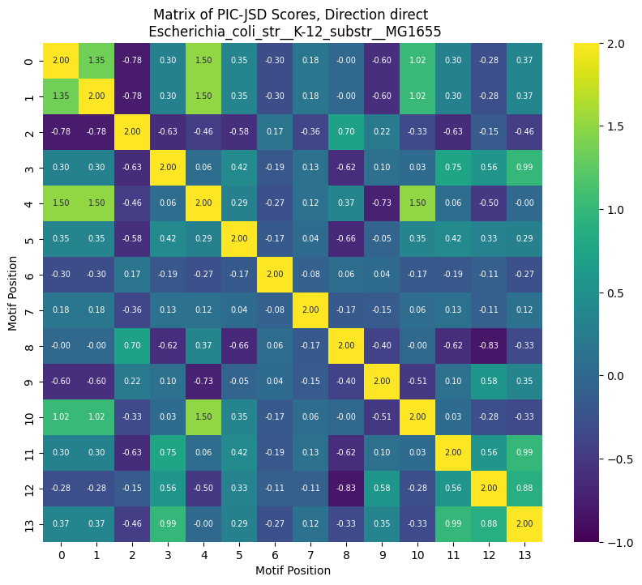 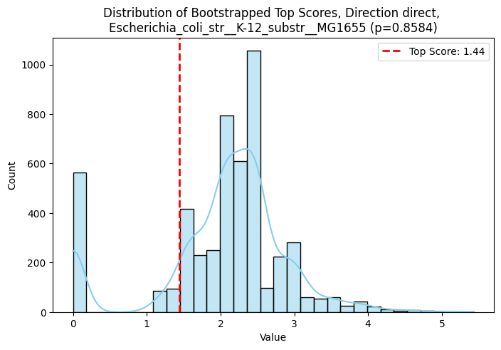 |  | [(['FNR_CRP'], ['Escherichia_coli_str__K-12_substr__MG1655'])]: No diagonal candidates were possible at the selected 80% threshold for CollecTF_FASTA/FNR_CRP/Escherichia_coli_str__K-12_substr__MG1655/TF_FNR_P0A9E5.fas, automatically reduced to 55%, at value 0.5510651010496298.   Inconsistent sequence lengths {19, 14} in 'CollecTF_FASTA/FNR_CRP/Escherichia_coli_str__K-12_substr__MG1655/TF_FNR_P0A9E5.fas'; trimmed all to 14bp. |
| **P0A9E5** | Reverse |  | <table border="1" class="dataframe">  <thead>    <tr style="text-align: right;">      <th>score</th>      <th>p_value</th>      <th>group1</th>      <th>group2</th>    </tr>  </thead>  <tbody>    <tr>      <td>1.316689</td>      <td>9.4240e-01</td>      <td>AA</td>      <td>TT</td>    </tr>    <tr>      <td>1.944945</td>      <td>7.3580e-01</td>      <td>AA</td>      <td>TT</td>    </tr>  </tbody></table> | 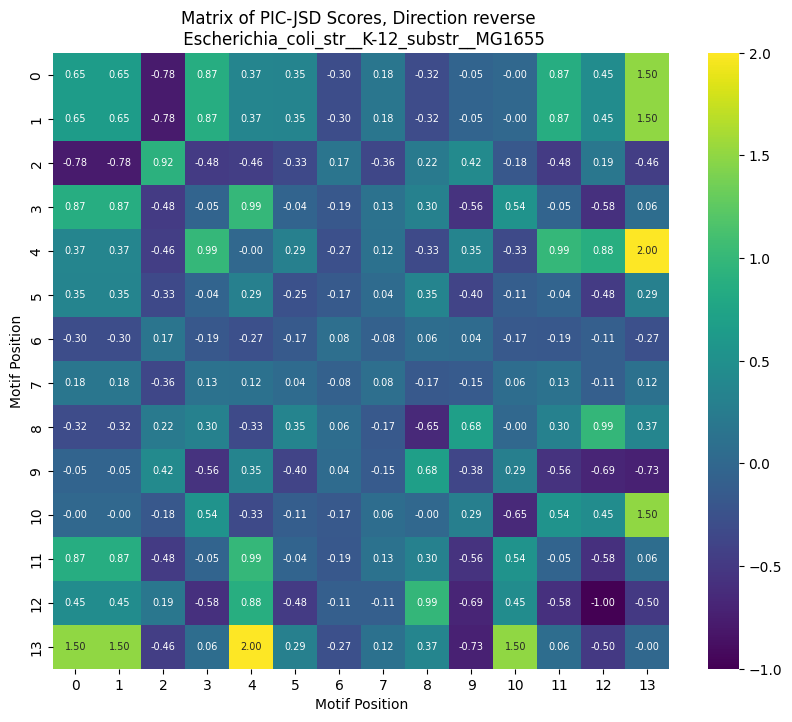 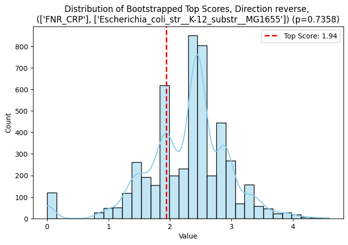 |  | [(['FNR_CRP'], ['Escherichia_coli_str__K-12_substr__MG1655'])]: No diagonal candidates were possible at the selected 80% threshold for CollecTF_FASTA/FNR_CRP/Escherichia_coli_str__K-12_substr__MG1655/TF_FNR_P0A9E5.fas, automatically reduced to 40%, at value 0.3859945368381321.   Inconsistent sequence lengths {19, 14} in 'CollecTF_FASTA/FNR_CRP/Escherichia_coli_str__K-12_substr__MG1655/TF_FNR_P0A9E5.fas'; trimmed all to 14bp. |
| **P0ACJ8** | Direct | 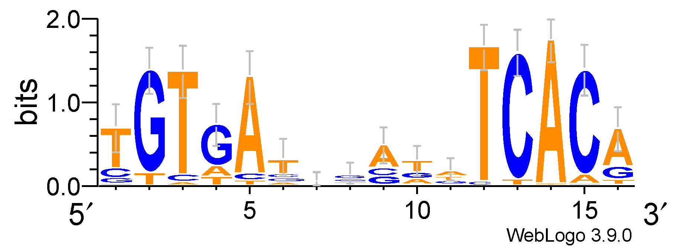 | <table border="1" class="dataframe">  <thead>    <tr style="text-align: right;">      <th>score</th>      <th>p_value</th>      <th>group1</th>      <th>group2</th>    </tr>  </thead>  <tbody>    <tr>      <td>1.854011</td>      <td>2.7500e-01</td>      <td>TG</td>      <td>TG</td>    </tr>    <tr>      <td>2.461494</td>      <td>1.7680e-01</td>      <td>CA</td>      <td>CA</td>    </tr>  </tbody></table> | 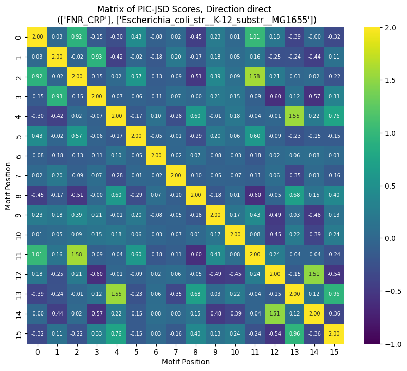 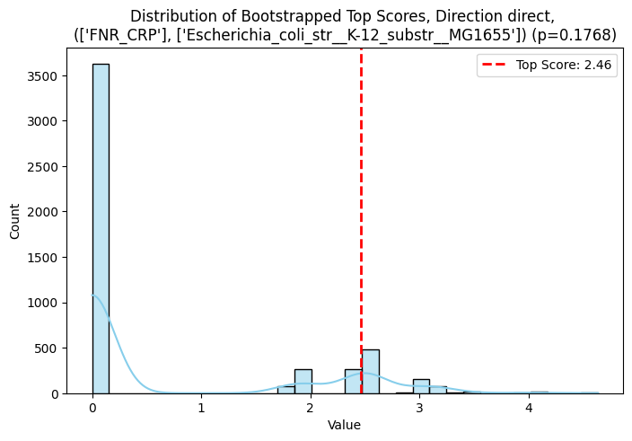 |  | Inconsistent sequence lengths {16, 22} in 'CollecTF_FASTA/FNR_CRP/Escherichia_coli_str__K-12_substr__MG1655/TF_CRP_P0ACJ8.fas'; trimmed all to 16bp. |
| **P0ACJ8** | Reverse |  | <table border="1" class="dataframe">  <thead>    <tr style="text-align: right;">      <th>score</th>      <th>p_value</th>      <th>group1</th>      <th>group2</th>    </tr>  </thead>  <tbody>    <tr>      <td>5.511452</td>      <td>0.0000e+00</td>      <td>TCAC</td>      <td>AGTG</td>    </tr>    <tr>      <td>2.421567</td>      <td>3.3180e-01</td>      <td>CA</td>      <td>GT</td>    </tr>    <tr>      <td>1.914691</td>      <td>5.4300e-01</td>      <td>CA</td>      <td>GT</td>    </tr>  </tbody></table> | 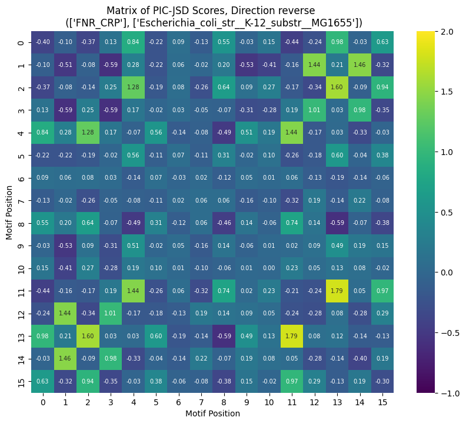 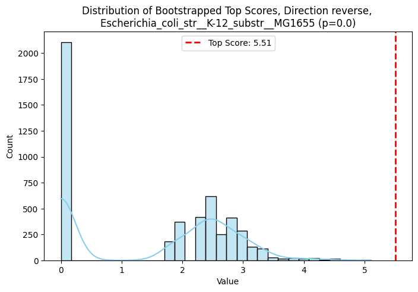 |  | Inconsistent sequence lengths {16, 22} in 'CollecTF_FASTA/FNR_CRP/Escherichia_coli_str__K-12_substr__MG1655/TF_CRP_P0ACJ8.fas'; trimmed all to 16bp. |
| **P74171** | Direct | 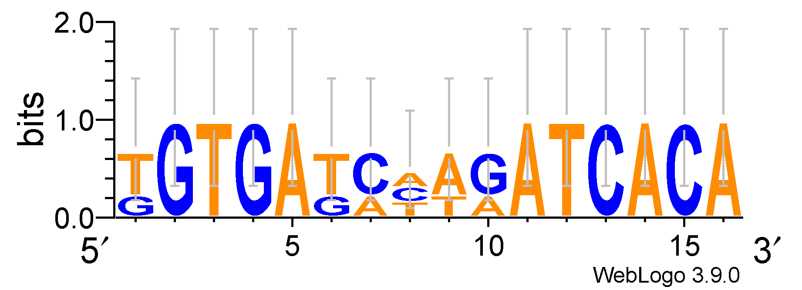 | <table border="1" class="dataframe">  <thead>    <tr style="text-align: right;">      <th>score</th>      <th>p_value</th>      <th>group1</th>      <th>group2</th>    </tr>  </thead>  <tbody>    <tr>      <td>4.0</td>      <td>4.2260e-01</td>      <td>CA</td>      <td>CA</td>    </tr>  </tbody></table> | 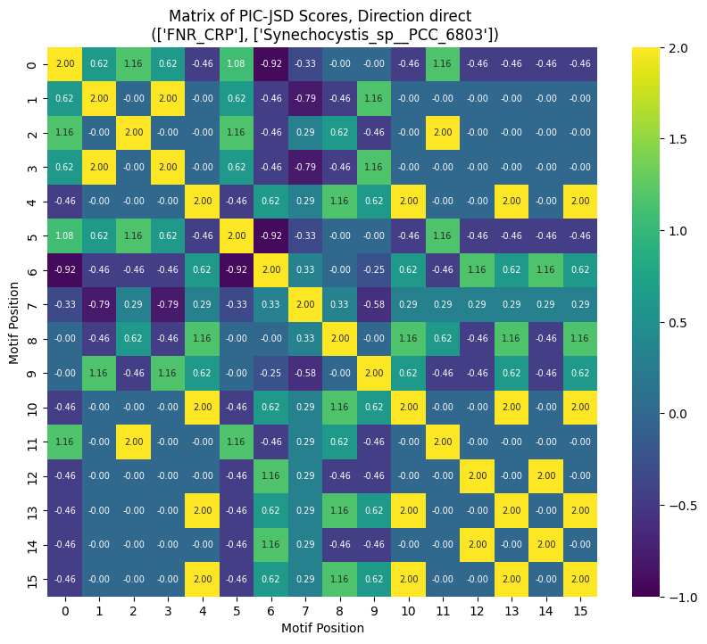 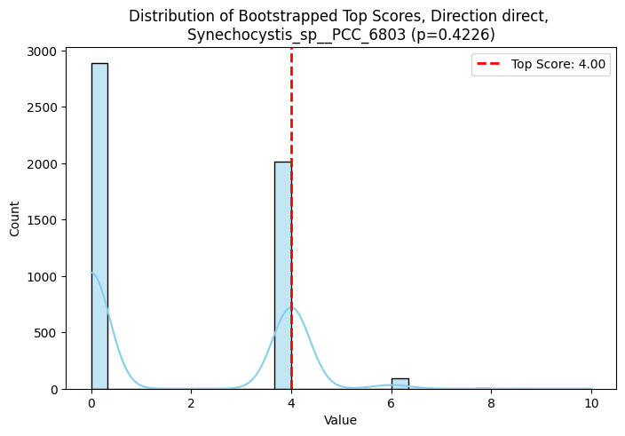 |  |  |
| **P74171** | Reverse |  | <table border="1" class="dataframe">  <thead>    <tr style="text-align: right;">      <th>score</th>      <th>p_value</th>      <th>group1</th>      <th>group2</th>    </tr>  </thead>  <tbody>    <tr>      <td>8.0</td>      <td>1.0000e-03</td>      <td>TCAC</td>      <td>AGTG</td>    </tr>    <tr>      <td>4.0</td>      <td>5.5060e-01</td>      <td>CA</td>      <td>GT</td>    </tr>  </tbody></table> | 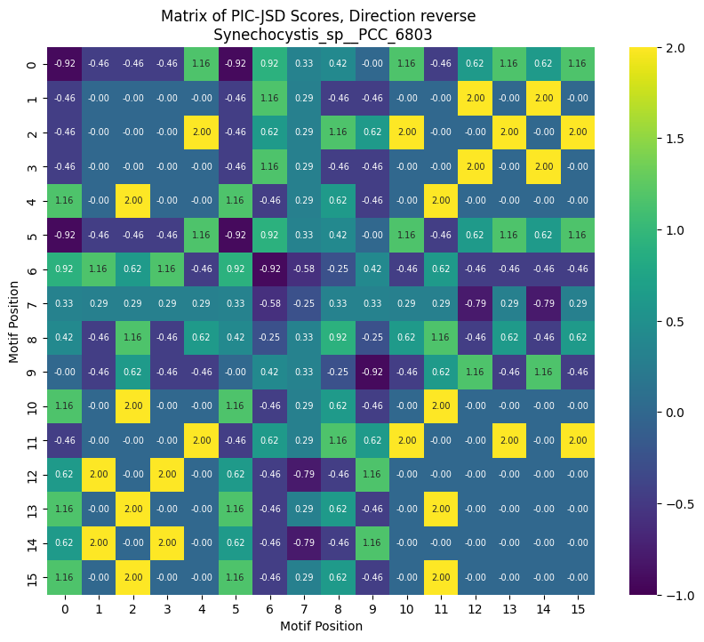 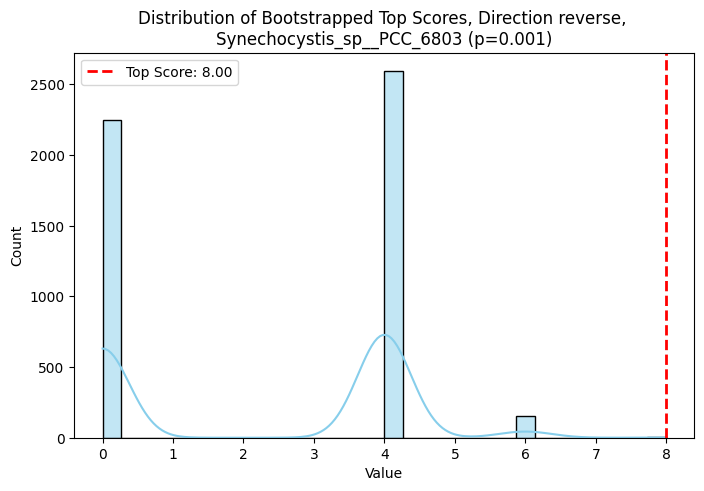 |  |  |
| **Q4UZF6** | Direct | 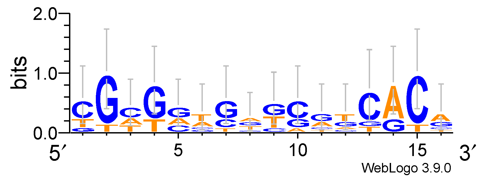 | <table border="1" class="dataframe">  <thead>    <tr style="text-align: right;">      <th>score</th>      <th>p_value</th>      <th>group1</th>      <th>group2</th>    </tr>  </thead>  <tbody>    <tr>      <td>1.034832</td>      <td>5.7980e-01</td>      <td>GC</td>      <td>GG</td>    </tr>  </tbody></table> | 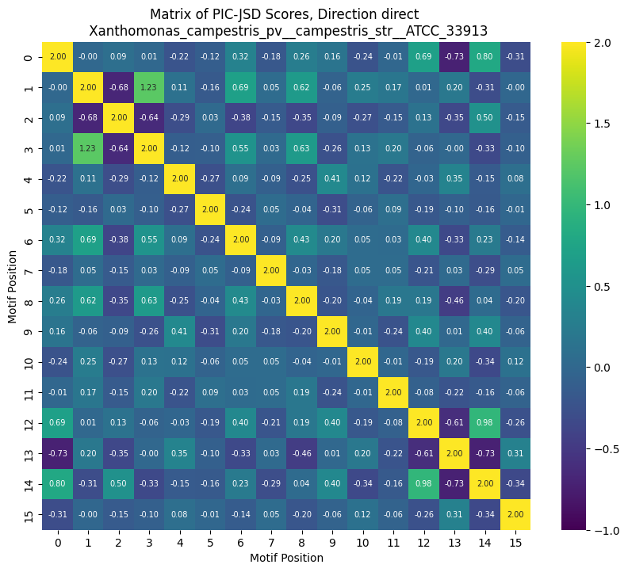 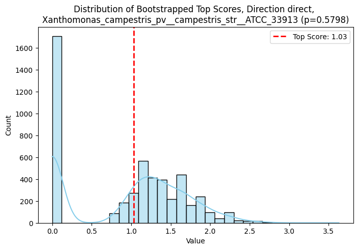 |  | [(['FNR_CRP'], ['Xanthomonas_campestris_pv__campestris_str__ATCC_33913'])]: No diagonal candidates were possible at the selected 80% threshold for CollecTF_FASTA/FNR_CRP/Xanthomonas_campestris_pv__campestris_str__ATCC_33913/TF_Clp_Q4UZF6.fas, automatically reduced to 65%, at value 0.4036011048733301.   Inconsistent sequence lengths {16, 22} in 'CollecTF_FASTA/FNR_CRP/Xanthomonas_campestris_pv__campestris_str__ATCC_33913/TF_Clp_Q4UZF6.fas'; trimmed all to 16bp. |
| **Q4UZF6** | Reverse |  | <table border="1" class="dataframe">  <thead>    <tr style="text-align: right;">      <th>score</th>      <th>p_value</th>      <th>group1</th>      <th>group2</th>    </tr>  </thead>  <tbody>    <tr>      <td>1.221073</td>      <td>3.2100e-01</td>      <td>CA</td>      <td>GC</td>    </tr>  </tbody></table> | 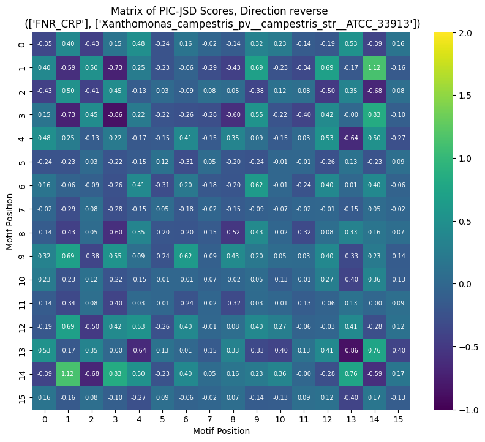 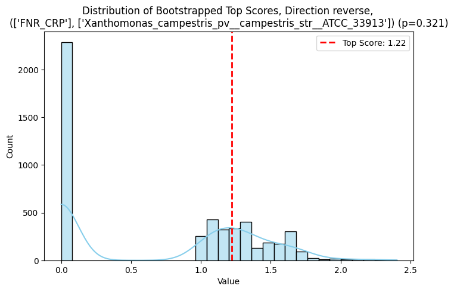 |  | [(['FNR_CRP'], ['Xanthomonas_campestris_pv__campestris_str__ATCC_33913'])]: No diagonal candidates were possible at the selected 80% threshold for CollecTF_FASTA/FNR_CRP/Xanthomonas_campestris_pv__campestris_str__ATCC_33913/TF_Clp_Q4UZF6.fas, automatically reduced to 75%, at value 0.4716255921639829.   Inconsistent sequence lengths {16, 22} in 'CollecTF_FASTA/FNR_CRP/Xanthomonas_campestris_pv__campestris_str__ATCC_33913/TF_Clp_Q4UZF6.fas'; trimmed all to 16bp. |
| **Q79VI7** | Direct | 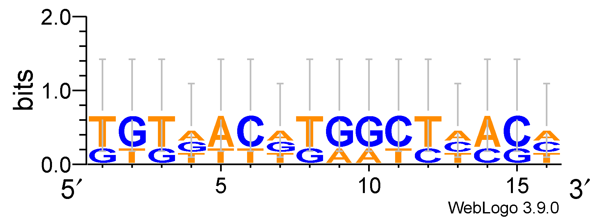 | <table border="1" class="dataframe">  <thead>    <tr style="text-align: right;">      <th>score</th>      <th>p_value</th>      <th>group1</th>      <th>group2</th>    </tr>  </thead>  <tbody>    <tr>      <td>1.836592</td>      <td>5.0400e-01</td>      <td>GT</td>      <td>TG</td>    </tr>  </tbody></table> | 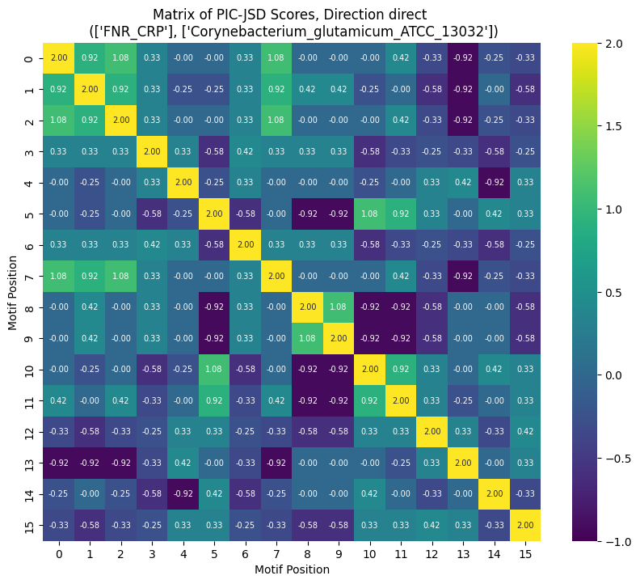 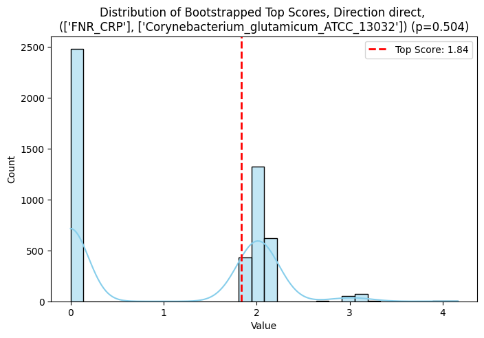 |  | Inconsistent sequence lengths {16, 21} in 'CollecTF_FASTA/FNR_CRP/Corynebacterium_glutamicum_ATCC_13032/TF_GlxR_Q79VI7.fas'; trimmed all to 16bp. |
| **Q79VI7** | Reverse |  | <table border="1" class="dataframe">  <thead>    <tr style="text-align: right;">      <th>score</th>      <th>p_value</th>      <th>group1</th>      <th>group2</th>    </tr>  </thead>  <tbody>    <tr>      <td>2.0</td>      <td>3.8420e-01</td>      <td>CT</td>      <td>GG</td>    </tr>  </tbody></table> | 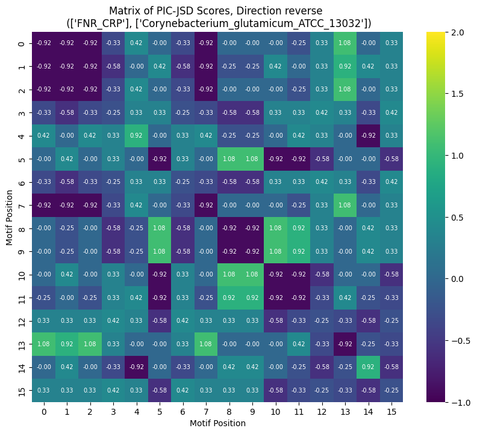 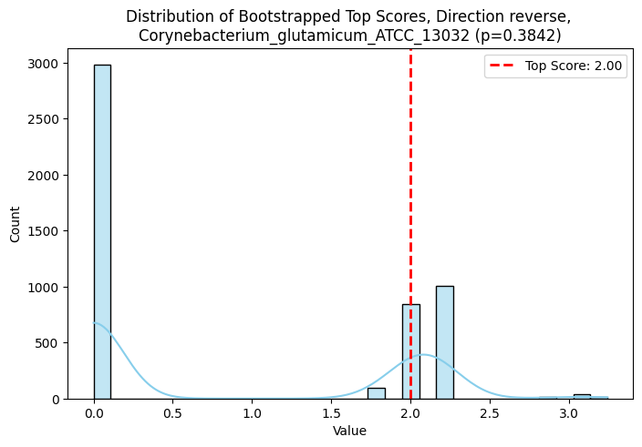 |  | Inconsistent sequence lengths {16, 21} in 'CollecTF_FASTA/FNR_CRP/Corynebacterium_glutamicum_ATCC_13032/TF_GlxR_Q79VI7.fas'; trimmed all to 16bp. |
| **Q7CFV3** | Direct | 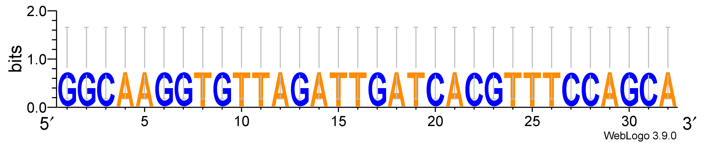 | <table border="1" class="dataframe">  <thead>    <tr style="text-align: right;">      <th>score</th>      <th>p_value</th>      <th>group1</th>      <th>group2</th>    </tr>  </thead>  <tbody>    <tr>      <td>6.0</td>      <td>9.9620e-01</td>      <td>GAT</td>      <td>GAT</td>    </tr>    <tr>      <td>6.0</td>      <td>9.9620e-01</td>      <td>GTT</td>      <td>GTT</td>    </tr>    <tr>      <td>6.0</td>      <td>9.9620e-01</td>      <td>GCA</td>      <td>GCA</td>    </tr>    <tr>      <td>4.0</td>      <td>1.0000e+00</td>      <td>GG</td>      <td>GG</td>    </tr>    <tr>      <td>4.0</td>      <td>1.0000e+00</td>      <td>GT</td>      <td>GT</td>    </tr>    <tr>      <td>4.0</td>      <td>1.0000e+00</td>      <td>AG</td>      <td>AG</td>    </tr>    <tr>      <td>4.0</td>      <td>1.0000e+00</td>      <td>TT</td>      <td>TT</td>    </tr>    <tr>      <td>4.0</td>      <td>1.0000e+00</td>      <td>TG</td>      <td>TG</td>    </tr>    <tr>      <td>4.0</td>      <td>1.0000e+00</td>      <td>CA</td>      <td>CA</td>    </tr>    <tr>      <td>4.0</td>      <td>1.0000e+00</td>      <td>GT</td>      <td>GT</td>    </tr>    <tr>      <td>4.0</td>      <td>1.0000e+00</td>      <td>TT</td>      <td>TT</td>    </tr>    <tr>      <td>4.0</td>      <td>1.0000e+00</td>      <td>TT</td>      <td>TT</td>    </tr>    <tr>      <td>4.0</td>      <td>1.0000e+00</td>      <td>TT</td>      <td>TT</td>    </tr>    <tr>      <td>4.0</td>      <td>1.0000e+00</td>      <td>TT</td>      <td>TT</td>    </tr>    <tr>      <td>4.0</td>      <td>1.0000e+00</td>      <td>TC</td>      <td>TC</td>    </tr>    <tr>      <td>4.0</td>      <td>1.0000e+00</td>      <td>CA</td>      <td>CA</td>    </tr>    <tr>      <td>4.0</td>      <td>1.0000e+00</td>      <td>CA</td>      <td>CA</td>    </tr>    <tr>      <td>4.0</td>      <td>1.0000e+00</td>      <td>AG</td>      <td>AG</td>    </tr>    <tr>      <td>4.0</td>      <td>1.0000e+00</td>      <td>AG</td>      <td>AG</td>    </tr>    <tr>      <td>4.0</td>      <td>1.0000e+00</td>      <td>CA</td>      <td>CA</td>    </tr>    <tr>      <td>4.0</td>      <td>1.0000e+00</td>      <td>CA</td>      <td>CA</td>    </tr>  </tbody></table> | 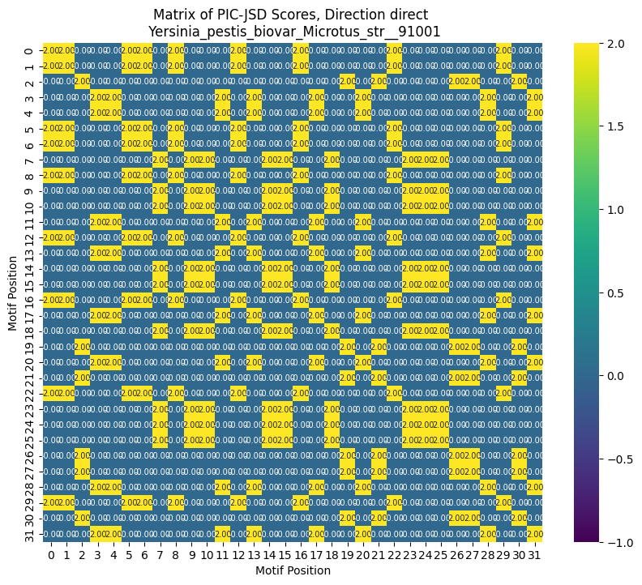 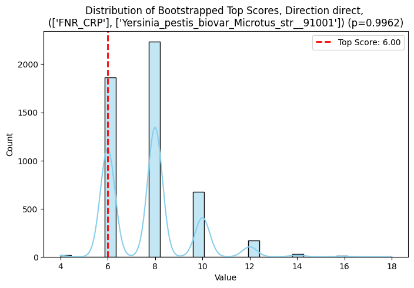 |  |  |
| **Q7CFV3** | Reverse |  | <table border="1" class="dataframe">  <thead>    <tr style="text-align: right;">      <th>score</th>      <th>p_value</th>      <th>group1</th>      <th>group2</th>    </tr>  </thead>  <tbody>    <tr>      <td>6.0</td>      <td>9.9500e-01</td>      <td>TTG</td>      <td>AAC</td>    </tr>    <tr>      <td>6.0</td>      <td>9.9500e-01</td>      <td>ATC</td>      <td>TAG</td>    </tr>    <tr>      <td>6.0</td>      <td>9.9500e-01</td>      <td>TCA</td>      <td>AGT</td>    </tr>    <tr>      <td>6.0</td>      <td>9.9500e-01</td>      <td>CAC</td>      <td>GTG</td>    </tr>    <tr>      <td>4.0</td>      <td>1.0000e+00</td>      <td>TG</td>      <td>AC</td>    </tr>    <tr>      <td>4.0</td>      <td>1.0000e+00</td>      <td>TT</td>      <td>AA</td>    </tr>    <tr>      <td>4.0</td>      <td>1.0000e+00</td>      <td>AC</td>      <td>TG</td>    </tr>    <tr>      <td>4.0</td>      <td>1.0000e+00</td>      <td>GT</td>      <td>CA</td>    </tr>    <tr>      <td>4.0</td>      <td>1.0000e+00</td>      <td>TT</td>      <td>AA</td>    </tr>    <tr>      <td>4.0</td>      <td>1.0000e+00</td>      <td>TT</td>      <td>AA</td>    </tr>    <tr>      <td>4.0</td>      <td>1.0000e+00</td>      <td>TC</td>      <td>AG</td>    </tr>    <tr>      <td>4.0</td>      <td>1.0000e+00</td>      <td>TC</td>      <td>AG</td>    </tr>    <tr>      <td>4.0</td>      <td>1.0000e+00</td>      <td>CC</td>      <td>GG</td>    </tr>    <tr>      <td>4.0</td>      <td>1.0000e+00</td>      <td>CC</td>      <td>GG</td>    </tr>    <tr>      <td>4.0</td>      <td>1.0000e+00</td>      <td>CA</td>      <td>GT</td>    </tr>    <tr>      <td>4.0</td>      <td>1.0000e+00</td>      <td>CA</td>      <td>GT</td>    </tr>    <tr>      <td>4.0</td>      <td>1.0000e+00</td>      <td>GC</td>      <td>CG</td>    </tr>    <tr>      <td>4.0</td>      <td>1.0000e+00</td>      <td>CA</td>      <td>GT</td>    </tr>    <tr>      <td>4.0</td>      <td>1.0000e+00</td>      <td>CA</td>      <td>GT</td>    </tr>  </tbody></table> | 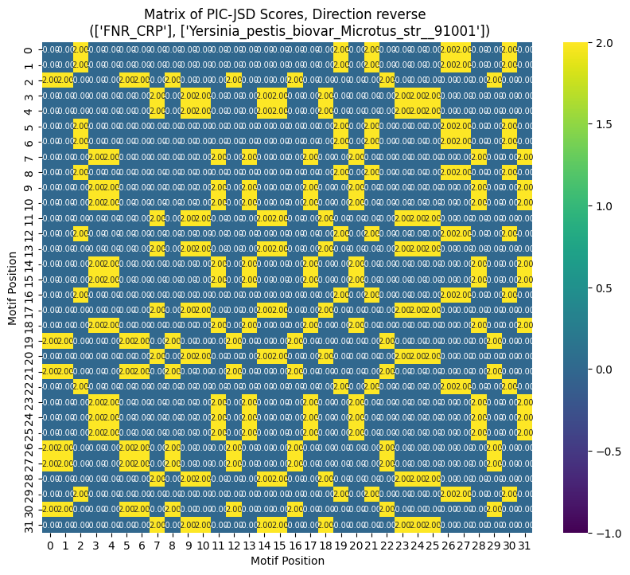 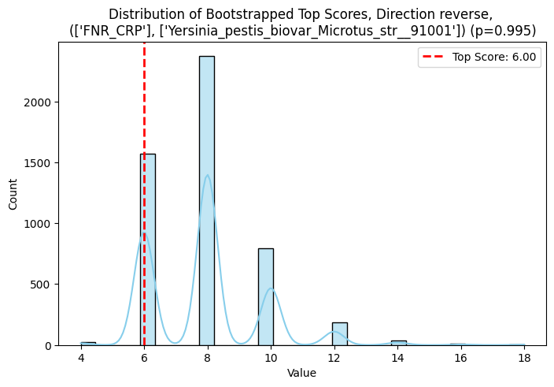 |  |  |
| **Q7M7I9** | Direct | 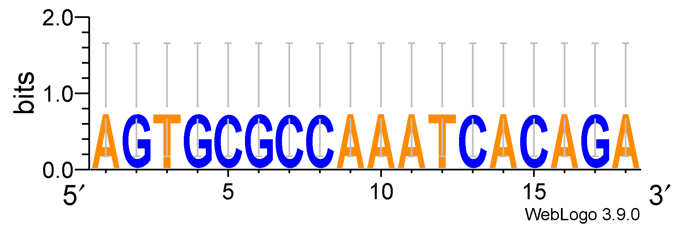 | <table border="1" class="dataframe">  <thead>    <tr style="text-align: right;">      <th>score</th>      <th>p_value</th>      <th>group1</th>      <th>group2</th>    </tr>  </thead>  <tbody>    <tr>      <td>4.0</td>      <td>1.0000e+00</td>      <td>GC</td>      <td>GC</td>    </tr>    <tr>      <td>4.0</td>      <td>1.0000e+00</td>      <td>AA</td>      <td>AA</td>    </tr>    <tr>      <td>4.0</td>      <td>1.0000e+00</td>      <td>CA</td>      <td>CA</td>    </tr>    <tr>      <td>4.0</td>      <td>1.0000e+00</td>      <td>CA</td>      <td>CA</td>    </tr>    <tr>      <td>4.0</td>      <td>1.0000e+00</td>      <td>CA</td>      <td>CA</td>    </tr>    <tr>      <td>4.0</td>      <td>1.0000e+00</td>      <td>AG</td>      <td>AG</td>    </tr>  </tbody></table> | 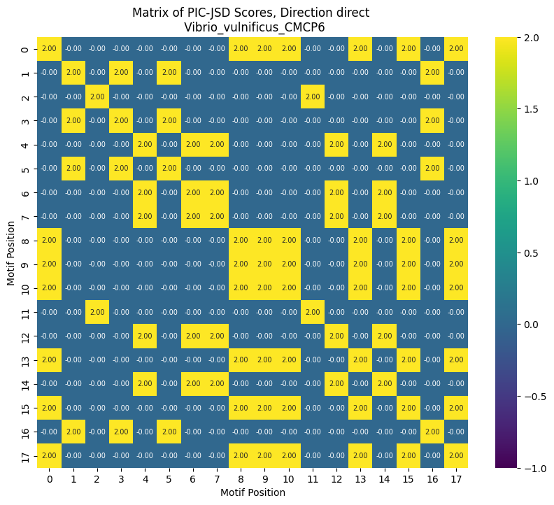 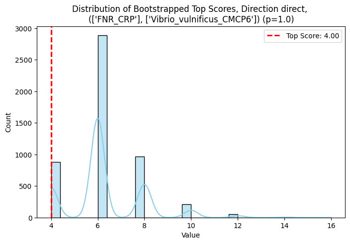 |  |  |
| **Q7M7I9** | Reverse |  | <table border="1" class="dataframe">  <thead>    <tr style="text-align: right;">      <th>score</th>      <th>p_value</th>      <th>group1</th>      <th>group2</th>    </tr>  </thead>  <tbody>    <tr>      <td>6.0</td>      <td>5.7160e-01</td>      <td>CAC</td>      <td>GTG</td>    </tr>    <tr>      <td>4.0</td>      <td>9.9900e-01</td>      <td>GC</td>      <td>CG</td>    </tr>    <tr>      <td>4.0</td>      <td>9.9900e-01</td>      <td>CA</td>      <td>GT</td>    </tr>    <tr>      <td>4.0</td>      <td>9.9900e-01</td>      <td>CA</td>      <td>GT</td>    </tr>    <tr>      <td>4.0</td>      <td>9.9900e-01</td>      <td>GA</td>      <td>CT</td>    </tr>  </tbody></table> | 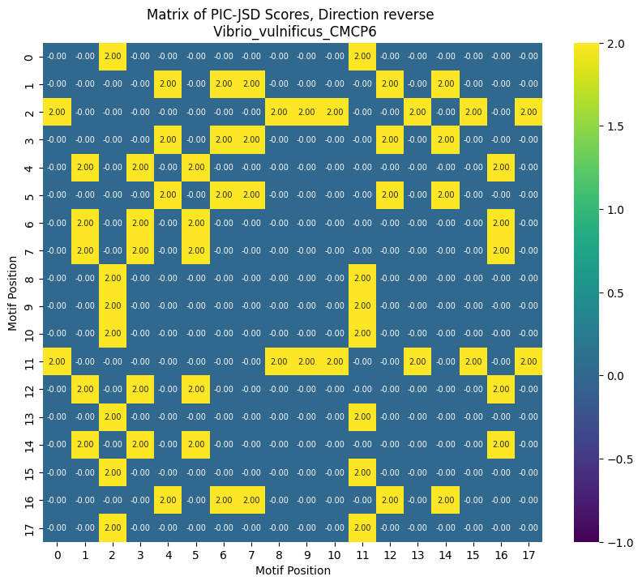 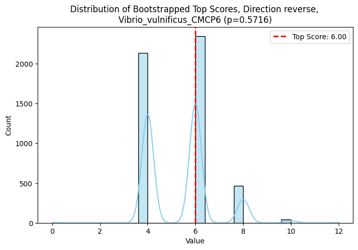 |  |  |
| **Q88F34** | Direct | 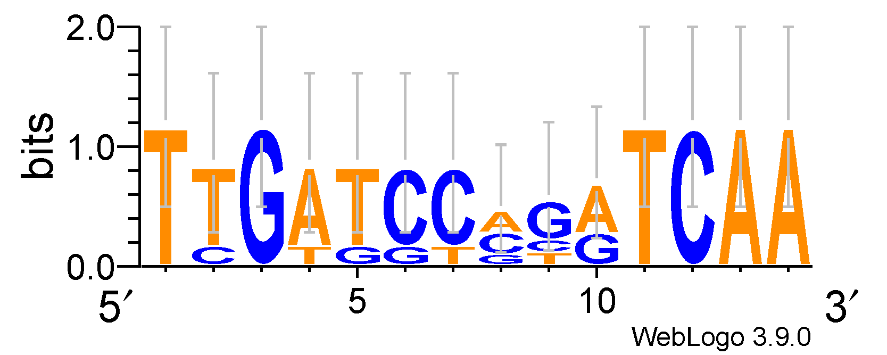 | <table border="1" class="dataframe">  <thead>    <tr style="text-align: right;">      <th>score</th>      <th>p_value</th>      <th>group1</th>      <th>group2</th>    </tr>  </thead>  <tbody>    <tr>      <td>2.845946</td>      <td>6.2700e-01</td>      <td>TC</td>      <td>TC</td>    </tr>  </tbody></table> | 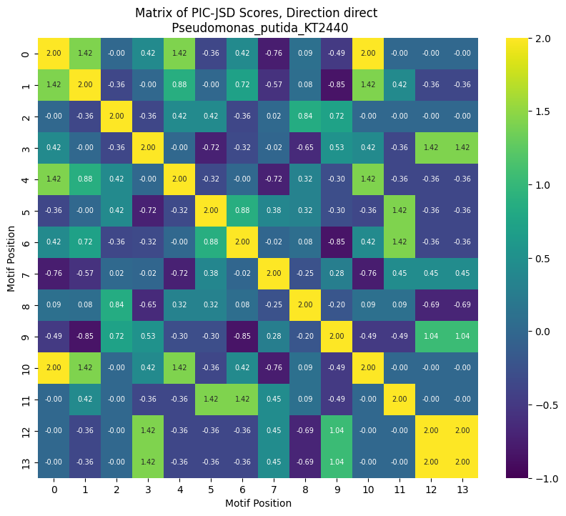 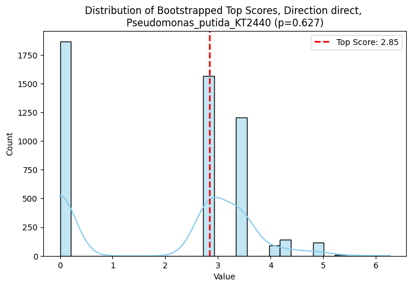 |  |  |
| **Q88F34** | Reverse |  | <table border="1" class="dataframe">  <thead>    <tr style="text-align: right;">      <th>score</th>      <th>p_value</th>      <th>group1</th>      <th>group2</th>    </tr>  </thead>  <tbody>    <tr>      <td>6.845946</td>      <td>1.6000e-03</td>      <td>TCAA</td>      <td>AGTT</td>    </tr>  </tbody></table> | 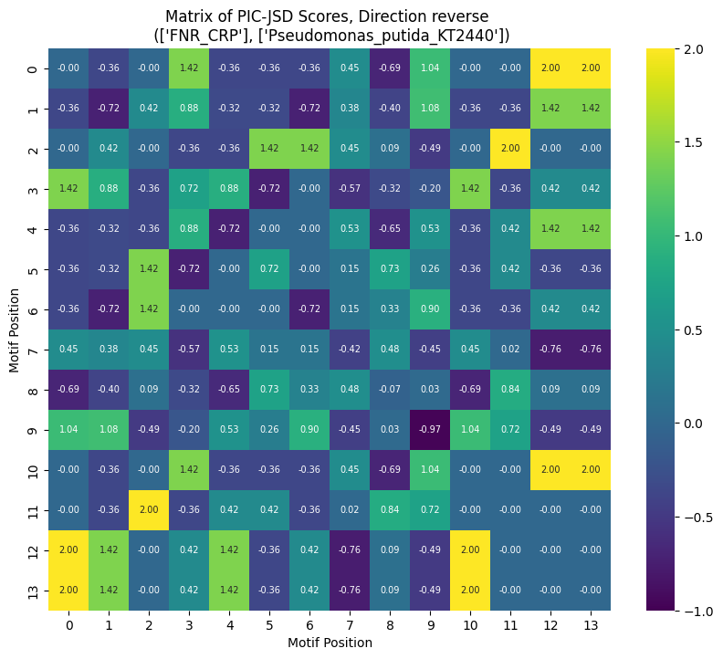 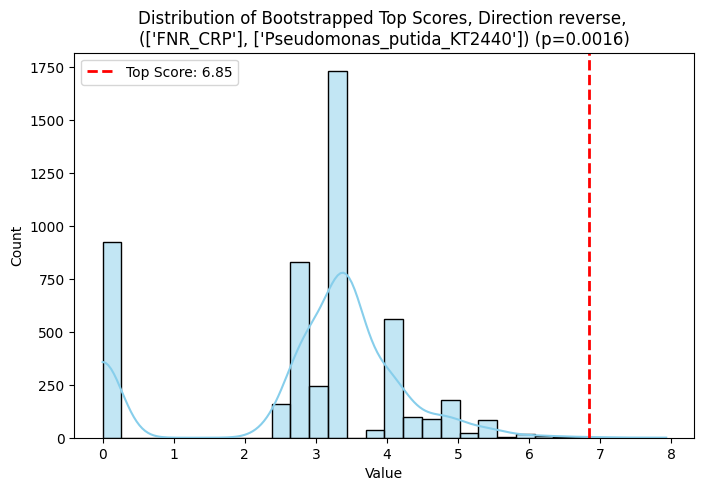 |  |  |
| **Q9KNW6** | Direct | 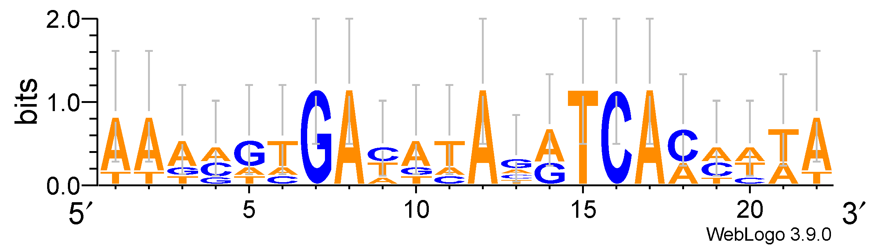 | <table border="1" class="dataframe">  <thead>    <tr style="text-align: right;">      <th>score</th>      <th>p_value</th>      <th>group1</th>      <th>group2</th>    </tr>  </thead>  <tbody>    <tr>      <td>2.18261</td>      <td>7.3640e-01</td>      <td>TA</td>      <td>AA</td>    </tr>  </tbody></table> | 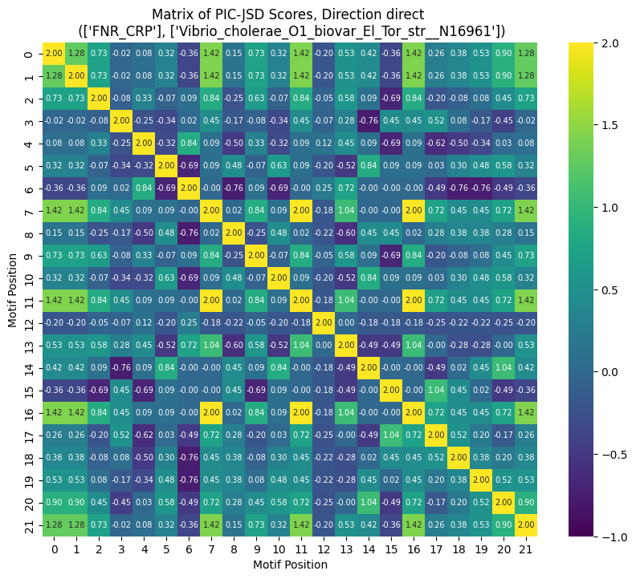 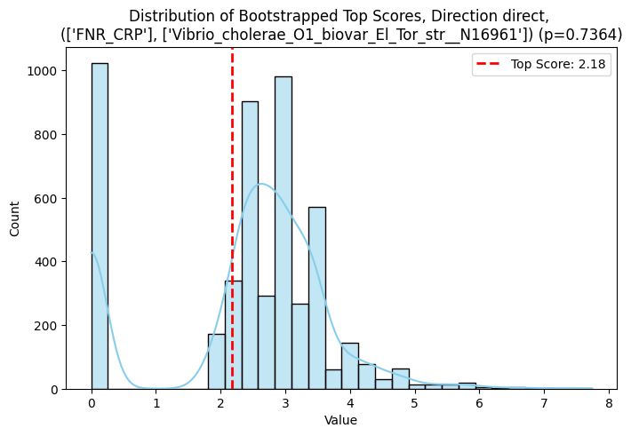 |  | [(['FNR_CRP'], ['Vibrio_cholerae_O1_biovar_El_Tor_str__N16961'])]: No diagonal candidates were possible at the selected 80% threshold for CollecTF_FASTA/FNR_CRP/Vibrio_cholerae_O1_biovar_El_Tor_str__N16961/TF_CRP_Q9KNW6.fas, automatically reduced to 70%, at value 0.8432203469336317. |
| **Q9KNW6** | Reverse |  | <table border="1" class="dataframe">  <thead>    <tr style="text-align: right;">      <th>score</th>      <th>p_value</th>      <th>group1</th>      <th>group2</th>    </tr>  </thead>  <tbody>    <tr>      <td>4.0</td>      <td>3.5200e-02</td>      <td>TC</td>      <td>AG</td>    </tr>  </tbody></table> | 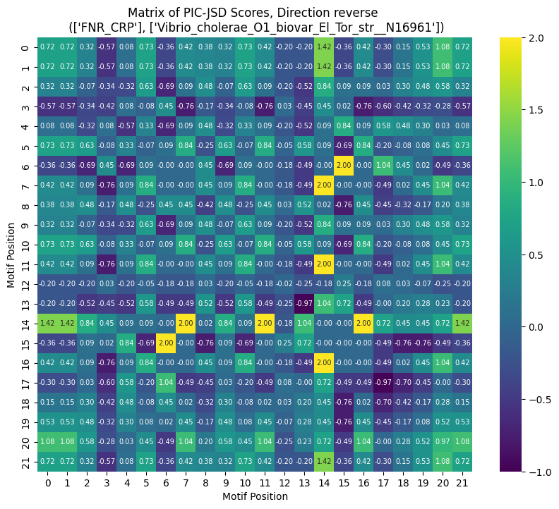 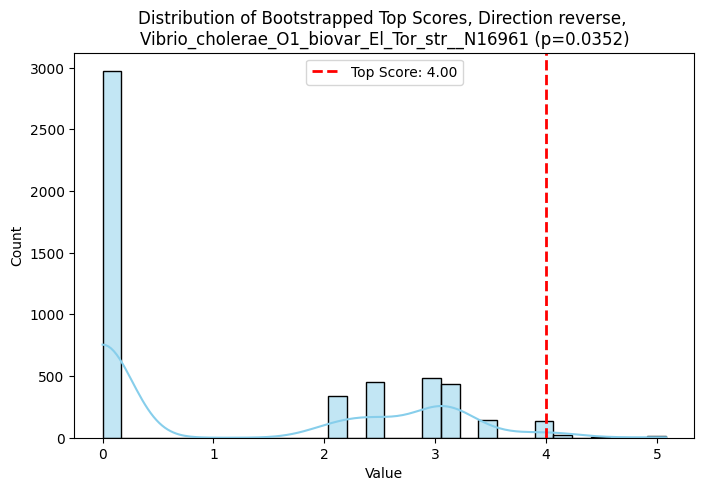 |  |  |
| **A0A072Z841** | Direct | 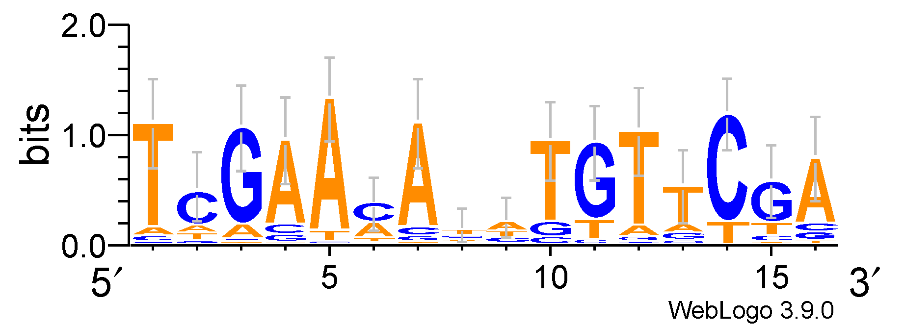 | <table border="1" class="dataframe">  <thead>    <tr style="text-align: right;">      <th>score</th>      <th>p_value</th>      <th>group1</th>      <th>group2</th>    </tr>  </thead>  <tbody>    <tr>      <td>2.97738</td>      <td>2.2800e-02</td>      <td>TCGA</td>      <td>TCGA</td>    </tr>  </tbody></table> | 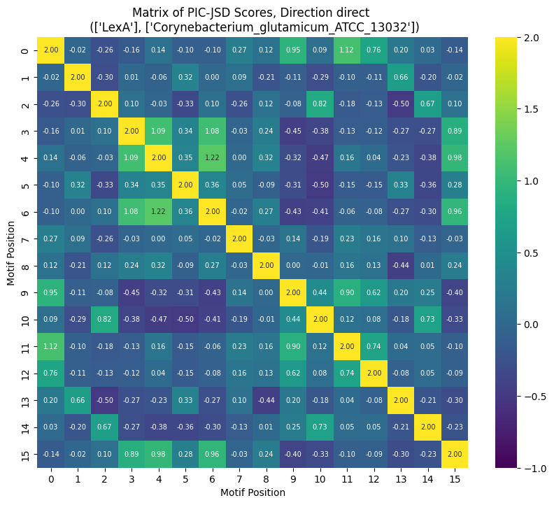 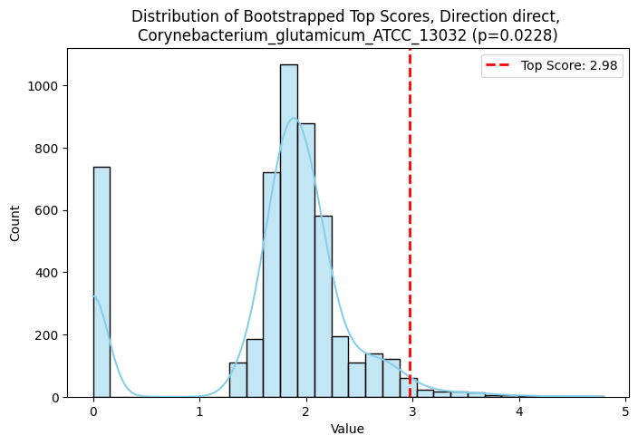 |  | [(['LexA'], ['Corynebacterium_glutamicum_ATCC_13032'])]: No diagonal candidates were possible at the selected 80% threshold for CollecTF_FASTA/LexA/Corynebacterium_glutamicum_ATCC_13032/TF_LexA_A0A072Z841.fas, automatically reduced to 75%, at value 0.6243770194257974. |
| **A0A072Z841** | Reverse |  | <table border="1" class="dataframe">  <thead>    <tr style="text-align: right;">      <th>score</th>      <th>p_value</th>      <th>group1</th>      <th>group2</th>    </tr>  </thead>  <tbody>    <tr>      <td>3.087044</td>      <td>3.3200e-02</td>      <td>TTC</td>      <td>AAG</td>    </tr>    <tr>      <td>1.716217</td>      <td>8.1040e-01</td>      <td>GA</td>      <td>CT</td>    </tr>  </tbody></table> | 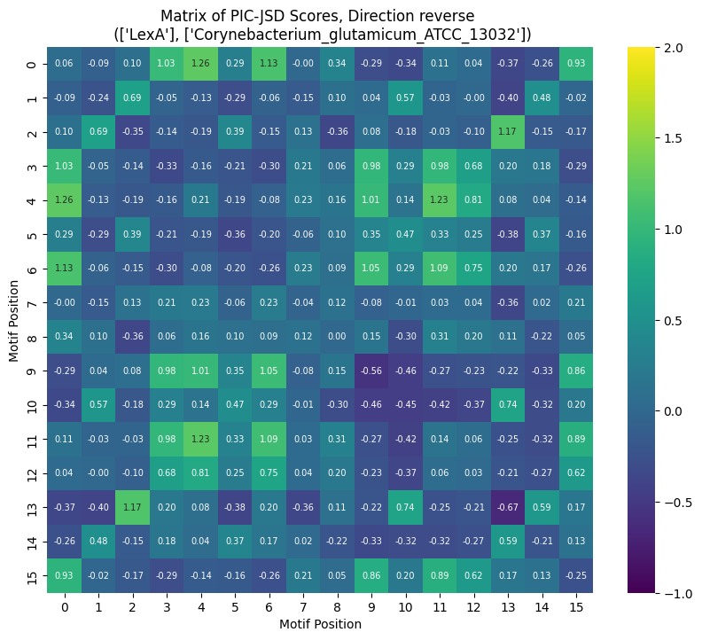 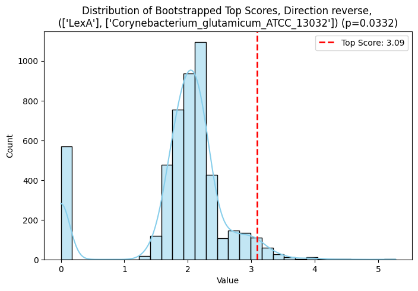 |  |  |
| **A0L9E2** | Direct | 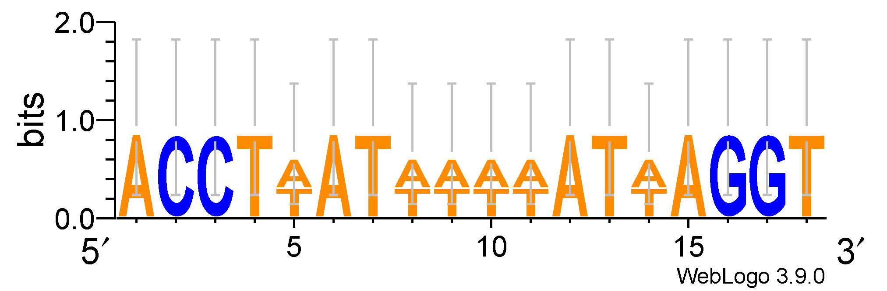 | <table border="1" class="dataframe">  <thead>    <tr style="text-align: right;">      <th>score</th>      <th>p_value</th>      <th>group1</th>      <th>group2</th>    </tr>  </thead>  <tbody>    <tr>      <td>4.0</td>      <td>6.8960e-01</td>      <td>AT</td>      <td>AT</td>    </tr>  </tbody></table> | 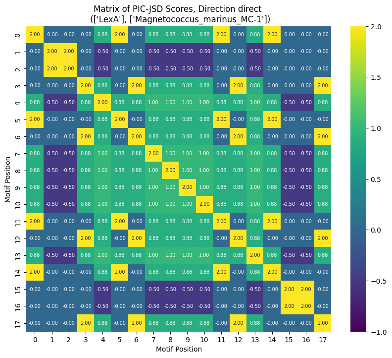 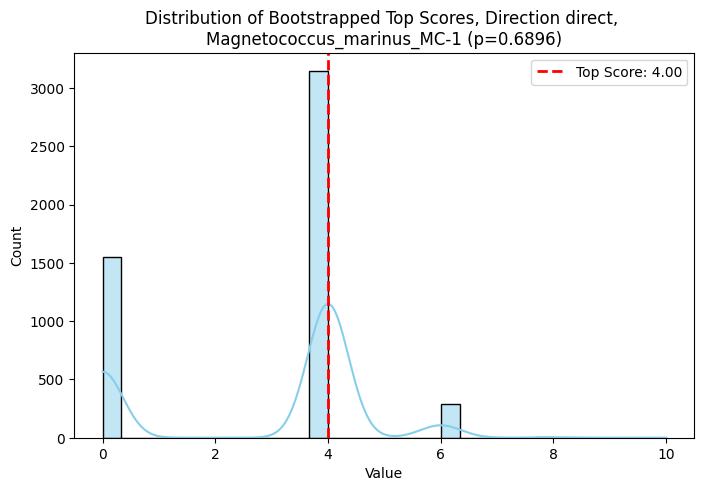 | (2 seq) |  |
| **A0L9E2** | Reverse |  | <table border="1" class="dataframe">  <thead>    <tr style="text-align: right;">      <th>score</th>      <th>p_value</th>      <th>group1</th>      <th>group2</th>    </tr>  </thead>  <tbody>    <tr>      <td>8.0</td>      <td>9.0000e-03</td>      <td>AGGT</td>      <td>TCCA</td>    </tr>    <tr>      <td>4.0</td>      <td>8.7800e-01</td>      <td>AT</td>      <td>TA</td>    </tr>  </tbody></table> | 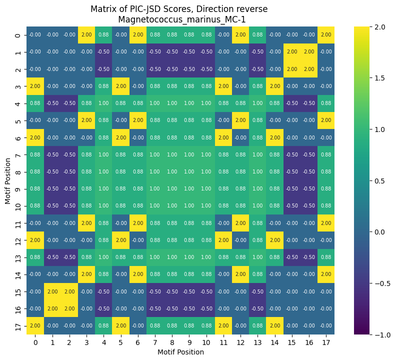 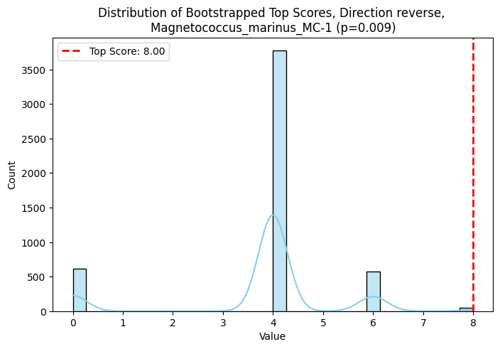 | (2 seq) |  |
| **A0QVY5** | Direct | 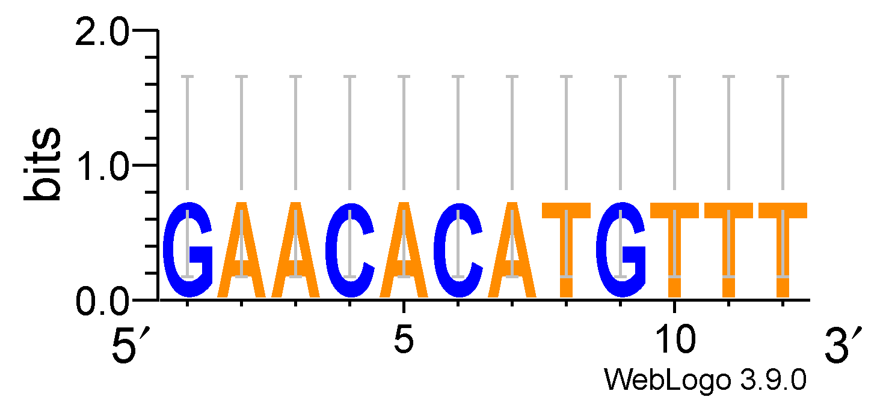 | <table border="1" class="dataframe">  <thead>    <tr style="text-align: right;">      <th>score</th>      <th>p_value</th>      <th>group1</th>      <th>group2</th>    </tr>  </thead>  <tbody>    <tr>      <td>6.0</td>      <td>2.8720e-01</td>      <td>ACA</td>      <td>ACA</td>    </tr>    <tr>      <td>4.0</td>      <td>9.6700e-01</td>      <td>TT</td>      <td>TT</td>    </tr>  </tbody></table> | 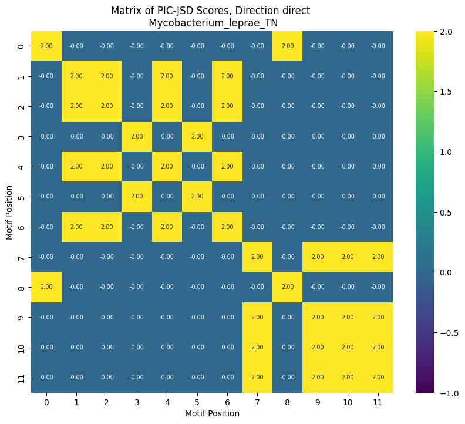 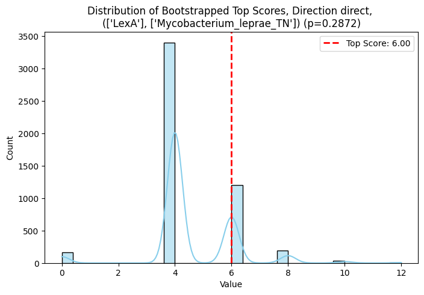 | (1 seq) |  |
| **A0QVY5** | Reverse |  | <table border="1" class="dataframe">  <thead>    <tr style="text-align: right;">      <th>score</th>      <th>p_value</th>      <th>group1</th>      <th>group2</th>    </tr>  </thead>  <tbody>    <tr>      <td>8.0</td>      <td>1.2720e-01</td>      <td>TGTT</td>      <td>ACAA</td>    </tr>    <tr>      <td>6.0</td>      <td>5.4200e-01</td>      <td>TGT</td>      <td>ACA</td>    </tr>    <tr>      <td>4.0</td>      <td>9.9720e-01</td>      <td>TT</td>      <td>AA</td>    </tr>  </tbody></table> | 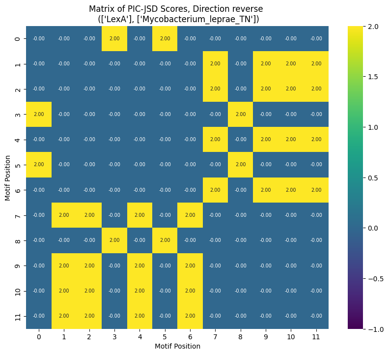 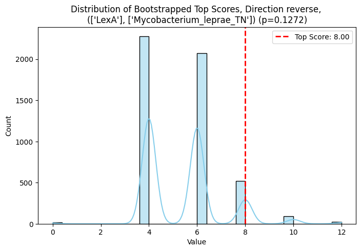 | (1 seq) |  |
| **I6Y1J7** | Direct | 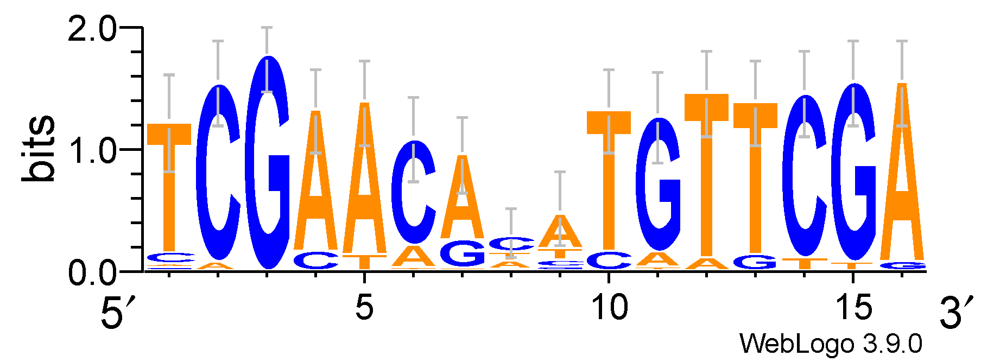 | <table border="1" class="dataframe">  <thead>    <tr style="text-align: right;">      <th>score</th>      <th>p_value</th>      <th>group1</th>      <th>group2</th>    </tr>  </thead>  <tbody>    <tr>      <td>6.063843</td>      <td>2.6000e-03</td>      <td>TCGA</td>      <td>TCGA</td>    </tr>  </tbody></table> | 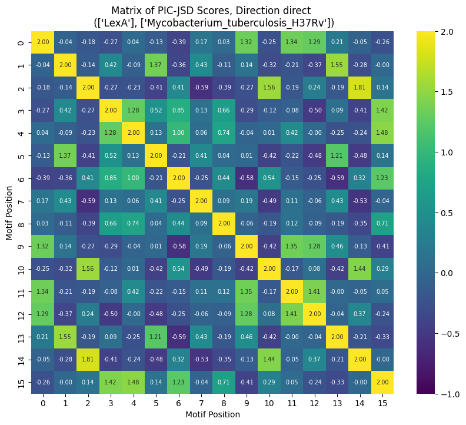 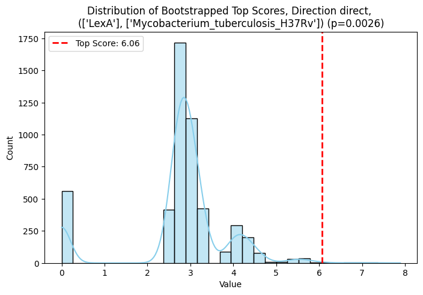 |  | Inconsistent sequence lengths {16, 18} in 'CollecTF_FASTA/LexA/Mycobacterium_tuberculosis_H37Rv/TF_LexA_I6Y1J7.fas'; trimmed all to 16bp. |
| **I6Y1J7** | Reverse |  | <table border="1" class="dataframe">  <thead>    <tr style="text-align: right;">      <th>score</th>      <th>p_value</th>      <th>group1</th>      <th>group2</th>    </tr>  </thead>  <tbody>    <tr>      <td>10.330597</td>      <td>0.0000e+00</td>      <td>TGTTCGA</td>      <td>ACAAGCT</td>    </tr>    <tr>      <td>3.042427</td>      <td>6.8420e-01</td>      <td>GA</td>      <td>CT</td>    </tr>    <tr>      <td>3.029928</td>      <td>7.0600e-01</td>      <td>GA</td>      <td>CT</td>    </tr>  </tbody></table> | 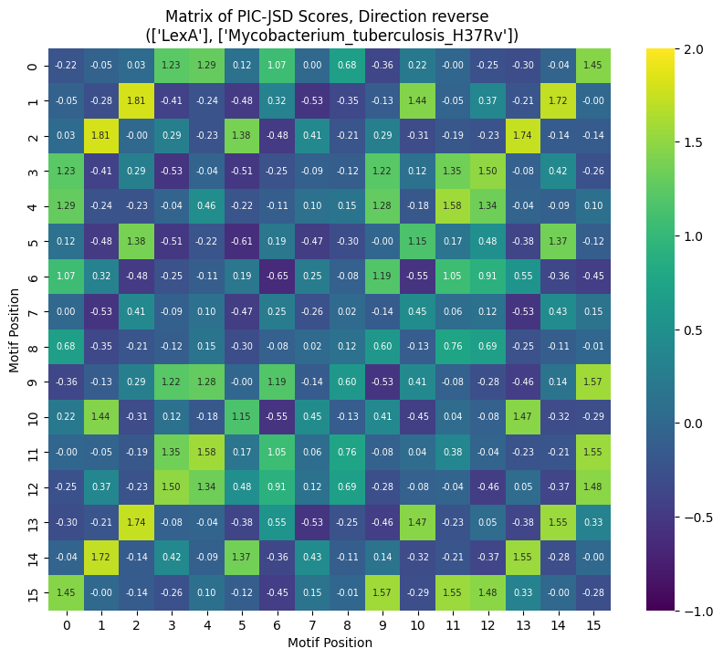 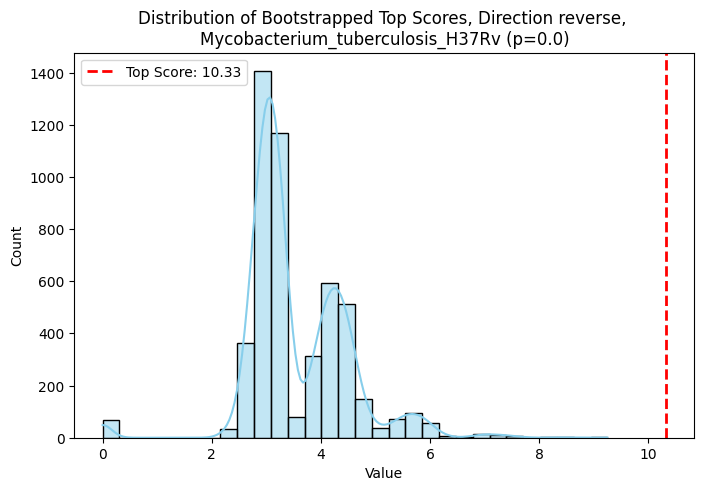 |  | Inconsistent sequence lengths {16, 18} in 'CollecTF_FASTA/LexA/Mycobacterium_tuberculosis_H37Rv/TF_LexA_I6Y1J7.fas'; trimmed all to 16bp. |
| **P0A153** | Direct | 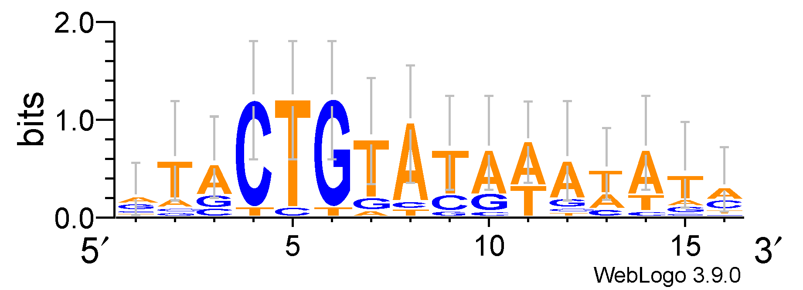 | <table border="1" class="dataframe">  <thead>    <tr style="text-align: right;">      <th>score</th>      <th>p_value</th>      <th>group1</th>      <th>group2</th>    </tr>  </thead>  <tbody>    <tr>      <td>1.159595</td>      <td>7.5500e-01</td>      <td>AT</td>      <td>AA</td>    </tr>  </tbody></table> | 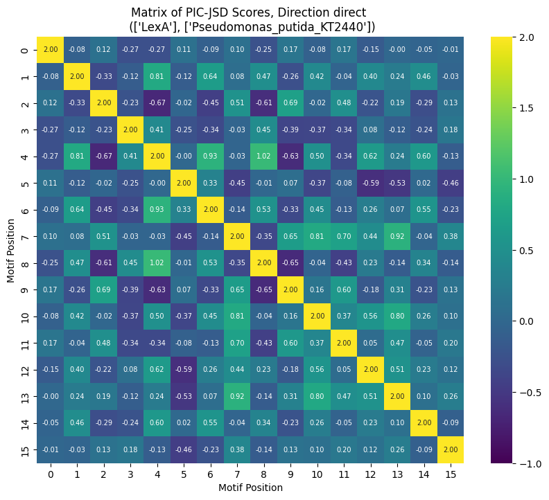 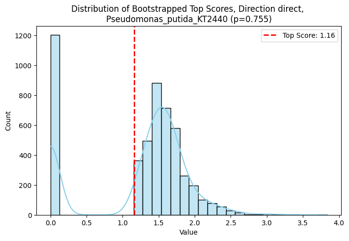 |  | [(['LexA'], ['Pseudomonas_putida_KT2440'])]: No diagonal candidates were possible at the selected 80% threshold for CollecTF_FASTA/LexA/Pseudomonas_putida_KT2440/TF_LexA_P0A153.fas, automatically reduced to 65%, at value 0.556171612906528.   Inconsistent sequence lengths {16, 22} in 'CollecTF_FASTA/LexA/Pseudomonas_putida_KT2440/TF_LexA_P0A153.fas'; trimmed all to 16bp. |
| **P0A153** | Reverse |  | <table border="1" class="dataframe">  <thead>    <tr style="text-align: right;">      <th>score</th>      <th>p_value</th>      <th>group1</th>      <th>group2</th>    </tr>  </thead>  <tbody>    <tr>      <td>1.423245</td>      <td>8.1200e-01</td>      <td>AA</td>      <td>TA</td>    </tr>  </tbody></table> | 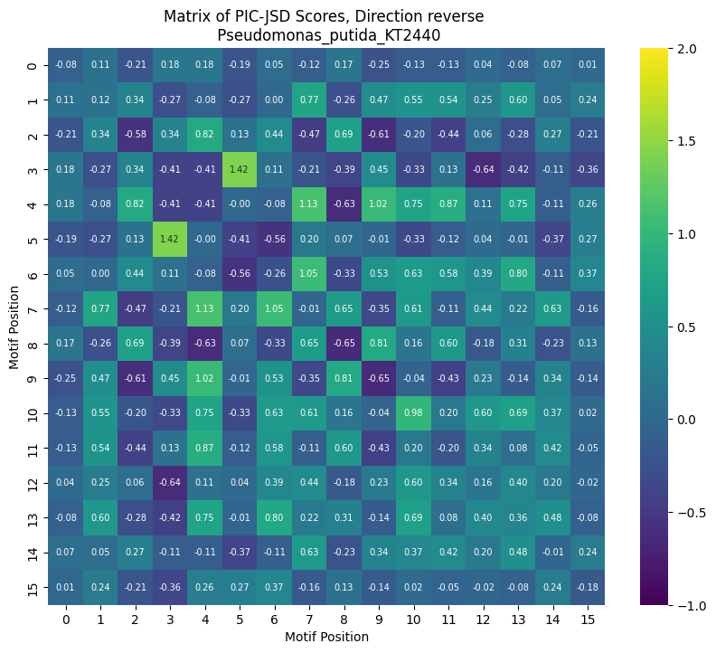 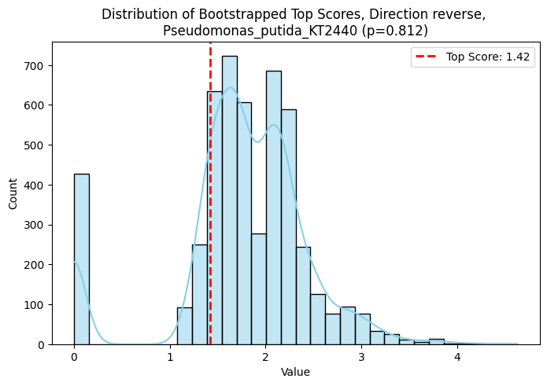 |  | [(['LexA'], ['Pseudomonas_putida_KT2440'])]: No diagonal candidates were possible at the selected 80% threshold for CollecTF_FASTA/LexA/Pseudomonas_putida_KT2440/TF_LexA_P0A153.fas, automatically reduced to 70%, at value 0.5864180795284234.   Inconsistent sequence lengths {16, 22} in 'CollecTF_FASTA/LexA/Pseudomonas_putida_KT2440/TF_LexA_P0A153.fas'; trimmed all to 16bp. |
| **P0A7C2** | Direct | 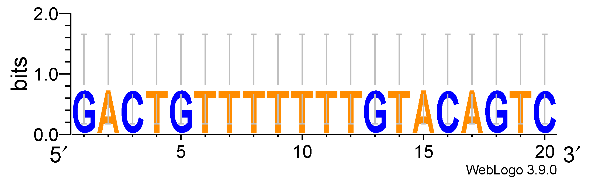 | <table border="1" class="dataframe">  <thead>    <tr style="text-align: right;">      <th>score</th>      <th>p_value</th>      <th>group1</th>      <th>group2</th>    </tr>  </thead>  <tbody>    <tr>      <td>12.0</td>      <td>3.9600e-02</td>      <td>TTTTTT</td>      <td>TTTTTT</td>    </tr>    <tr>      <td>10.0</td>      <td>1.6880e-01</td>      <td>TTTTT</td>      <td>TTTTT</td>    </tr>    <tr>      <td>8.0</td>      <td>5.3740e-01</td>      <td>TTTT</td>      <td>TTTT</td>    </tr>    <tr>      <td>6.0</td>      <td>9.8560e-01</td>      <td>TTT</td>      <td>TTT</td>    </tr>    <tr>      <td>6.0</td>      <td>9.8560e-01</td>      <td>TGT</td>      <td>TGT</td>    </tr>    <tr>      <td>4.0</td>      <td>1.0000e+00</td>      <td>TT</td>      <td>TT</td>    </tr>    <tr>      <td>4.0</td>      <td>1.0000e+00</td>      <td>AC</td>      <td>AC</td>    </tr>    <tr>      <td>4.0</td>      <td>1.0000e+00</td>      <td>GT</td>      <td>GT</td>    </tr>    <tr>      <td>4.0</td>      <td>1.0000e+00</td>      <td>GT</td>      <td>GT</td>    </tr>  </tbody></table> | 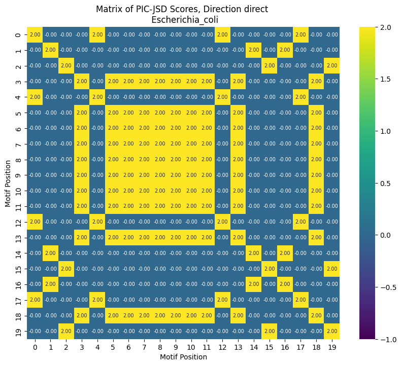 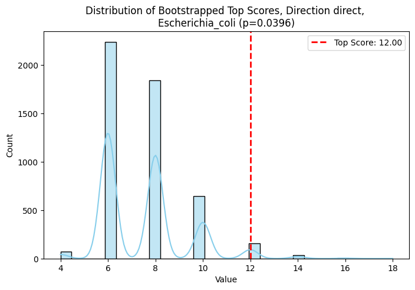 | [Escherichia coli str. K-12 substr. MG1655] |  |
| **P0A7C2** | Reverse |  | <table border="1" class="dataframe">  <thead>    <tr style="text-align: right;">      <th>score</th>      <th>p_value</th>      <th>group1</th>      <th>group2</th>    </tr>  </thead>  <tbody>    <tr>      <td>12.0</td>      <td>2.0000e-04</td>      <td>ACAGTC</td>      <td>TGTCAG</td>    </tr>    <tr>      <td>6.0</td>      <td>6.1700e-01</td>      <td>ACA</td>      <td>TGT</td>    </tr>    <tr>      <td>4.0</td>      <td>1.0000e+00</td>      <td>GT</td>      <td>CA</td>    </tr>    <tr>      <td>4.0</td>      <td>1.0000e+00</td>      <td>GT</td>      <td>CA</td>    </tr>    <tr>      <td>4.0</td>      <td>1.0000e+00</td>      <td>GT</td>      <td>CA</td>    </tr>  </tbody></table> | 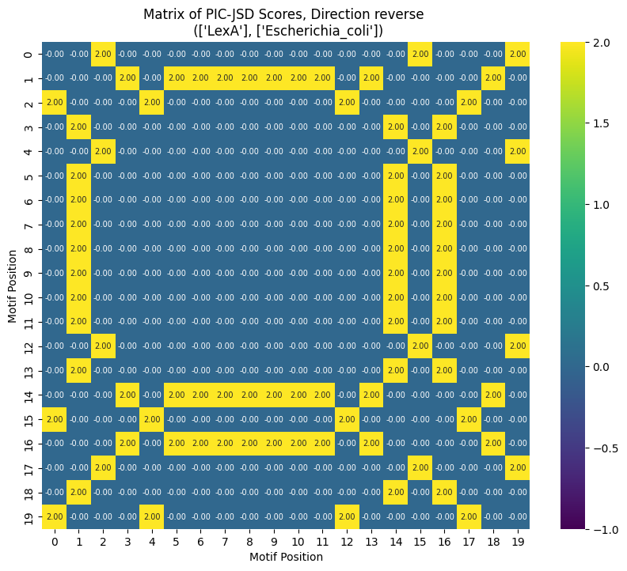 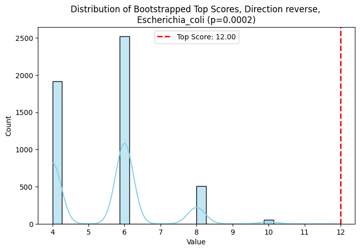 | [Escherichia coli str. K-12 substr. MG1655] |  |
| **P0DN68** | Direct | 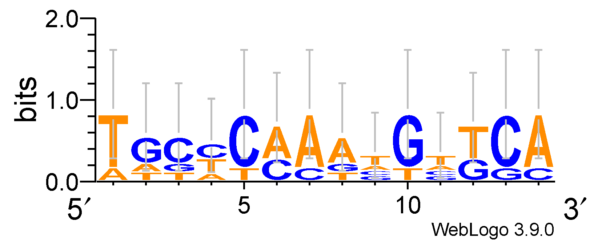 | <table border="1" class="dataframe">  <thead>    <tr style="text-align: right;">      <th>score</th>      <th>p_value</th>      <th>group1</th>      <th>group2</th>    </tr>  </thead>  <tbody>    <tr>      <td>1.961929</td>      <td>2.2160e-01</td>      <td>CA</td>      <td>CA</td>    </tr>  </tbody></table> | 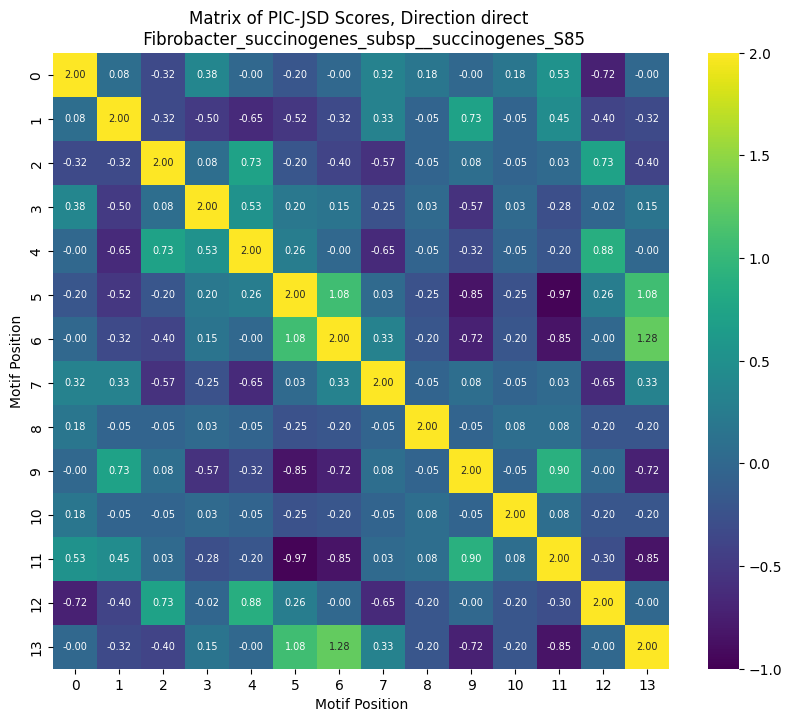 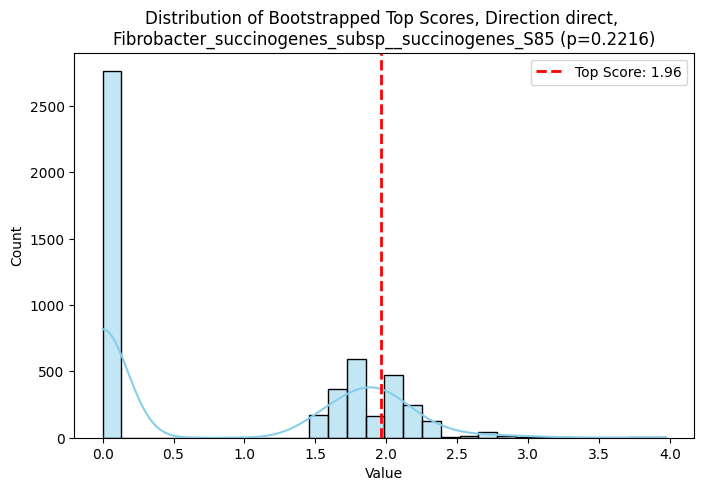 | (https://www.microbiologyresearch.org/content/journal/micro/10.1099/mic.0.27315-0) | Inconsistent sequence lengths {16, 14} in 'CollecTF_FASTA/LexA/Fibrobacter_succinogenes_subsp__succinogenes_S85/TF_LexA_P0DN68.fas'; trimmed all to 14bp. |
| **P0DN68** | Reverse |  | <table border="1" class="dataframe">  <thead>    <tr style="text-align: right;">      <th>score</th>      <th>p_value</th>      <th>group1</th>      <th>group2</th>    </tr>  </thead>  <tbody>    <tr>      <td>1.26576</td>      <td>6.8960e-01</td>      <td>CA</td>      <td>GT</td>    </tr>  </tbody></table> | 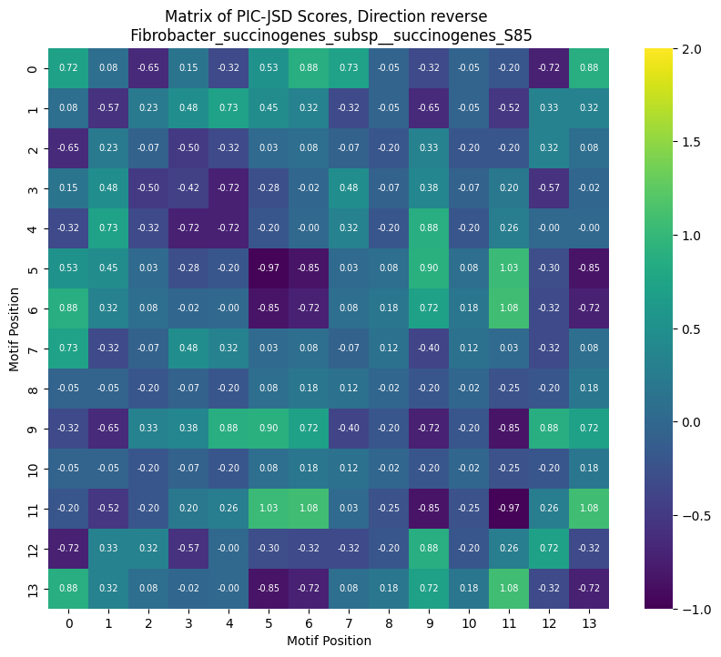 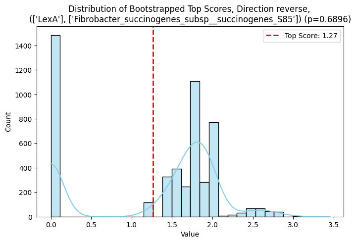 | (https://www.microbiologyresearch.org/content/journal/micro/10.1099/mic.0.27315-0) | [(['LexA'], ['Fibrobacter_succinogenes_subsp__succinogenes_S85'])]: No diagonal candidates were possible at the selected 80% threshold for CollecTF_FASTA/LexA/Fibrobacter_succinogenes_subsp__succinogenes_S85/TF_LexA_P0DN68.fas, automatically reduced to 70%, at value 0.514524699394769.   Inconsistent sequence lengths {16, 14} in 'CollecTF_FASTA/LexA/Fibrobacter_succinogenes_subsp__succinogenes_S85/TF_LexA_P0DN68.fas'; trimmed all to 14bp. |
| **P31080** | Direct | 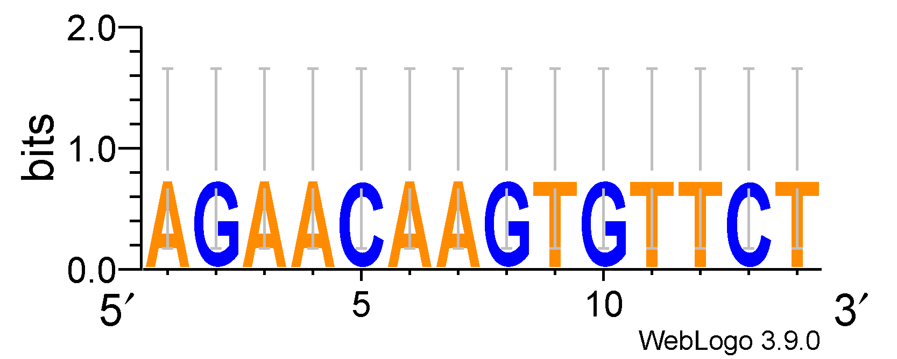 | <table border="1" class="dataframe">  <thead>    <tr style="text-align: right;">      <th>score</th>      <th>p_value</th>      <th>group1</th>      <th>group2</th>    </tr>  </thead>  <tbody>    <tr>      <td>4.0</td>      <td>9.9900e-01</td>      <td>AA</td>      <td>AA</td>    </tr>    <tr>      <td>4.0</td>      <td>9.9900e-01</td>      <td>AG</td>      <td>AG</td>    </tr>    <tr>      <td>4.0</td>      <td>9.9900e-01</td>      <td>GT</td>      <td>GT</td>    </tr>  </tbody></table> | 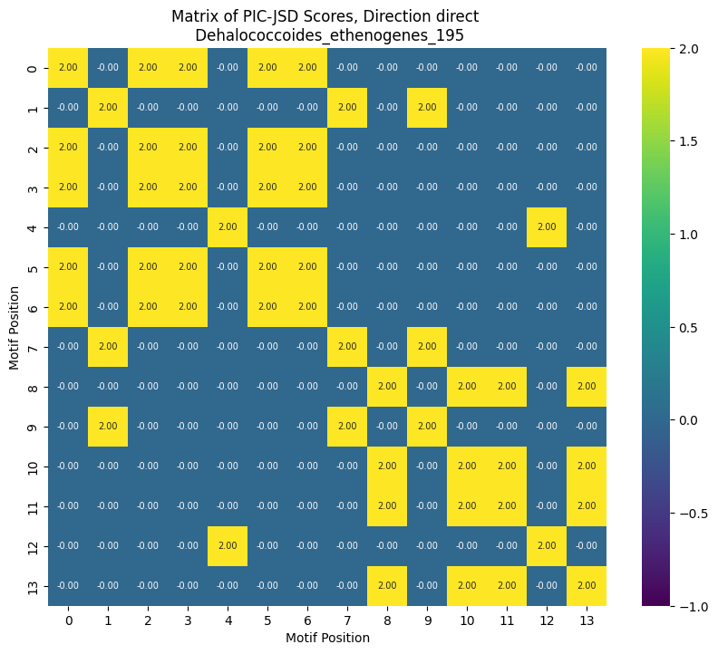 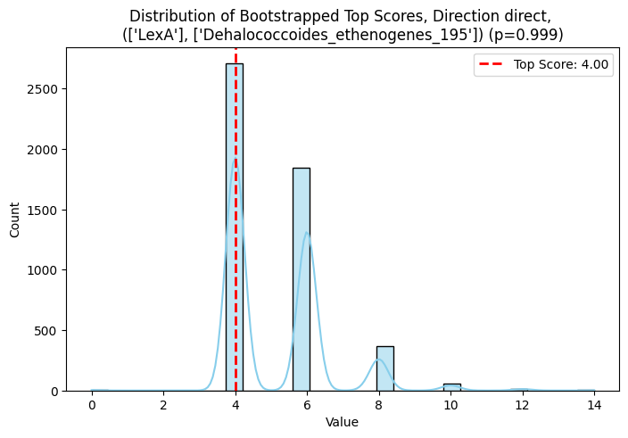 | (1 seq) |  |
| **P31080** | Reverse |  | <table border="1" class="dataframe">  <thead>    <tr style="text-align: right;">      <th>score</th>      <th>p_value</th>      <th>group1</th>      <th>group2</th>    </tr>  </thead>  <tbody>    <tr>      <td>12.0</td>      <td>5.8000e-03</td>      <td>TGTTCT</td>      <td>ACAAGA</td>    </tr>    <tr>      <td>4.0</td>      <td>9.9980e-01</td>      <td>GT</td>      <td>CA</td>    </tr>    <tr>      <td>4.0</td>      <td>9.9980e-01</td>      <td>TT</td>      <td>AA</td>    </tr>    <tr>      <td>4.0</td>      <td>9.9980e-01</td>      <td>CT</td>      <td>GA</td>    </tr>  </tbody></table> | 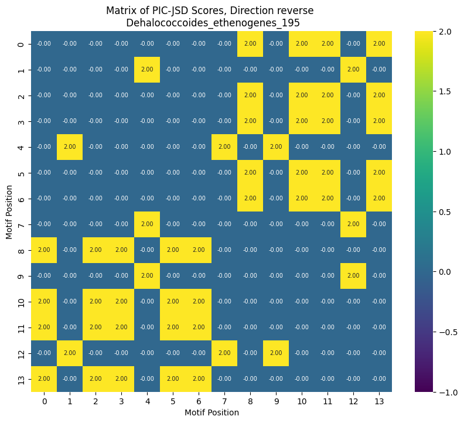 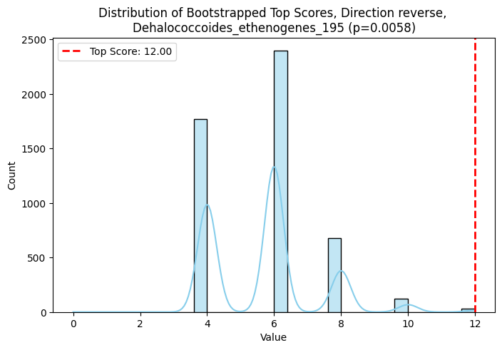 | (1 seq) |  |
| **P37452** | Direct | 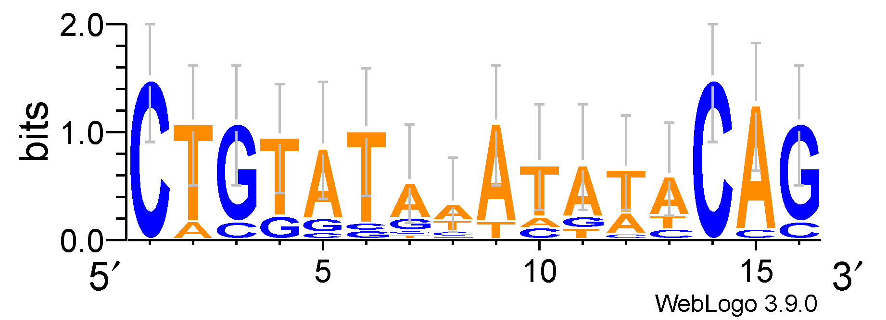 | <table border="1" class="dataframe">  <thead>    <tr style="text-align: right;">      <th>score</th>      <th>p_value</th>      <th>group1</th>      <th>group2</th>    </tr>  </thead>  <tbody>    <tr>      <td>1.560972</td>      <td>8.7800e-01</td>      <td>AT</td>      <td>AT</td>    </tr>    <tr>      <td>1.647882</td>      <td>8.4720e-01</td>      <td>AT</td>      <td>AT</td>    </tr>  </tbody></table> | 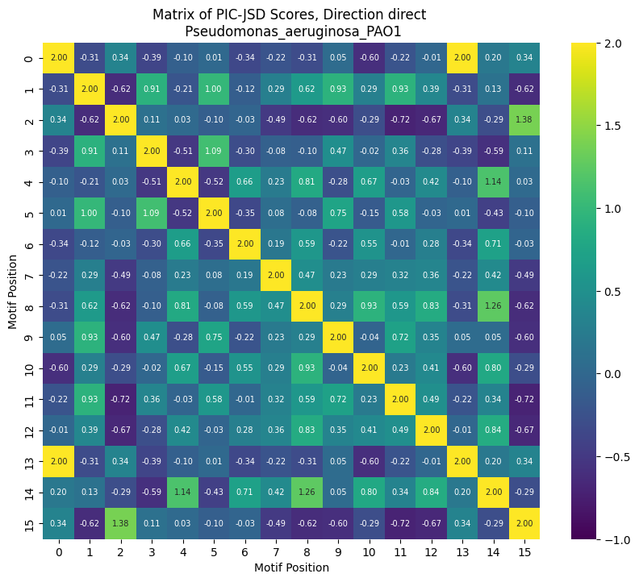 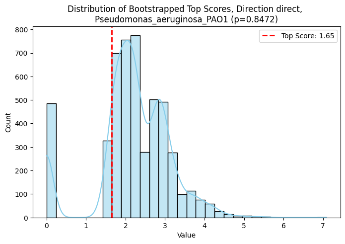 |  | [(['LexA'], ['Pseudomonas_aeruginosa_PAO1'])]: No diagonal candidates were possible at the selected 80% threshold for CollecTF_FASTA/LexA/Pseudomonas_aeruginosa_PAO1/TF_LexA_P37452.fas, automatically reduced to 65%, at value 0.7042621959168818.   Inconsistent sequence lengths {16, 20} in 'CollecTF_FASTA/LexA/Pseudomonas_aeruginosa_PAO1/TF_LexA_P37452.fas'; trimmed all to 16bp. |
| **P37452** | Reverse |  | <table border="1" class="dataframe">  <thead>    <tr style="text-align: right;">      <th>score</th>      <th>p_value</th>      <th>group1</th>      <th>group2</th>    </tr>  </thead>  <tbody>    <tr>      <td>4.315913</td>      <td>4.4000e-03</td>      <td>CAG</td>      <td>GTC</td>    </tr>  </tbody></table> | 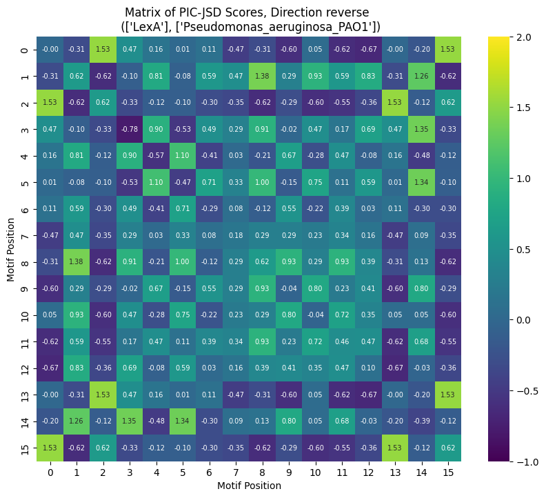 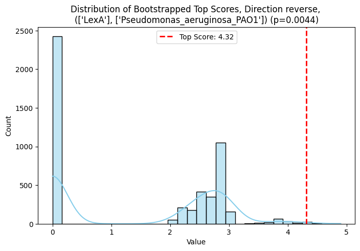 |  | Inconsistent sequence lengths {16, 20} in 'CollecTF_FASTA/LexA/Pseudomonas_aeruginosa_PAO1/TF_LexA_P37452.fas'; trimmed all to 16bp. |
| **P44858** | Direct | 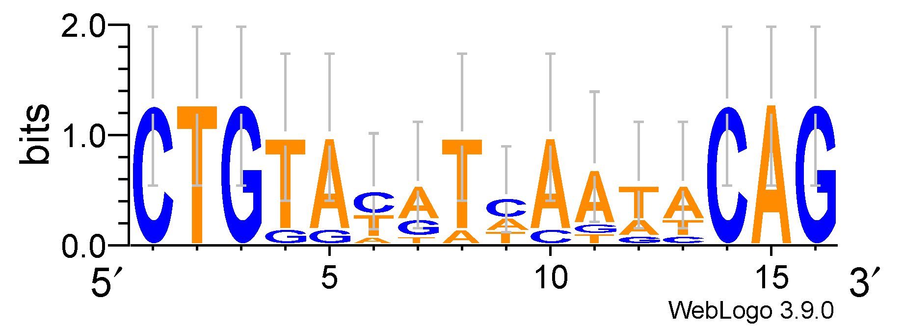 | <table border="1" class="dataframe">  <thead>    <tr style="text-align: right;">      <th>score</th>      <th>p_value</th>      <th>group1</th>      <th>group2</th>    </tr>  </thead>  <tbody>    <tr>      <td>1.485101</td>      <td>9.3560e-01</td>      <td>AT</td>      <td>AT</td>    </tr>  </tbody></table> | 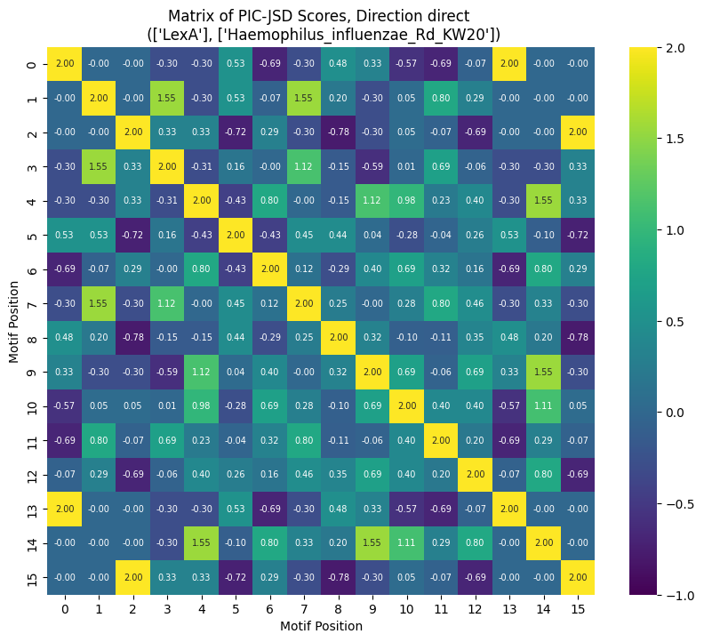 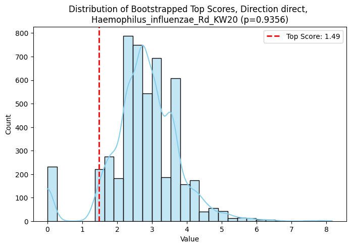 |  | [(['LexA'], ['Haemophilus_influenzae_Rd_KW20'])]: No diagonal candidates were possible at the selected 80% threshold for CollecTF_FASTA/LexA/Haemophilus_influenzae_Rd_KW20/TF_LexA_P44858.fas, automatically reduced to 35%, at value 0.6212165030569339. |
| **P44858** | Reverse |  | <table border="1" class="dataframe">  <thead>    <tr style="text-align: right;">      <th>score</th>      <th>p_value</th>      <th>group1</th>      <th>group2</th>    </tr>  </thead>  <tbody>    <tr>      <td>6.0</td>      <td>3.2000e-03</td>      <td>CAG</td>      <td>GTC</td>    </tr>  </tbody></table> | 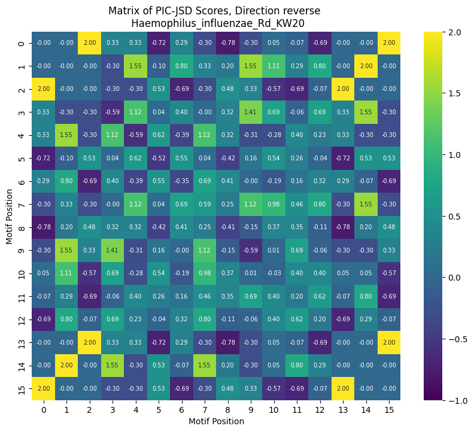 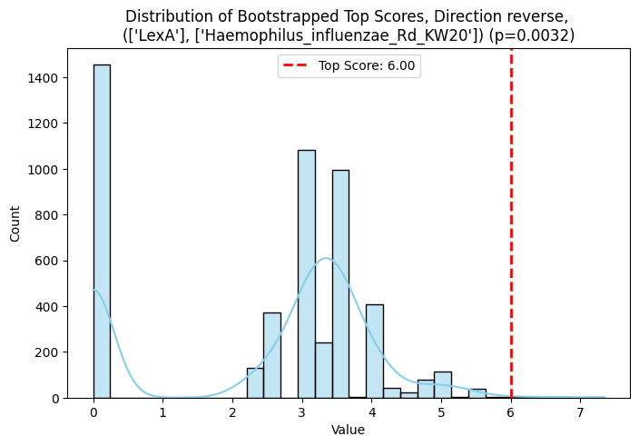 |  |  |
| **P61609** | Direct | 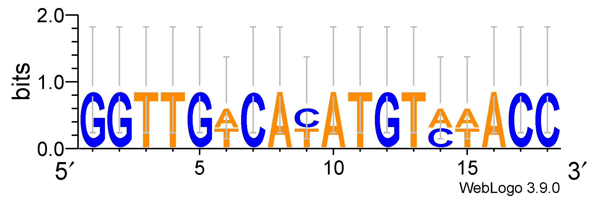 | <table border="1" class="dataframe">  <thead>    <tr style="text-align: right;">      <th>score</th>      <th>p_value</th>      <th>group1</th>      <th>group2</th>    </tr>  </thead>  <tbody>    <tr>      <td>4.0</td>      <td>8.8680e-01</td>      <td>TG</td>      <td>TG</td>    </tr>    <tr>      <td>4.0</td>      <td>8.8680e-01</td>      <td>GT</td>      <td>GT</td>    </tr>  </tbody></table> | 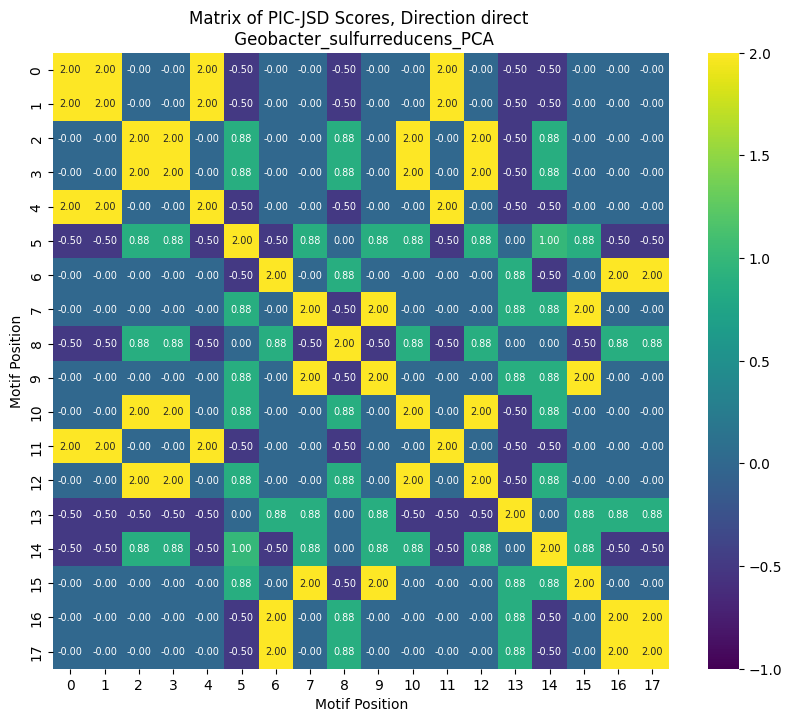 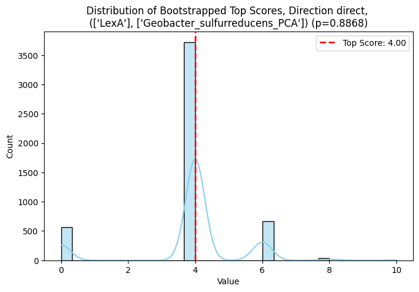 | (2 seq) |  |
| **P61609** | Reverse |  | <table border="1" class="dataframe">  <thead>    <tr style="text-align: right;">      <th>score</th>      <th>p_value</th>      <th>group1</th>      <th>group2</th>    </tr>  </thead>  <tbody>    <tr>      <td>6.0</td>      <td>2.3860e-01</td>      <td>ACC</td>      <td>TGG</td>    </tr>    <tr>      <td>4.0</td>      <td>9.5960e-01</td>      <td>CA</td>      <td>GT</td>    </tr>    <tr>      <td>4.0</td>      <td>9.5960e-01</td>      <td>TG</td>      <td>AC</td>    </tr>    <tr>      <td>4.0</td>      <td>9.5960e-01</td>      <td>AC</td>      <td>TG</td>    </tr>  </tbody></table> | 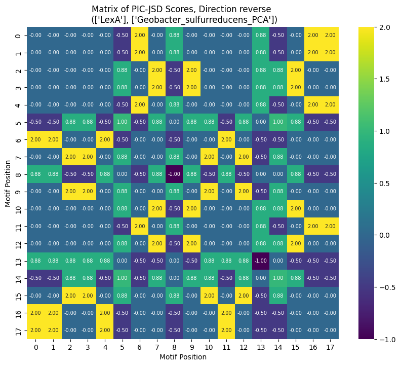 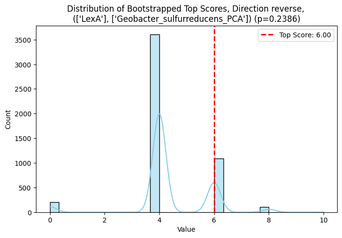 | (2 seq) |  |
| **P61611** | Direct | 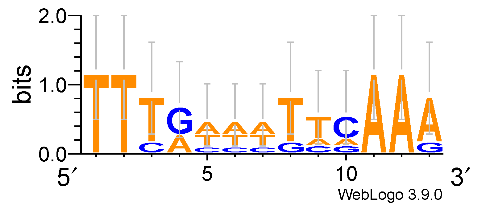 | <table border="1" class="dataframe">  <thead>    <tr style="text-align: right;">      <th>score</th>      <th>p_value</th>      <th>group1</th>      <th>group2</th>    </tr>  </thead>  <tbody>    <tr>      <td>3.422973</td>      <td>2.4760e-01</td>      <td>TT</td>      <td>TT</td>    </tr>    <tr>      <td>3.422973</td>      <td>2.4760e-01</td>      <td>AA</td>      <td>AA</td>    </tr>  </tbody></table> | 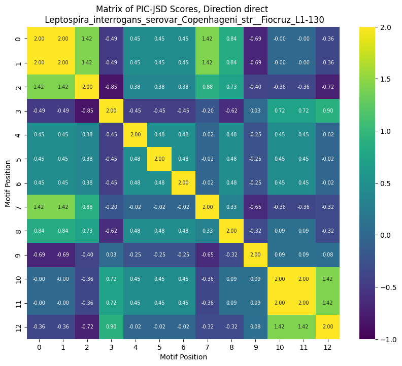 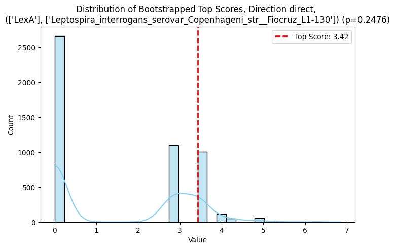 |  |  |
| **P61611** | Reverse |  | <table border="1" class="dataframe">  <thead>    <tr style="text-align: right;">      <th>score</th>      <th>p_value</th>      <th>group1</th>      <th>group2</th>    </tr>  </thead>  <tbody>    <tr>      <td>4.845946</td>      <td>1.5800e-02</td>      <td>AAA</td>      <td>TTT</td>    </tr>    <tr>      <td>4.000000</td>      <td>7.0400e-02</td>      <td>AA</td>      <td>TT</td>    </tr>    <tr>      <td>2.845946</td>      <td>5.4020e-01</td>      <td>AA</td>      <td>TT</td>    </tr>  </tbody></table> | 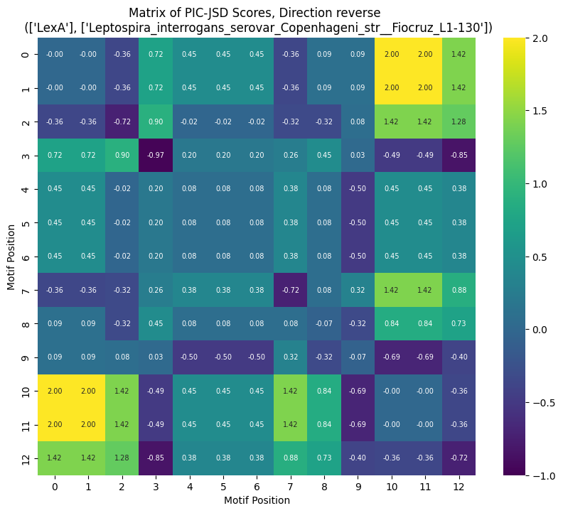 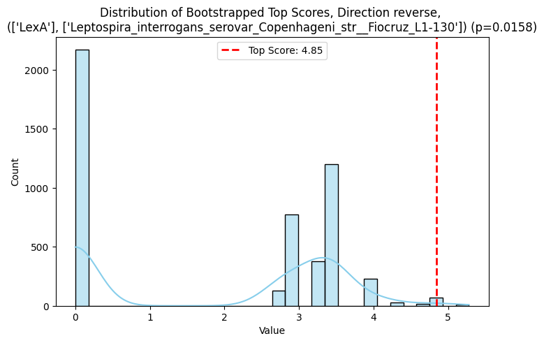 |  |  |
| **Q1D406** | Direct | 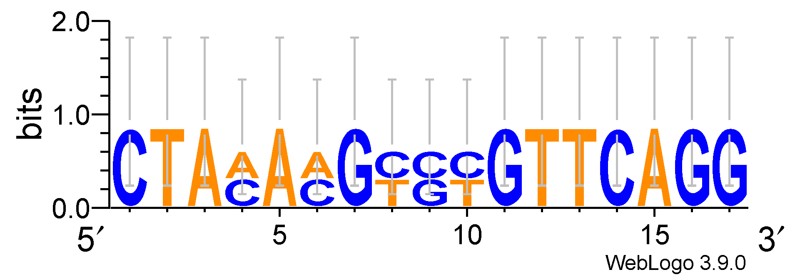 | <table border="1" class="dataframe">  <thead>    <tr style="text-align: right;">      <th>score</th>      <th>p_value</th>      <th>group1</th>      <th>group2</th>    </tr>  </thead>  <tbody>    <tr>      <td>3.0</td>      <td>7.9160e-01</td>      <td>AA</td>      <td>AA</td>    </tr>  </tbody></table> | 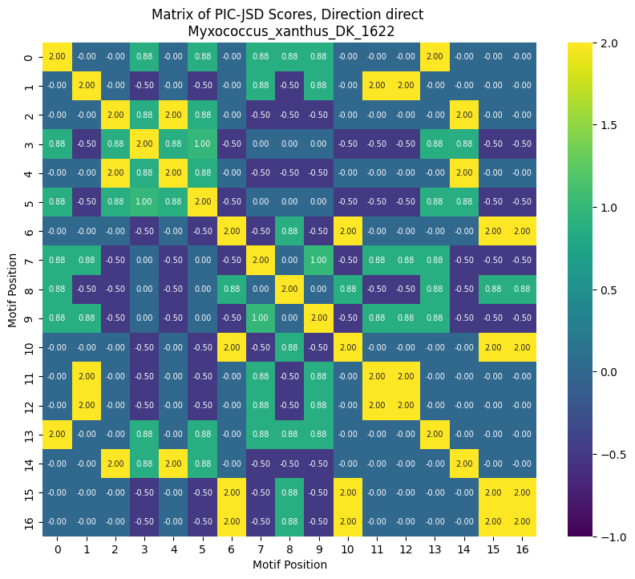 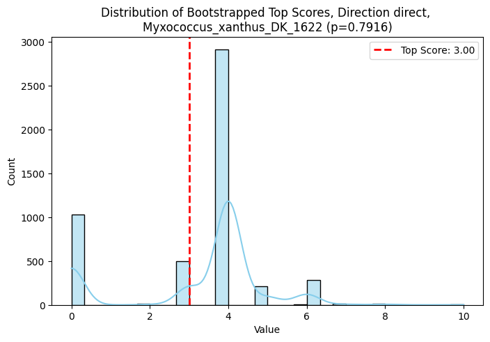 |  | [(['LexA'], ['Myxococcus_xanthus_DK_1622'])]: No diagonal candidates were possible at the selected 80% threshold for CollecTF_FASTA/LexA/Myxococcus_xanthus_DK_1622/TF_LexA_Q1D406.fas, automatically reduced to 65%, at value 0.9999999932676049. |
| **Q1D406** | Reverse |  | <table border="1" class="dataframe">  <thead>    <tr style="text-align: right;">      <th>score</th>      <th>p_value</th>      <th>group1</th>      <th>group2</th>    </tr>  </thead>  <tbody>    <tr>      <td>4.0</td>      <td>8.0500e-01</td>      <td>AG</td>      <td>TC</td>    </tr>  </tbody></table> | 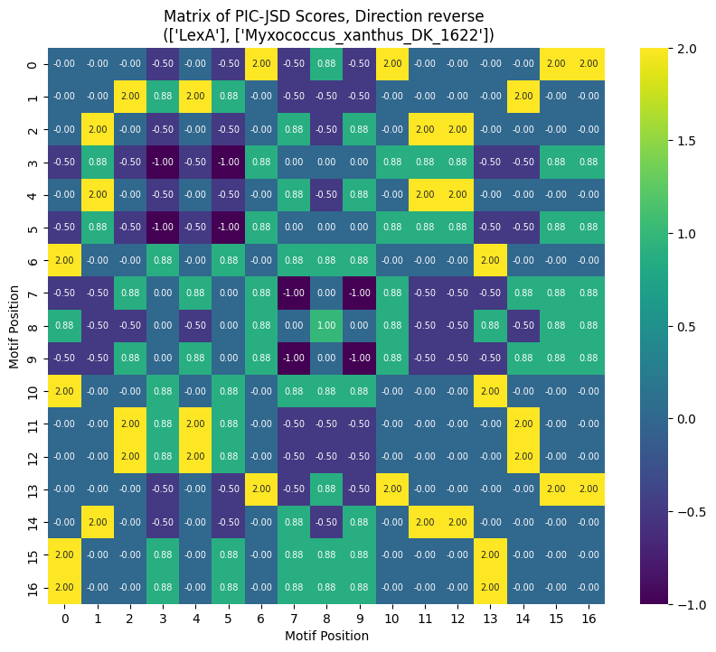 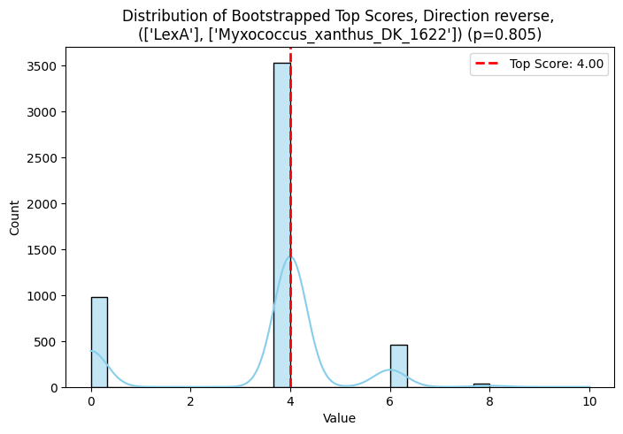 |  |  |
| **Q2SVP7** | Direct | 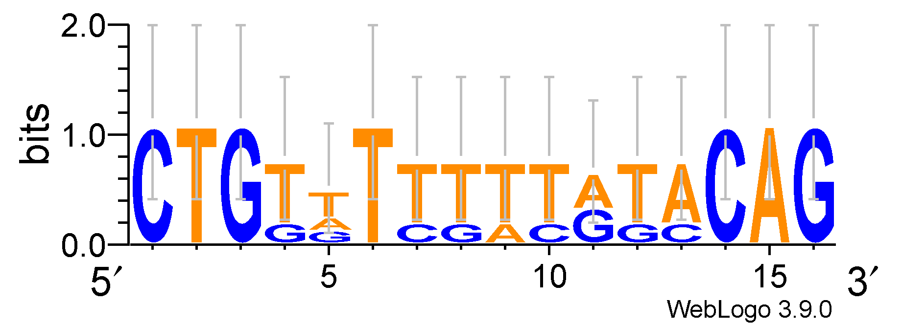 | <table border="1" class="dataframe">  <thead>    <tr style="text-align: right;">      <th>score</th>      <th>p_value</th>      <th>group1</th>      <th>group2</th>    </tr>  </thead>  <tbody>    <tr>      <td>2.507232</td>      <td>9.4420e-01</td>      <td>TT</td>      <td>TT</td>    </tr>  </tbody></table> | 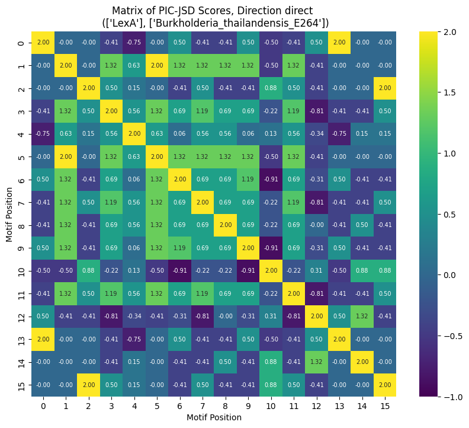 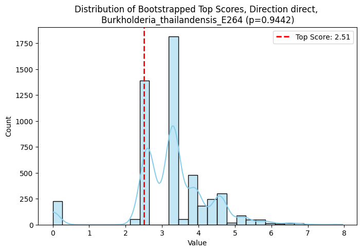 |  |  |
| **Q2SVP7** | Reverse |  | <table border="1" class="dataframe">  <thead>    <tr style="text-align: right;">      <th>score</th>      <th>p_value</th>      <th>group1</th>      <th>group2</th>    </tr>  </thead>  <tbody>    <tr>      <td>7.188722</td>      <td>6.0000e-04</td>      <td>ACAG</td>      <td>TGTC</td>    </tr>  </tbody></table> | 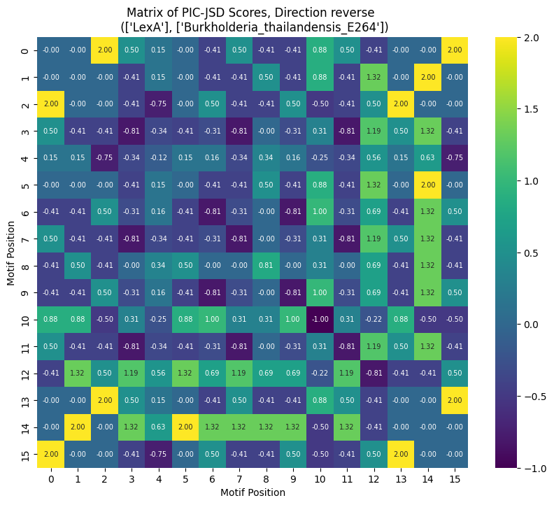 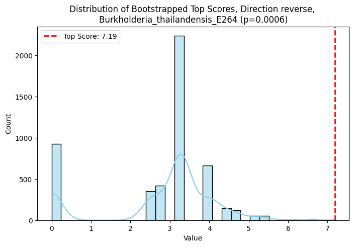 |  |  |
| **Q3Z9S7** | Direct | 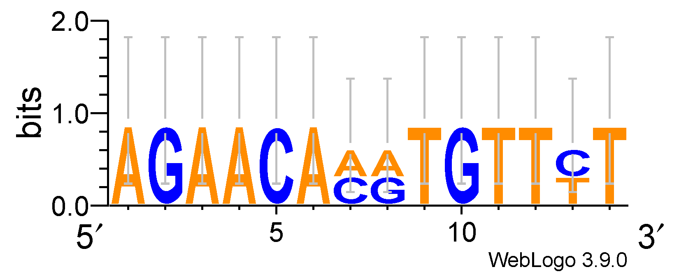 | No candidates found | 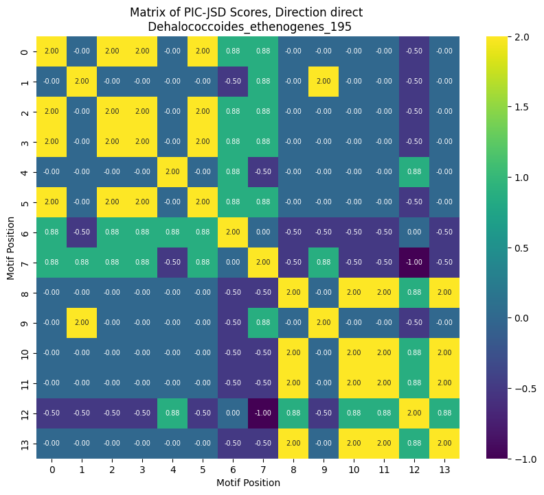 No Bootstrap | (2 seq) | [DETECT_PATTERNS] - (['LexA'], ['Dehalococcoides_ethenogenes_195']): Exhausted all fallbacks down to 25th percentile. No diagonal candidates >=2 positions found at user-specified 80% |
| **Q3Z9S7** | Reverse |  | <table border="1" class="dataframe">  <thead>    <tr style="text-align: right;">      <th>score</th>      <th>p_value</th>      <th>group1</th>      <th>group2</th>    </tr>  </thead>  <tbody>    <tr>      <td>8.0</td>      <td>1.8000e-02</td>      <td>TGTT</td>      <td>ACAA</td>    </tr>  </tbody></table> | 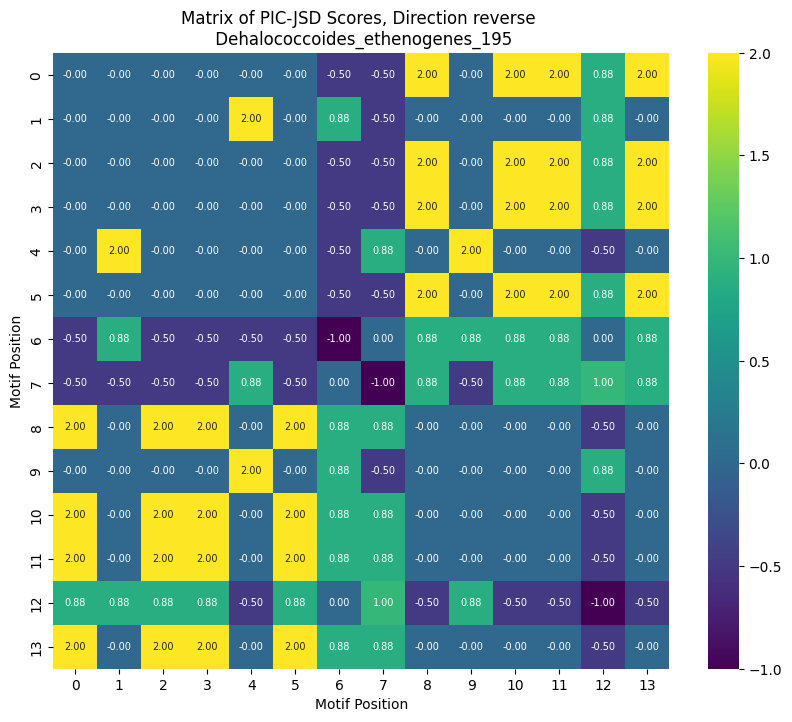 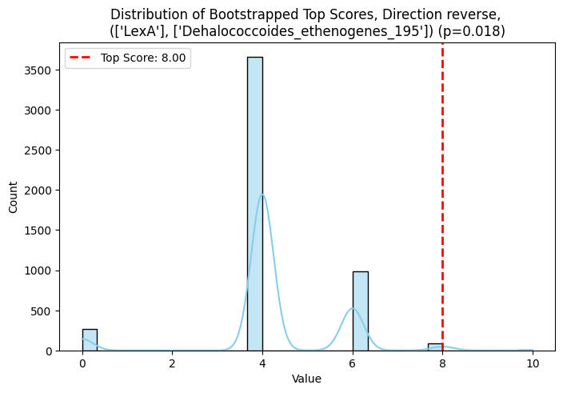 | (2 seq) |  |
| **Q6MHM9** | Direct | 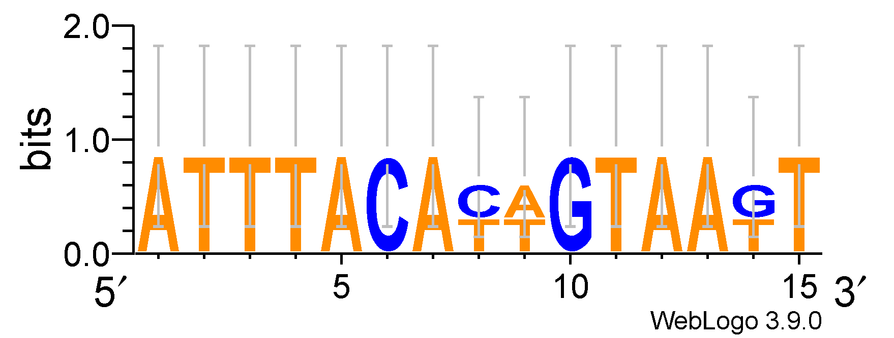 | <table border="1" class="dataframe">  <thead>    <tr style="text-align: right;">      <th>score</th>      <th>p_value</th>      <th>group1</th>      <th>group2</th>    </tr>  </thead>  <tbody>    <tr>      <td>4.0</td>      <td>9.9120e-01</td>      <td>TT</td>      <td>TT</td>    </tr>    <tr>      <td>4.0</td>      <td>9.9120e-01</td>      <td>TA</td>      <td>TA</td>    </tr>  </tbody></table> | 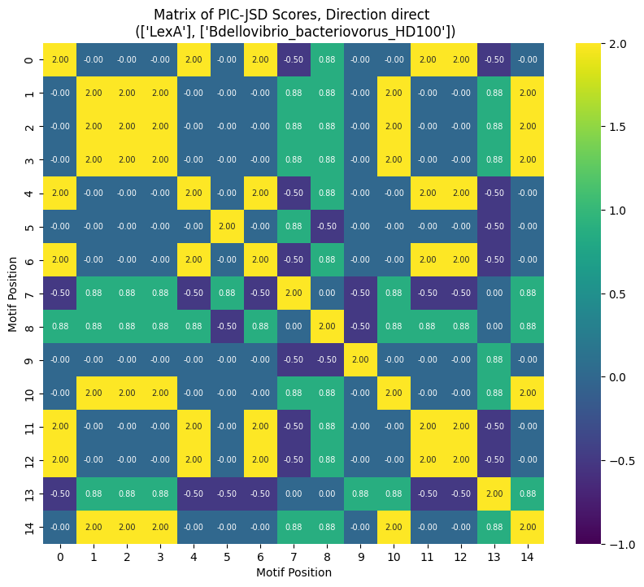 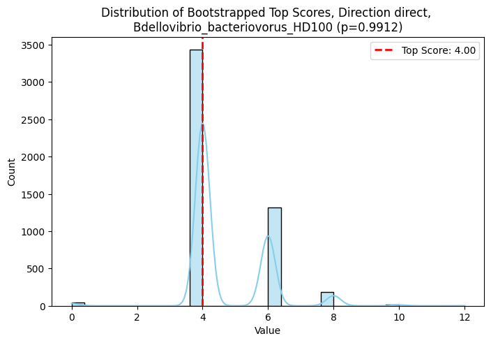 |  |  |
| **Q6MHM9** | Reverse |  | <table border="1" class="dataframe">  <thead>    <tr style="text-align: right;">      <th>score</th>      <th>p_value</th>      <th>group1</th>      <th>group2</th>    </tr>  </thead>  <tbody>    <tr>      <td>8.0</td>      <td>5.9200e-02</td>      <td>GTAA</td>      <td>CATT</td>    </tr>    <tr>      <td>4.0</td>      <td>9.9660e-01</td>      <td>AA</td>      <td>TT</td>    </tr>  </tbody></table> | 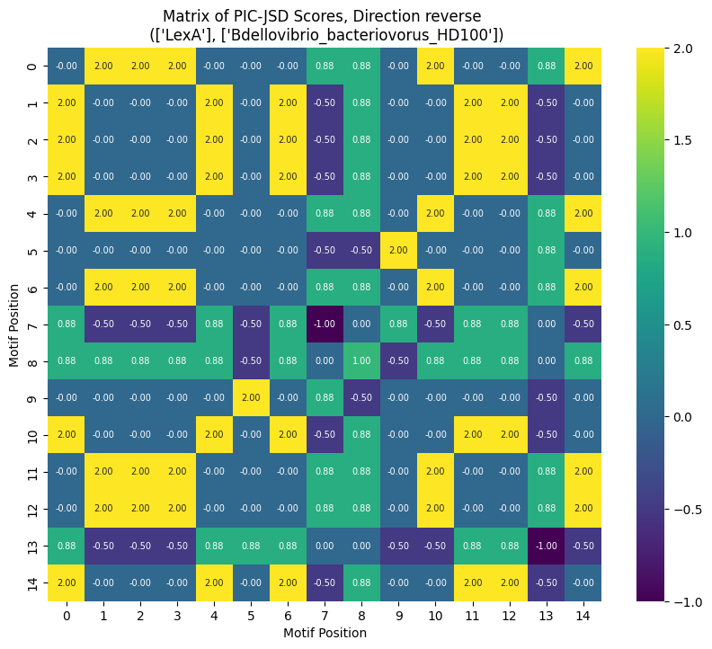 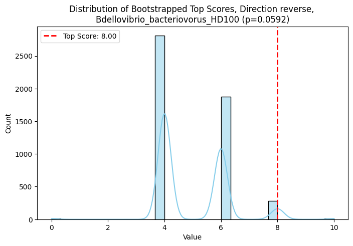 |  |  |
| **Q87KN2** | Direct | 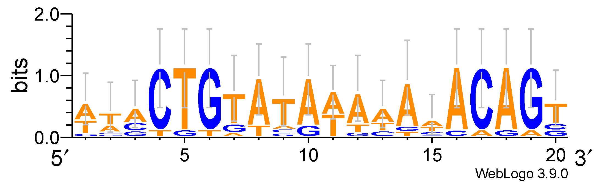 | <table border="1" class="dataframe">  <thead>    <tr style="text-align: right;">      <th>score</th>      <th>p_value</th>      <th>group1</th>      <th>group2</th>    </tr>  </thead>  <tbody>    <tr>      <td>1.994681</td>      <td>8.3480e-01</td>      <td>AC</td>      <td>AC</td>    </tr>  </tbody></table> | 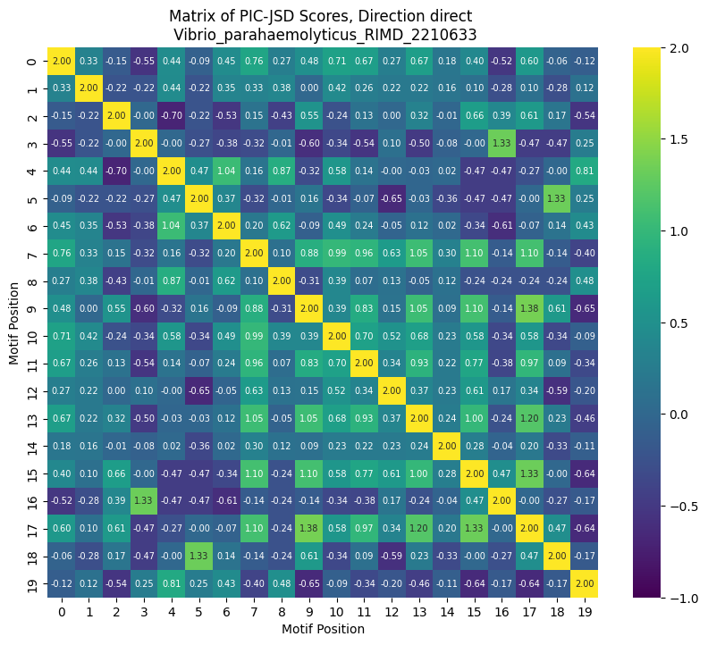 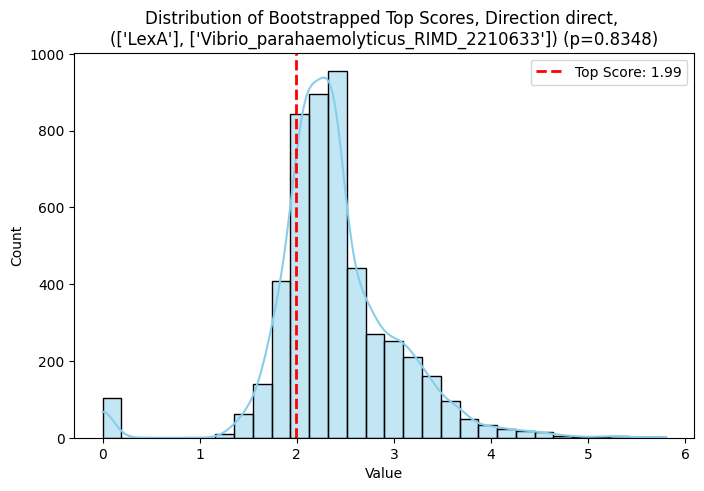 |  | [(['LexA'], ['Vibrio_parahaemolyticus_RIMD_2210633'])]: No diagonal candidates were possible at the selected 80% threshold for CollecTF_FASTA/LexA/Vibrio_parahaemolyticus_RIMD_2210633/TF_LexA_Q87KN2.fas, automatically reduced to 65%, at value 0.6633335145818818.   Inconsistent sequence lengths {20, 22} in 'CollecTF_FASTA/LexA/Vibrio_parahaemolyticus_RIMD_2210633/TF_LexA_Q87KN2.fas'; trimmed all to 20bp. |
| **Q87KN2** | Reverse |  | <table border="1" class="dataframe">  <thead>    <tr style="text-align: right;">      <th>score</th>      <th>p_value</th>      <th>group1</th>      <th>group2</th>    </tr>  </thead>  <tbody>    <tr>      <td>5.437533</td>      <td>0.0000e+00</td>      <td>ACAG</td>      <td>TGTC</td>    </tr>    <tr>      <td>2.142946</td>      <td>4.9640e-01</td>      <td>GT</td>      <td>CA</td>    </tr>  </tbody></table> | 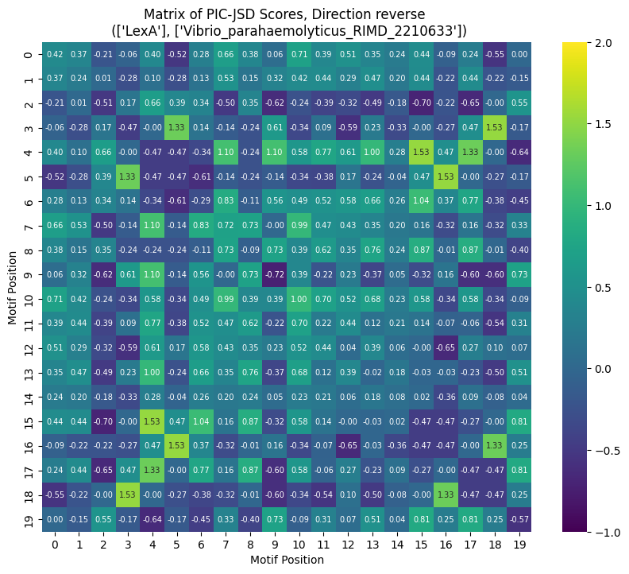 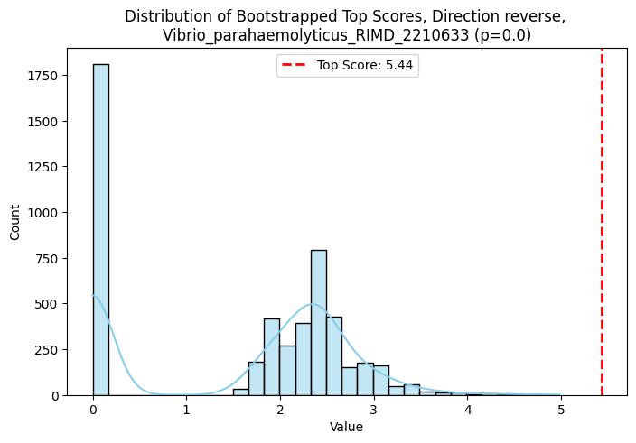 |  | Inconsistent sequence lengths {20, 22} in 'CollecTF_FASTA/LexA/Vibrio_parahaemolyticus_RIMD_2210633/TF_LexA_Q87KN2.fas'; trimmed all to 20bp. |
| **Q8F663** | Direct | 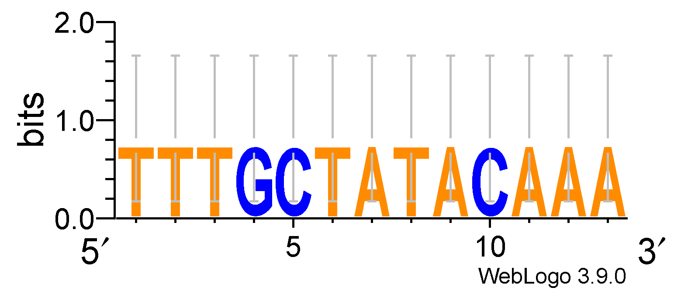 | <table border="1" class="dataframe">  <thead>    <tr style="text-align: right;">      <th>score</th>      <th>p_value</th>      <th>group1</th>      <th>group2</th>    </tr>  </thead>  <tbody>    <tr>      <td>4.0</td>      <td>1.0000e+00</td>      <td>TT</td>      <td>TT</td>    </tr>    <tr>      <td>4.0</td>      <td>1.0000e+00</td>      <td>TA</td>      <td>TA</td>    </tr>    <tr>      <td>4.0</td>      <td>1.0000e+00</td>      <td>AA</td>      <td>AA</td>    </tr>  </tbody></table> | 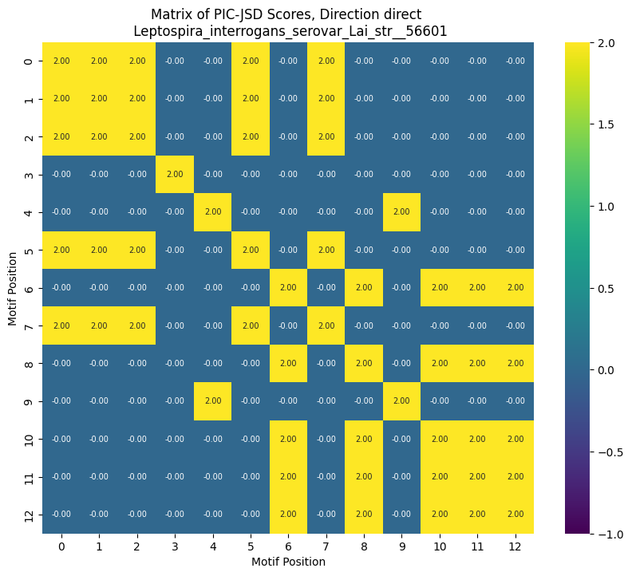 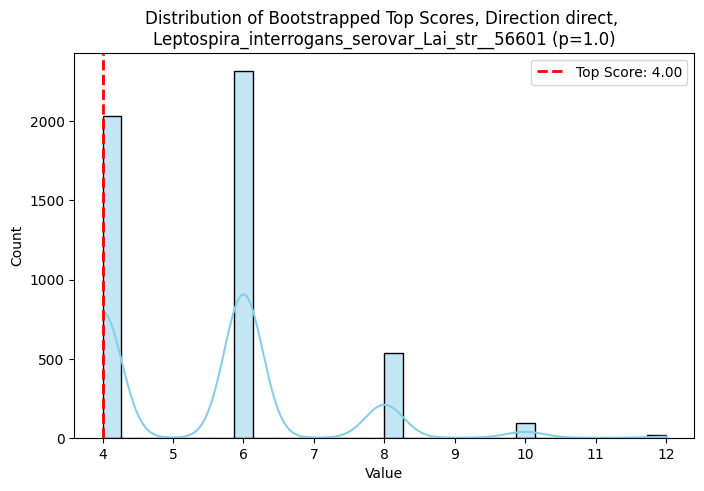 | (1 seq) |  |
| **Q8F663** | Reverse |  | <table border="1" class="dataframe">  <thead>    <tr style="text-align: right;">      <th>score</th>      <th>p_value</th>      <th>group1</th>      <th>group2</th>    </tr>  </thead>  <tbody>    <tr>      <td>8.0</td>      <td>2.2480e-01</td>      <td>CAAA</td>      <td>GTTT</td>    </tr>    <tr>      <td>4.0</td>      <td>9.9980e-01</td>      <td>TA</td>      <td>AT</td>    </tr>    <tr>      <td>4.0</td>      <td>9.9980e-01</td>      <td>AA</td>      <td>TT</td>    </tr>    <tr>      <td>4.0</td>      <td>9.9980e-01</td>      <td>AA</td>      <td>TT</td>    </tr>  </tbody></table> | 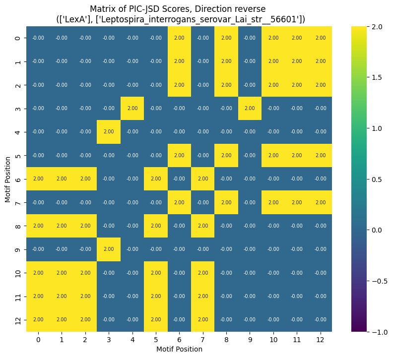 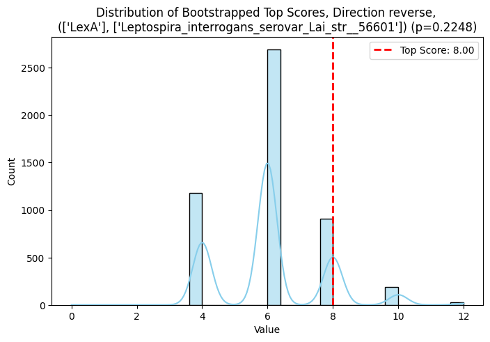 | (1 seq) |  |
| **Q8PN77** | Direct | 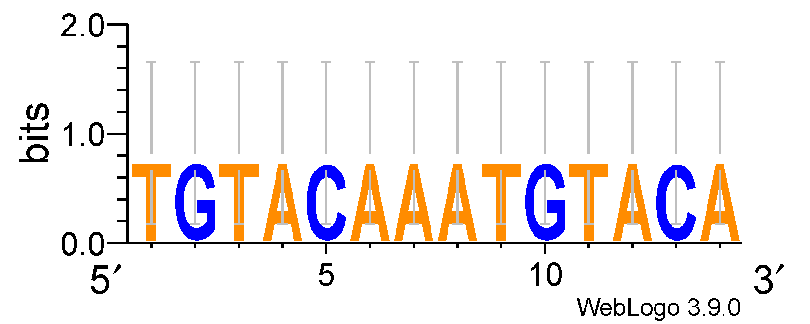 | <table border="1" class="dataframe">  <thead>    <tr style="text-align: right;">      <th>score</th>      <th>p_value</th>      <th>group1</th>      <th>group2</th>    </tr>  </thead>  <tbody>    <tr>      <td>12.0</td>      <td>3.6000e-03</td>      <td>TGTACA</td>      <td>TGTACA</td>    </tr>    <tr>      <td>4.0</td>      <td>1.0000e+00</td>      <td>AA</td>      <td>AA</td>    </tr>  </tbody></table> | 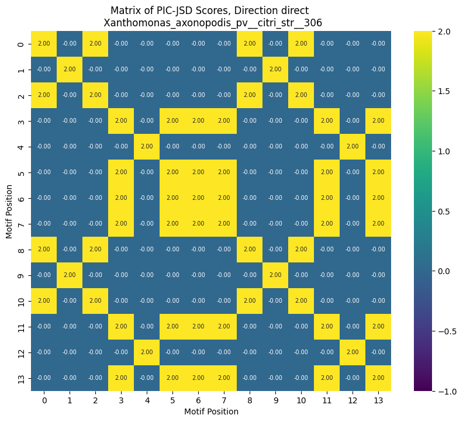  | (1 seq) |  |
| **Q8PN77** | Reverse |  | <table border="1" class="dataframe">  <thead>    <tr style="text-align: right;">      <th>score</th>      <th>p_value</th>      <th>group1</th>      <th>group2</th>    </tr>  </thead>  <tbody>    <tr>      <td>12.0</td>      <td>4.6000e-03</td>      <td>TGTACA</td>      <td>ACATGT</td>    </tr>    <tr>      <td>6.0</td>      <td>6.8680e-01</td>      <td>ACA</td>      <td>TGT</td>    </tr>    <tr>      <td>6.0</td>      <td>6.8680e-01</td>      <td>ACA</td>      <td>TGT</td>    </tr>  </tbody></table> | 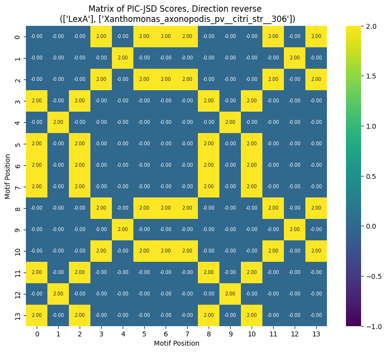 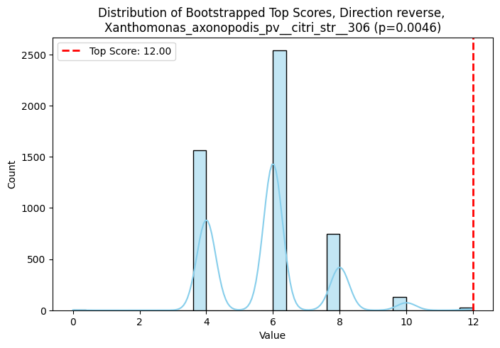 | (1 seq) |  |
| **Q8Y7H7** | Direct | 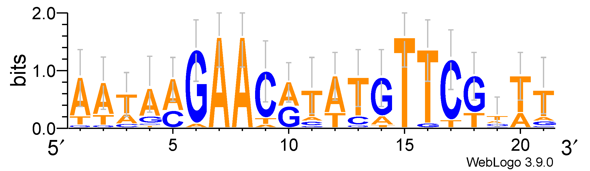 | <table border="1" class="dataframe">  <thead>    <tr style="text-align: right;">      <th>score</th>      <th>p_value</th>      <th>group1</th>      <th>group2</th>    </tr>  </thead>  <tbody>    <tr>      <td>2.378963</td>      <td>5.1720e-01</td>      <td>AA</td>      <td>AA</td>    </tr>    <tr>      <td>2.154263</td>      <td>7.4800e-01</td>      <td>AA</td>      <td>AA</td>    </tr>  </tbody></table> | 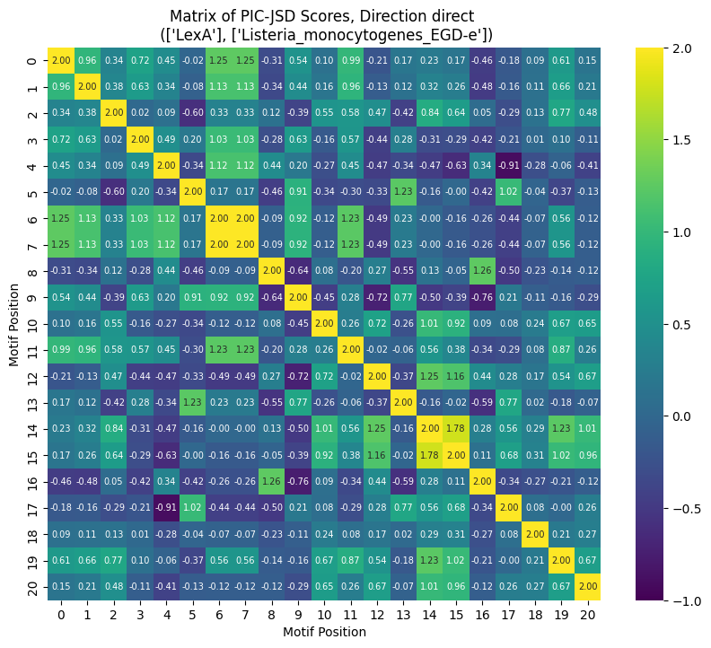 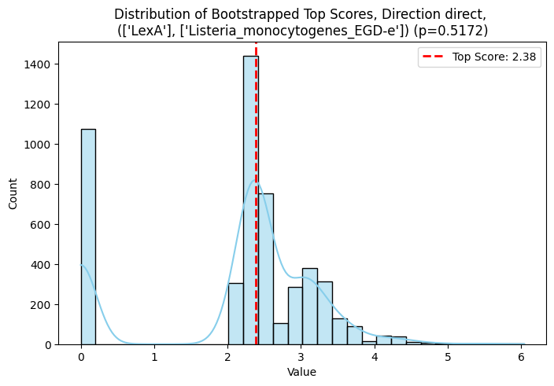 |  |  |
| **Q8Y7H7** | Reverse |  | <table border="1" class="dataframe">  <thead>    <tr style="text-align: right;">      <th>score</th>      <th>p_value</th>      <th>group1</th>      <th>group2</th>    </tr>  </thead>  <tbody>    <tr>      <td>6.423769</td>      <td>0.0000e+00</td>      <td>GTTC</td>      <td>CAAG</td>    </tr>    <tr>      <td>2.168267</td>      <td>8.4500e-01</td>      <td>TT</td>      <td>AA</td>    </tr>    <tr>      <td>2.240445</td>      <td>8.1680e-01</td>      <td>TT</td>      <td>AA</td>    </tr>  </tbody></table> | 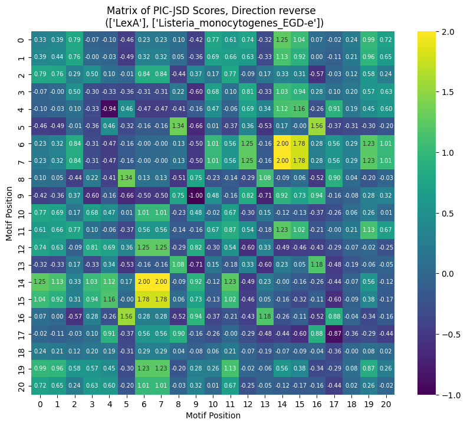 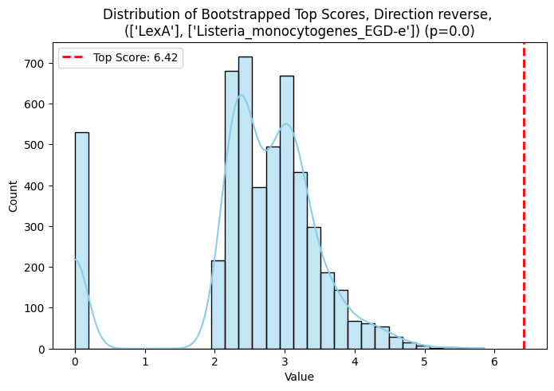 |  |  |
| **Q8YMM5** | Direct |  | <table border="1" class="dataframe">  <thead>    <tr style="text-align: right;">      <th>score</th>      <th>p_value</th>      <th>group1</th>      <th>group2</th>    </tr>  </thead>  <tbody>    <tr>      <td>4.000000</td>      <td>9.9400e-02</td>      <td>GT</td>      <td>GT</td>    </tr>    <tr>      <td>2.994755</td>      <td>5.0240e-01</td>      <td>TA</td>      <td>TA</td>    </tr>  </tbody></table> |   |  |  |
| **Q8YMM5** | Reverse |  | <table border="1" class="dataframe">  <thead>    <tr style="text-align: right;">      <th>score</th>      <th>p_value</th>      <th>group1</th>      <th>group2</th>    </tr>  </thead>  <tbody>    <tr>      <td>2.994755</td>      <td>7.3660e-01</td>      <td>AC</td>      <td>TG</td>    </tr>    <tr>      <td>2.994755</td>      <td>7.1540e-01</td>      <td>GT</td>      <td>CA</td>    </tr>  </tbody></table> |   |  |  |
| **Q9L4P1** | Direct | 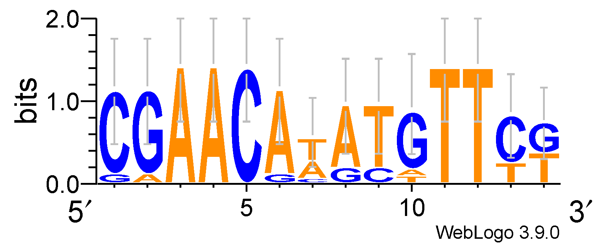 | <table border="1" class="dataframe">  <thead>    <tr style="text-align: right;">      <th>score</th>      <th>p_value</th>      <th>group1</th>      <th>group2</th>    </tr>  </thead>  <tbody>    <tr>      <td>1.494718</td>      <td>9.8240e-01</td>      <td>CG</td>      <td>TG</td>    </tr>  </tbody></table> | 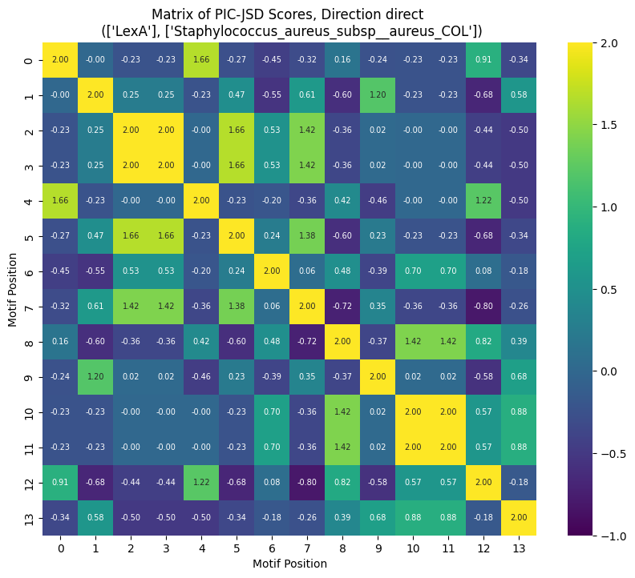 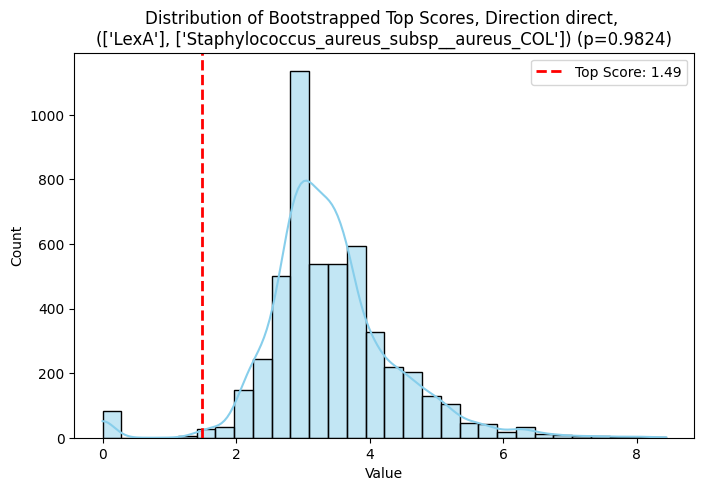 |  | [(['LexA'], ['Staphylococcus_aureus_subsp__aureus_COL'])]: No diagonal candidates were possible at the selected 80% threshold for CollecTF_FASTA/LexA/Staphylococcus_aureus_subsp__aureus_COL/TF_LexA_Q9L4P1.fas, automatically reduced to 30%, at value 0.6390359490701214. |
| **Q9L4P1** | Reverse |  | <table border="1" class="dataframe">  <thead>    <tr style="text-align: right;">      <th>score</th>      <th>p_value</th>      <th>group1</th>      <th>group2</th>    </tr>  </thead>  <tbody>    <tr>      <td>7.930041</td>      <td>0.0000e+00</td>      <td>TGTTC</td>      <td>ACAAG</td>    </tr>  </tbody></table> | 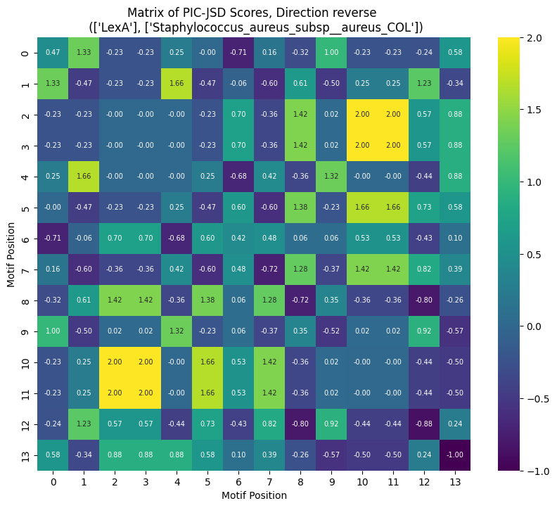 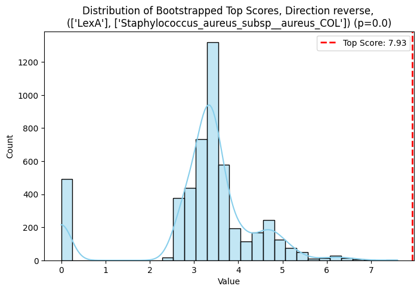 |  |  |
| **Q9PH24** | Direct | 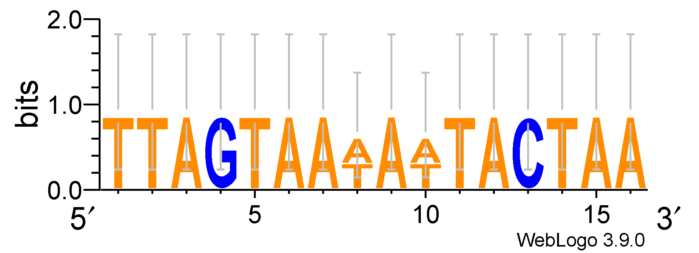 | <table border="1" class="dataframe">  <thead>    <tr style="text-align: right;">      <th>score</th>      <th>p_value</th>      <th>group1</th>      <th>group2</th>    </tr>  </thead>  <tbody>    <tr>      <td>6.0</td>      <td>7.2620e-01</td>      <td>TAA</td>      <td>TAA</td>    </tr>    <tr>      <td>4.0</td>      <td>1.0000e+00</td>      <td>TA</td>      <td>TA</td>    </tr>    <tr>      <td>4.0</td>      <td>1.0000e+00</td>      <td>TA</td>      <td>TA</td>    </tr>    <tr>      <td>4.0</td>      <td>1.0000e+00</td>      <td>TA</td>      <td>TA</td>    </tr>    <tr>      <td>4.0</td>      <td>1.0000e+00</td>      <td>TA</td>      <td>TA</td>    </tr>    <tr>      <td>4.0</td>      <td>1.0000e+00</td>      <td>TA</td>      <td>TA</td>    </tr>  </tbody></table> | 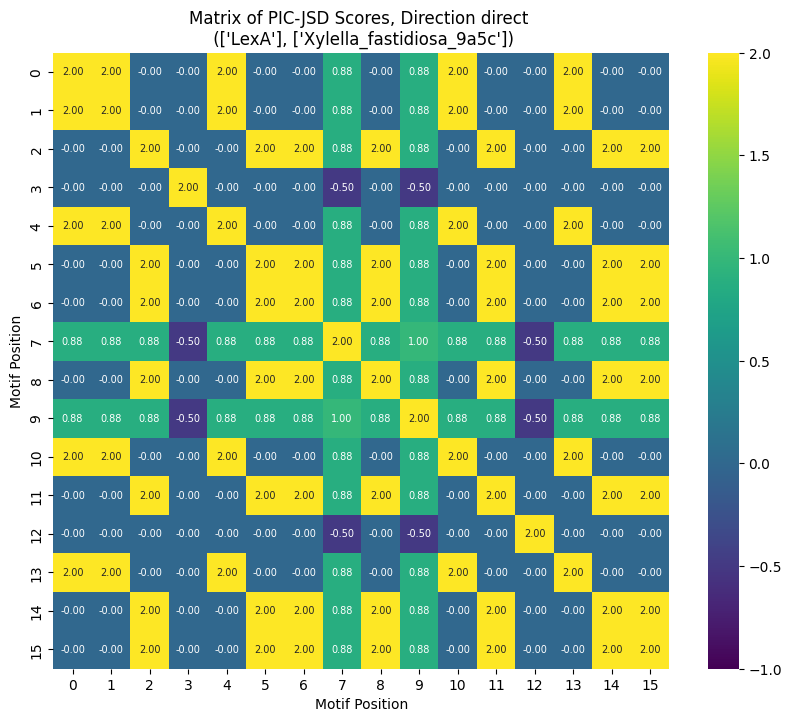 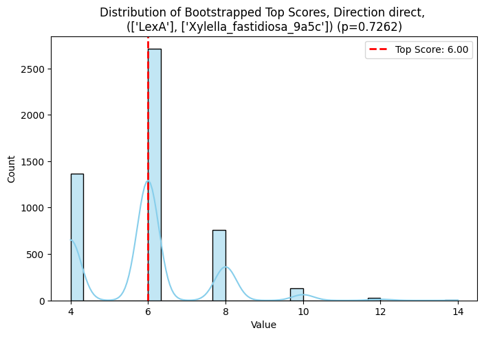 | (2 seq) |  |
| **Q9PH24** | Reverse |  | <table border="1" class="dataframe">  <thead>    <tr style="text-align: right;">      <th>score</th>      <th>p_value</th>      <th>group1</th>      <th>group2</th>    </tr>  </thead>  <tbody>    <tr>      <td>12.0</td>      <td>8.0000e-04</td>      <td>TACTAA</td>      <td>ATGATT</td>    </tr>    <tr>      <td>6.0</td>      <td>7.4740e-01</td>      <td>TAA</td>      <td>ATT</td>    </tr>    <tr>      <td>4.0</td>      <td>9.9980e-01</td>      <td>TA</td>      <td>AT</td>    </tr>    <tr>      <td>4.0</td>      <td>9.9980e-01</td>      <td>TA</td>      <td>AT</td>    </tr>    <tr>      <td>4.0</td>      <td>9.9980e-01</td>      <td>TA</td>      <td>AT</td>    </tr>  </tbody></table> | 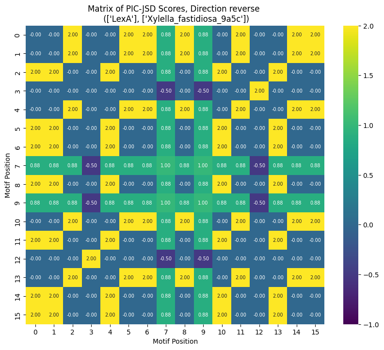 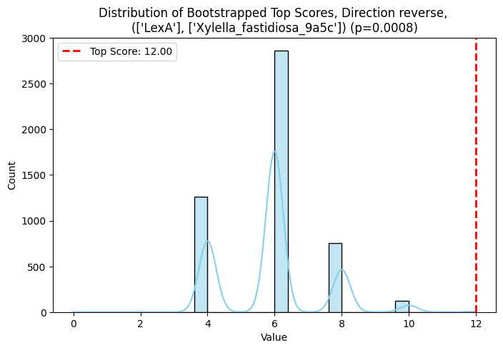 | (2 seq) |  |
| **Q883X4** | Direct | 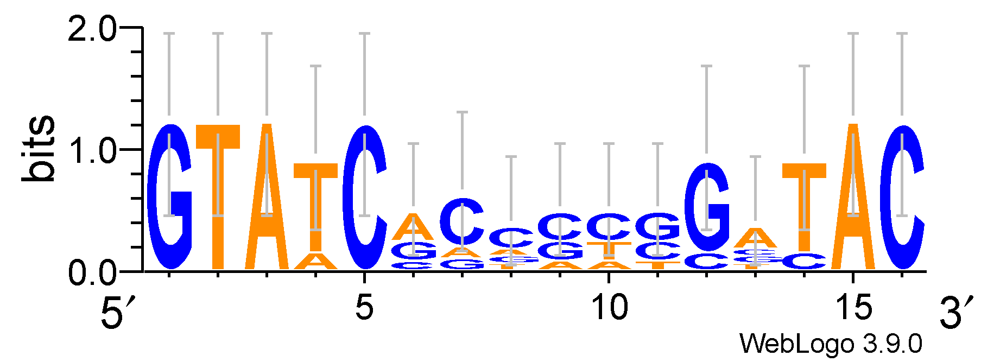 | <table border="1" class="dataframe">  <thead>    <tr style="text-align: right;">      <th>score</th>      <th>p_value</th>      <th>group1</th>      <th>group2</th>    </tr>  </thead>  <tbody>    <tr>      <td>3.497377</td>      <td>1.1260e-01</td>      <td>TA</td>      <td>TA</td>    </tr>  </tbody></table> | 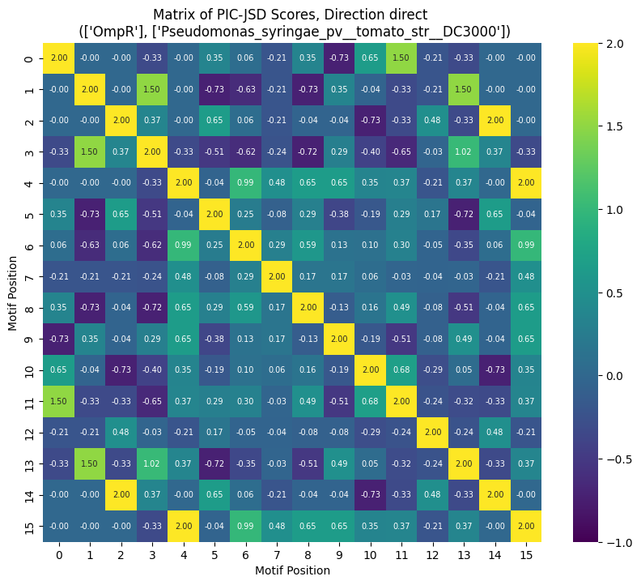 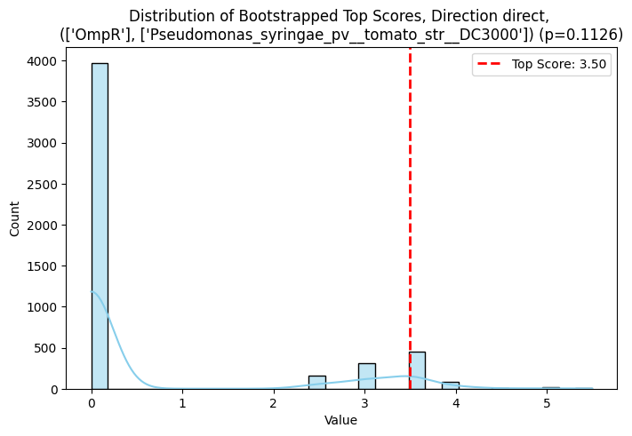 | (?? https://apsjournals.apsnet.org/doi/pdf/10.1094/MPMI-23-7-0927) |  |
| **Q883X4** | Reverse |  | <table border="1" class="dataframe">  <thead>    <tr style="text-align: right;">      <th>score</th>      <th>p_value</th>      <th>group1</th>      <th>group2</th>    </tr>  </thead>  <tbody>    <tr>      <td>5.497377</td>      <td>6.6000e-03</td>      <td>TAC</td>      <td>ATG</td>    </tr>  </tbody></table> | 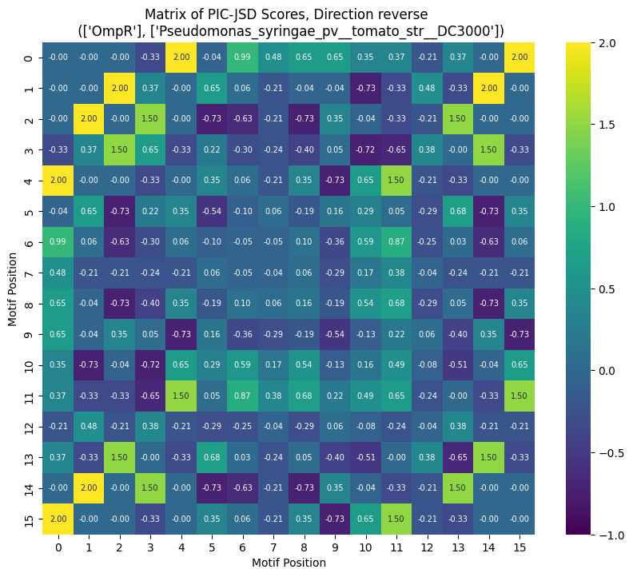 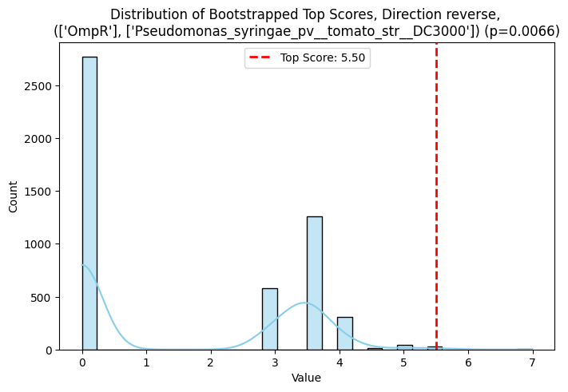 | (?? https://apsjournals.apsnet.org/doi/pdf/10.1094/MPMI-23-7-0927) |  |